# Grid Container
- `flex`는 한 방향 레이아웃 시스템이다.

- `grid`는 두 방향(가로, 세로로) 레이아웃 시스템이다.

<br />

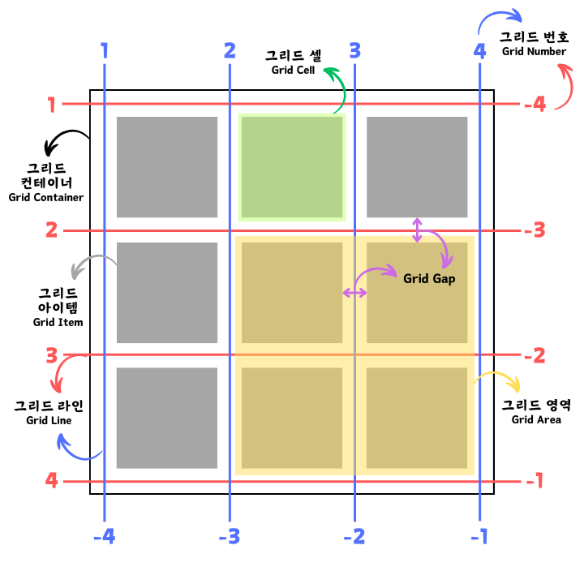
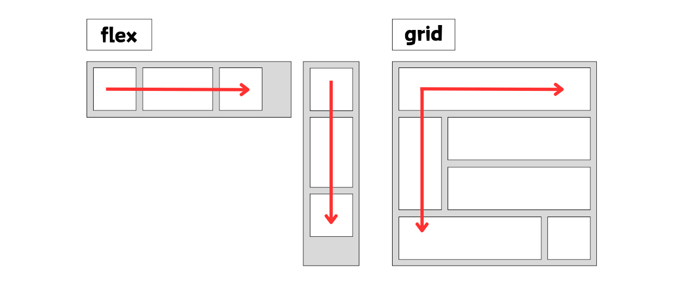


<br />
<br />


## display
- Grid Container를 정의한다.
  - `display: grid;`
  - `display: inline-grid;`
    - container가 inline 속성이 된다.


<br />
<br />


## grid-template-rows, grid-template-columns
- 행(row), 열(column)의 트랙의 크기를 정의하는 속성이다.

- `grid-template-rows`는 컨테이너의 높이가 지정

```css
.container {
  /* 1 : 1 : 1 비율인 3개의 열(column) */
  grid-template-columns: 1fr 1fr 1fr;

  /* 80px 고정 열(column) 하나에 나머지는 2 : 1 비율의 열(column) */
  grid-template-columns: 80px 2fr 1fr;

  /* 80px 120px 고정 행(row) 두개에 마지막 행(row)은 컨텐츠 내용에 따라 자동으로(auto) 늘어난다. */
  grid-template-rows: 80px 120px auto;

  /* 1 : 2 : 3 비율인 3개의 행(row) */
  grid-template-rows: 1fr 2fr 3fr;
}
```

<br />

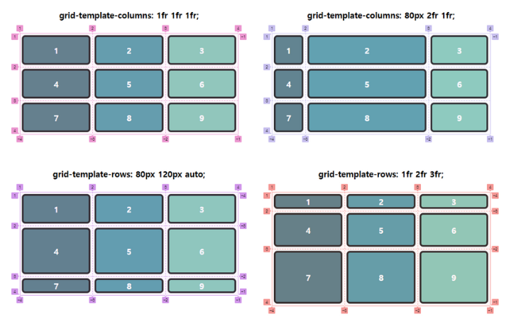


<br />
<br />


## repeat 함수
- 반복되는 값을 자동으로 처리할 수 있는 함수이다.

- repeat(반복횟수, 반복값)

```css
.container {
  /* grid-template-columns: 1fr 1fr 1fr; */
  grid-template-columns: repeat(3, 1fr);

  /* grid-template-columns: 1fr 2fr 1fr 2fr 1fr 2fr; */
  grid-template-columns: repeat(3, 1fr 2fr);
}
```


<br />
<br />


## minmax 함수
- 최솟값과 최댓값을 지정할 수 있는 함수이다.

- minmax(최솟값, 최댓값)

```css
.container {
	grid-template-columns: repeat(3, 1fr);
	grid-template-rows: repeat(3, minmax(100px, auto));
  /* 행의 크기가 최소 100px은 확보하고, 최대는 내용에 따라 자동으로(auto) 늘어난다. */
}
```

<br />

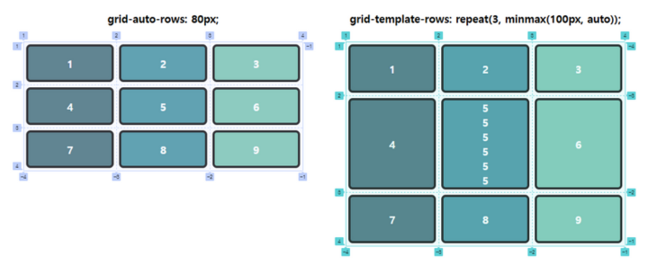


<br />
<br />


## auto-fill, auto-fit
- 컨테이너 안에서 아이템들이 행, 열 크기에 맞게 자동으로(암시적) 조정한다.

- `auto-fill`
  - 남는 공간(빈 트랙)을 유지한다.

  ```css
  .container {
    grid-template-columns: repeat(auto-fill, minmax(20%, auto));
  }
  ```

  <br />

  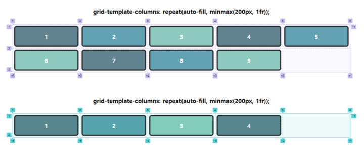

  <br />

- `auto-fit`
  - 남는 공간(빈 트랙)을 채운다.

  ```css
  .container {
    grid-template-columns: repeat(auto-fit, minmax(20%, auto));
  }
  ```

  <br />

  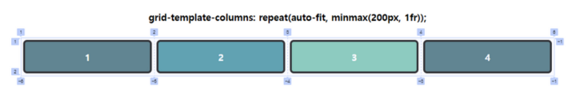


<br />
<br />


## grid-template-areas
- 지정된 그리드 영역 이름(`grid-area`)을 참조해 그리드 템플릿을 생성할 수 있다.
  - `grid-area`는 Grid Item에 적용하는 속성이다.

- `.`(마침표)를 사용해 빈 영역을 정의할 수 있다.

```html
  <div class="container">
    <header><span>header</span></header>
    <main><span>main</span></main>
    <aside><span>aside</span></aside>
    <footer><span>footer</span></footer>
  </div>
```

```css
.container {
  display: grid;
  grid-template-rows: repeat(4, 100px);
  grid-template-columns: repeat(3, 1fr);
  grid-template-areas:
    "header header header"
    "main main aside"
    ". . ."
    "footer footer footer";
}

header { grid-area: header; }
main   { grid-area: main;   }
aside  { grid-area: aside;  }
footer { grid-area: footer; }
```

<br />

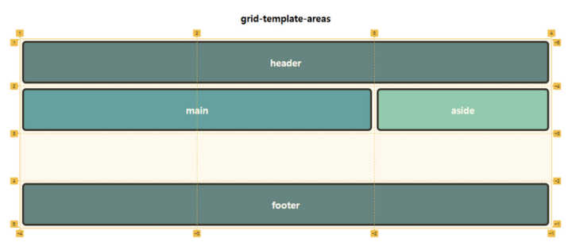


<br />
<br />


## grid-auto-flow
- 아이템이 자동 배치되는 흐름을 결정하는 속성이다.

  - `grid-auto-flow: row;`
    - 행축을 따라 차례로 배치된다.
  - `grid-auto-flow: column;`
    - 열축을 따라 차례로 배치된다.
  - `grid-auto-flow: row dense(dense);`
    - 행축을 따라 차례로 배치되며, 빈 공간을 채운다.
  - `grid-auto-flow: column dense;`
    - 열축을 따라 차례로 배치되며, 빈 공간을 채운다.

<br />

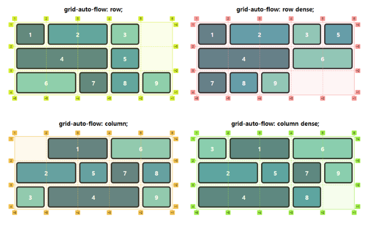


<br />
<br />


## grid-auto-rows, grid-auto-columns
-  `grid-template-rows`, `grid-template-columns`를 설정할 때는 명시적으로 행, 열의 갯수를 맞춰서 설정한다.

-  `grid-auto-rows`, `grid-auto-columns`는 명시적으로 갯수를 설정해주는 것과 상관없이 암시적으로 알아서 설정한 트랙의 크기만큼 적용된다.

```css
/* container - 1 */
.container {
  grid-template-columns: repeat(3, 1fr);
  grid-template-rows: repeat(2, minmax(100px, auto));
}

/* container - 2 */
.container {
  grid-template-columns: repeat(3, 1fr);
  grid-auto-rows: minmax(100px, auto);
}
```

<br />

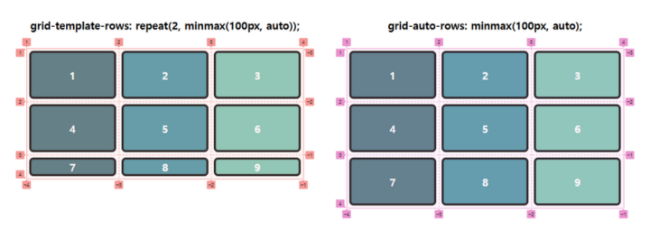


<br />
<br />


## gap
- 각 아이템 사이의 간격을 설정한다.

```css
.container {
  gap: 10px; /* row-gap: 10px; column-gap: 10px; */
  gap: 10px 20px; /* row-gap: 10px; column-gap: 20px; */
}
```

<br />

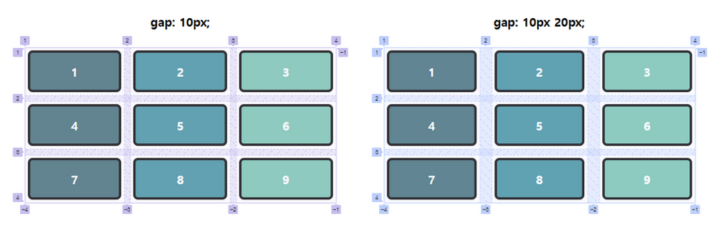


<br />
<br />


## place-content
- `justify-content`와 `align-content`의 단축 속성이다.

```css
.container {
  place-content: justify-content align-content;
}
```


<br />
<br />


## justify-content
- 메인축 방향으로 아이템들을 정렬하는 속성이다.

  - `justify-content: normal;`
    - 기본값
    - `stretch`와 같다.
  - `justify-content: start;`
    - 아이템들을 시작점으로 정렬한다.
  - `justify-content: end;`
    - 아이템들을 끝점으로 정렬한다.
  - `justify-content: center;`
    - 아이템들을 가운데로 정렬한다.
  - `justify-content: space-between;`
    - 아이템들 사이에 균일한 간격을 만들어 정렬한다.
  - `justify-content: space-around;`
    - 아이템들의 좌우에 균일한 간격을 만들어 정렬한다.
  - `justify-content: space-evenly;`
    - 아이템들의 사이와 좌우 양 끝에 균일한 간격을 만들어 정렬한다.
  - `justify-content: stretch;`
    - 행 축을 채우기 위해 그리드 컨텐츠를 늘린다.

<br />

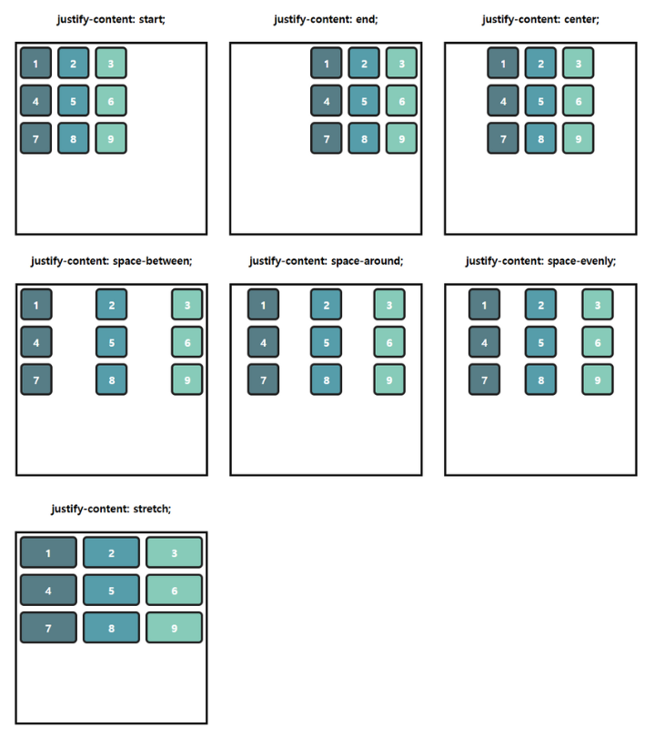


<br />
<br />


## align-content
- 교차축 방향으로 아이템들을 정렬하는 속성이다.

  - `align-content: normal;`
    - 기본값
    - `stretch`와 같다.
  - `align-content: start;`
    - 아이템들을 시작점으로 정렬한다.
  - `align-content: end;`
    - 아이템들을 끝점으로 정렬한다.
  - `align-content: center;`
    - 아이템들을 가운데로 정렬한다.
  - `align-content: space-between;`
    - 아이템들을 사이에 균일한 간격을 만들어 정렬한다.
  - `align-content: space-around;`
    - 아이템들의 상하에 균일한 간격을 만들어 정렬한다.
  - `align-content: space-evenly;`
    - 아이템들의 사이와 상하 양 끝에 균일한 간격을 만들어 정렬한다.
  - `align-content: stretch;`
    - 열 축을 채우기 위해 그리드 콘텐츠를 늘린다.

<br />

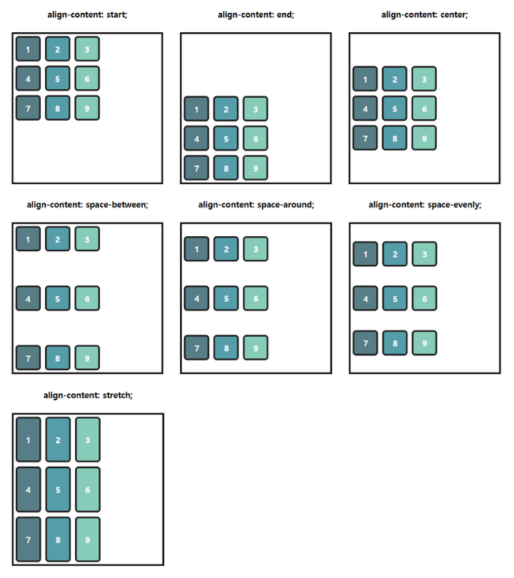


<br />
<br />


## place-items
- `justify-items`와 `align-items`의 단축 속성이다.

```css
.container {
  place-items: justify-items align-items;
}
```


<br />
<br />


## justify-items
- 셀 내에서 메인축 방향으로 아이템을 정렬하는 속성이다.

  - `justify-items: normal;`
    - 기본값
    - `stretch`와 같다.
  - `justify-items: start;`
    - 아이템을 시작점으로 정렬한다.
  - `justify-items: end;`
    - 아이템을 끝점으로 정렬한다.
  - `justify-items: center;`
    - 아이템을 가운데로 정렬한다.
  - `justify-items: stretch;`
    - 행 축을 채우기 위해 아이템을 늘린다.

<br />

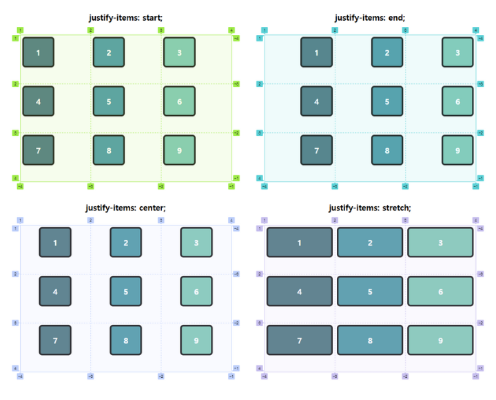


<br />
<br />


## align-items
- 셀 내에서 교차축 방향으로 아이템을 정렬하는 속성이다.

  - `align-items: normal;`
    - 기본값
    - `stretch`와 같다.
  - `align-items: start;`
    - 아이템을 시작점으로 정렬한다.
  - `align-items: end;`
    - 아이템을 끝점으로 정렬한다.
  - `align-items: center;`
    - 아이템을 가운데로 정렬한다.
  - `align-items: stretch;`
    - 열 축을 채우기 위해 아이템을 늘린다.

<br />

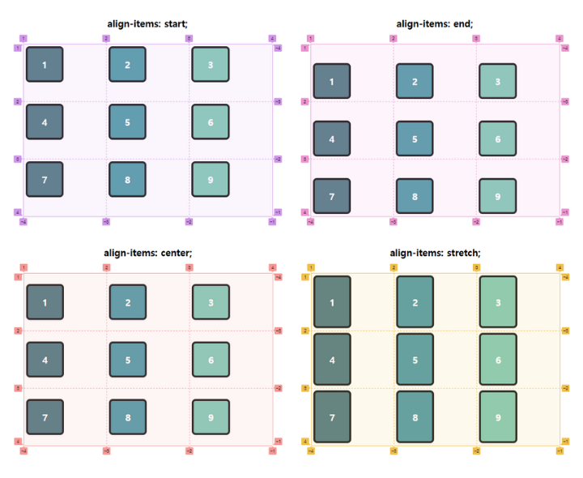


<br />
<br />
<br />
<br />
<br />
<br />
<br />
<br />


# Grid Items

<br />

## grid-row, grid-column
- grid line을 이용하여 row와 column의 영역을 지정한다.

- `grid-row` : `grid-row-start`, `grid-row-end`의 단축 속성이다.

- `grid-column` : `grid-column-start`, `grid-column-end`의 단축 속성이다.

```css
.item-1 {
  /* grid-row-start: 1; grid-row-end: 2; */
  grid-row: 1 / 2;

  /* grid-column-start: 1; grid-column-end: 3; */
  grid-column: 1 / 3;
}

.item-2 {
  /* 1번 라인에서 2칸을 차지 */
  grid-row: 1 / span 2;
  
  /* grid-column-start: 3; grid-column-end: -1; */
  grid-column: 3 / -1;
}

.item-3 {
  /* grid-row-start: 2; */
  grid-row: 2;

  /* grid-column-start: 3; */
  grid-column: 3;
}

.item-4 {
  /* grid-row-start: 1; */
  grid-row: 1;
  
  /* grid-column-start: 2; */
  grid-column: 2;
}
```

<br />

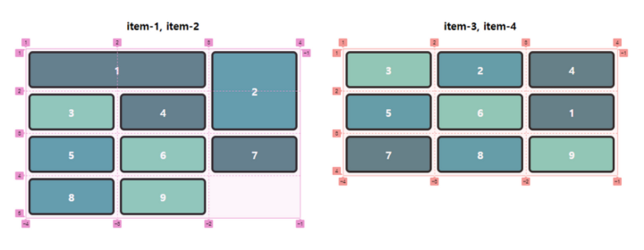


<br />
<br />


## grid-area
- `grid-row-start`, `grid-column-start`, `grid-row-end`, `grid-column-end`의 단축 속성이다.

  ```css
  .item {
    /* grid-row-start / grid-column-start / grid-row-end / grid-column-end */
    grid-area: 2 / span 2 / 3 / -1;
  }
  ```

- `grid-template-areas`가 참조할 영역(Area) 이름을 설정할 수도 있다.

  ```css
  .container {
    display: grid;
    grid-template-rows: repeat(3, 100px);
    grid-template-columns: repeat(3, 1fr);
    grid-template-areas:
      "header header header"
      "main main aside"
      ". . ."
      "footer footer footer";
  }

  header { grid-area: header; }
  main   { grid-area: main;   }
  aside  { grid-area: aside;  }
  footer { grid-area: footer; }
  ```


<br />
<br />


## place-self
- `align-self`와 `justify-self`의 단축 속성이다.

```css
.item {
  place-self: justify-self align-self;
}
```


<br />
<br />


## justify-self
- 특정 아이템만 셀 내에서 메인축 방향으로 아이템을 정렬하는 속성이다.

  - `justify-self: normal;`
    - 기본값
    - `stretch`와 같다.
  - `justify-self: start;`
    - 아이템을 시작점으로 정렬한다.
  - `justify-self: end;`
    - 아이템을 끝점으로 정렬한다.
  - `justify-self: center;`
    - 아이템을 가운데로 정렬한다.
  - `justify-self: stretch;`
    - 행 축을 채우기 위해 아이템을 늘린다.

<br />

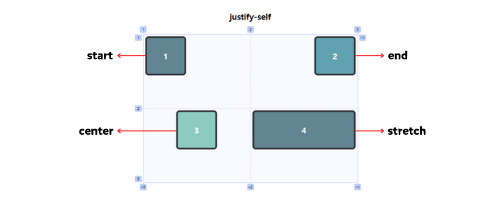


<br />
<br />


## align-self
- 특정 아이템만 셀 내에서 교차축 방향으로 아이템을 정렬하는 속성이다.

  - `align-self: normal;`
    - 기본값
    - `stretch`와 같다.
  - `align-self: start;`
    - 아이템을 시작점으로 정렬한다.
  - `align-self: end;`
    - 아이템을 끝점으로 정렬한다.
  - `align-self: center;`
    - 아이템을 가운데로 정렬한다.
  - `align-self: stretch;`
    - 열 축을 채우기 위해 아이템을 늘린다.

<br />

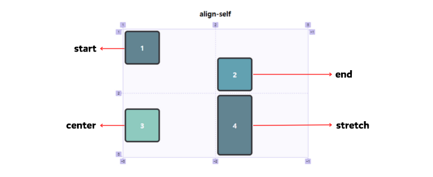


<br />
<br />


## order
- 아이템들의 순서를 설정하는 속성이다.

- HTML 구조와 상관없이 순서를 변경할 수 있다.

- 기본값 : `0`

- 음수가 허용된다.

```css
.item:nth-child(1) { order: 1; }
.item:nth-child(3) { order: 5; }
.item:nth-child(5) { order: -1; }
```

<br />

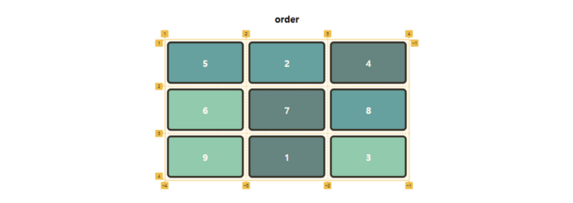


<br />
<br />


## z-index
- 아이템이 쌓이는 순서를 변경할 수 있는 속성이다.

```css
.item:nth-child(1) {
  grid-area: 1 / 1 / 2 / 3;
}
.item:nth-child(2) {
  grid-area: 1 / 2 / 3 / 3;
  z-index: 1;
}
.item:nth-child(3) {
  grid-area: 2 / 2 / 3 / 4;
}
```

<br />

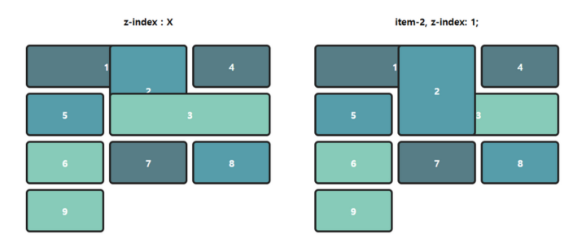