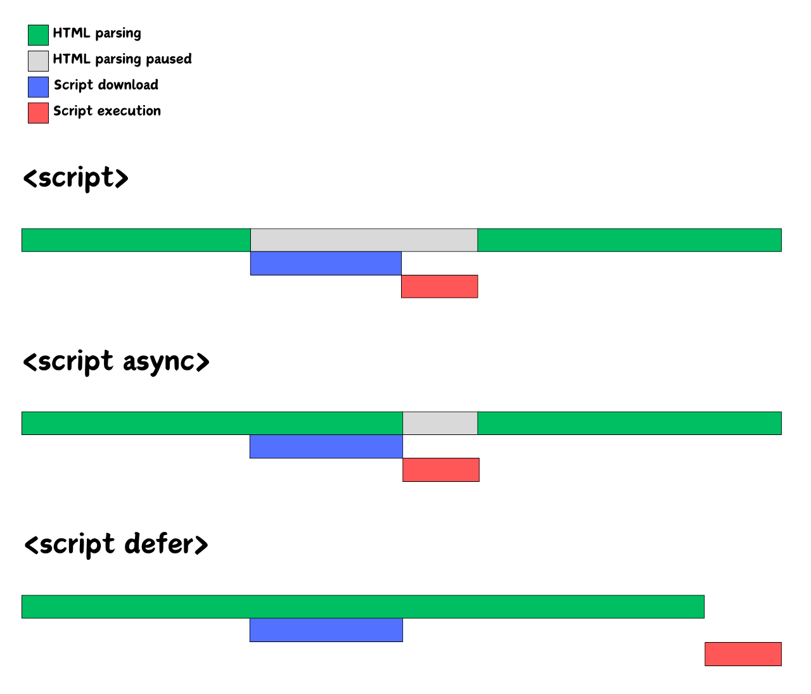

## 렌더링 (Rendering)
- HTML, CSS, Javascript 등 개발자가 작성한 문서가 브라우저에서 출력되는 과정을 말한다.

- 브라우저마다 렌더링을 수행하는 엔진이 다르다.
  - Chrome : Blink
  - Edge : Blink
  - Opera : Blink
  - Safari : Webkit
  - Firefox : Gecko

<br />

### 브라우저 렌더링 원리
- 서버로 부터 HTML 문서를 전달받는다.

- HTML 문서를 위에서 아래로 순차적으로 파싱하여 태그와 속성을 발견한다.

- 태그와 속성들은 DOM Tree 형태로 변환되어 메모리에 저장된다.

- HTML 파싱 중 CSS 링크 또는 스타일 태그를 만나면 이를 파싱하여 CSSOM Tree 형태로 변환되어 메모리에 저장된다.

- 문서의 파싱이 완료되면 DOM Tree와 CSSOM Tree를 결합하여 Render Tree를 생성한다.

- Render Tree는 브라우저상에서 요소의 위치와 크기를 결정하는 Reflow 과정을 거친다.

- 마지막으로 요소의 색상, 경계선 등 시각적 요소를 그리는 Repaint 과정이 진행된다.

<br />

### 만약 HTML 파싱 중간에 script 태그를 만나면 어떻게 되는가❓
- 브라우저는 해당 스크립트를 로드하고 실행하기 위해 파싱을 일시 중단한다.
  - 외부 스크립트의 경우 스크립트를 로드하고 실행한 후 파싱을 제기한다.
  - 내부 스크립트의 경우 실행이 완료될 때까지 파싱이 중단된다.

- 이로 인해 파싱 속도가 저하되고 DOM Tree가 완성되기 전에 스크립트가 DOM을 조작할 가능성이 있어 얘기치 못한 상황이 발생할 수 있다.

- 이러한 문제를 방지하기 위해 `async`나 `defer`속성을 사용하여 파싱에 미치는 영향을 최소화할 수 있다.

- `async`나 `defer`속성은 스크립트를 비동기적으로 로드하는 속성이다.
  - `async`
    - HTML 파싱이 진행중에 병렬로 스크립트가 로드된다.
      - 파싱을 중단하고 스크립트를 즉시 실행한다.
    - 스크립트가 서로 의존성이 없고 로드되는 순서가 상관없을 경우에 적합하다.

  - `defer`
    - HTML 파싱이 진행중에 병렬로 스크립트가 로드된다.
      - 파싱이 완료된 후에 스크립트를 실행한다.
    - 스크립트를 비동기적으로 로드하되 HTML 파싱이 완료된 후 스크립트를 실행한다.
    - 스크립트 실행 순서가 중요할 경우에 적합하다.

```
📌 파싱 : 주어진 데이터를 해석하고 분석하여 원하는 형식 또는 구조로 변환하는 작업이다.
📌 비동기 : 순서대로 진행하는 것이 아닌 한번에 여러개가 진행된다. (병렬 수행)
```

<br />

### 스크립트의 로드 순서
