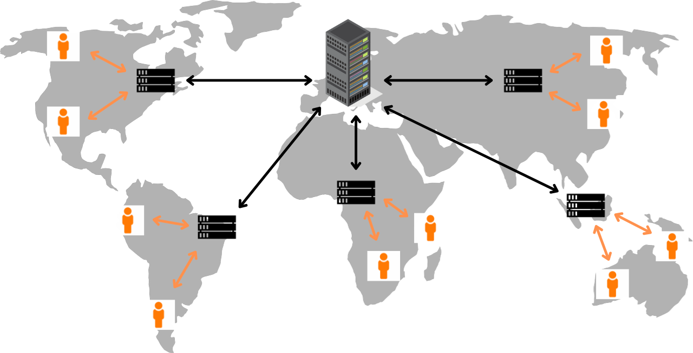

## CDN (Content Delivery Network)
- 사용자에게 웹 콘텐츠를 보다 빠르고 효율적으로 전달하기 위해 설계된 분산형 서버 네트워크이다.

- CDN의 핵심 목표는 사용자가 웹 콘텐츠를 요청할 때 가장 가까운 서버에서 콘텐츠를 제공하여 지연 시간을 줄이는 것이다.

 
  

 

### CDN의 작동 원리
- 콘텐츠 캐싱
    - CDN은 웹 콘텐츠(이미지, 동영상, HTML 페이지 등)를 전 세계 여러 데이터 센터에 분산 저장한다.
    - 이를 `캐싱(Cache)`이라고 하며, 콘텐츠를 사용자와 가까운 서버에 저장하여 빠르게 제공할 수 있다.

- 사용자 요청 처리
    - 사용자가 웹사이트에 접속하면 CDN은 DNS(Domain Name System)를 활용해 사용자와 지리적으로 가장 가까운 서버로 요청을 보낸다.

#### 만약 CDN 캐싱 서버에 요청한 콘텐츠가 없다면❓
- CDN은 원본 서버(Origin Server)로 요청을 전달하여 콘텐츠를 가져온다.

- 이후 이 콘텐츠를 캐싱 서버에 저장하여 다음 요청에 대비한다.

 

### CDN을 사용하는 주요 이점
- 빠른 로딩 속도
  -  CDN은 사용자와 가까운 서버에서 콘텐츠를 제공하기 때문에 로딩 속도를 대폭 향상시킨다.
  - 이는 특히 전 세계적으로 서비스를 제공하는 웹사이트에서 매우 중요한 요소이다.

- 서버 부하 감소
  -  CDN은 트래픽을 여러 서버로 분산시켜 원본 서버의 부하를 줄인다.
  - 이를 통해 대량의 사용자 요청도 안정적으로 처리할 수 있다.

- 안정성 강화
  - CDN은 서버 장애 시 다른 서버가 요청을 처리하도록 설계되어 있어 웹사이트의 가용성을 높일 수 있다.
  - 또한 DDoS(Distributed Denial of Service) 공격과 같은 위협으로부터 시스템을 보호하는 데도 유용하다.