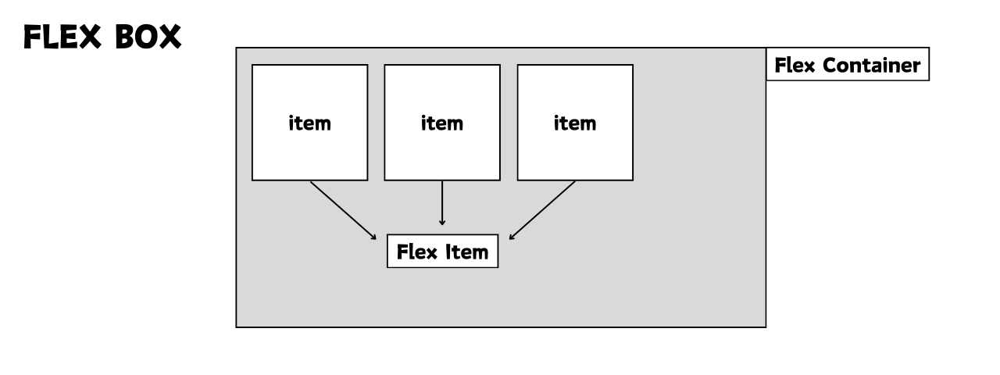
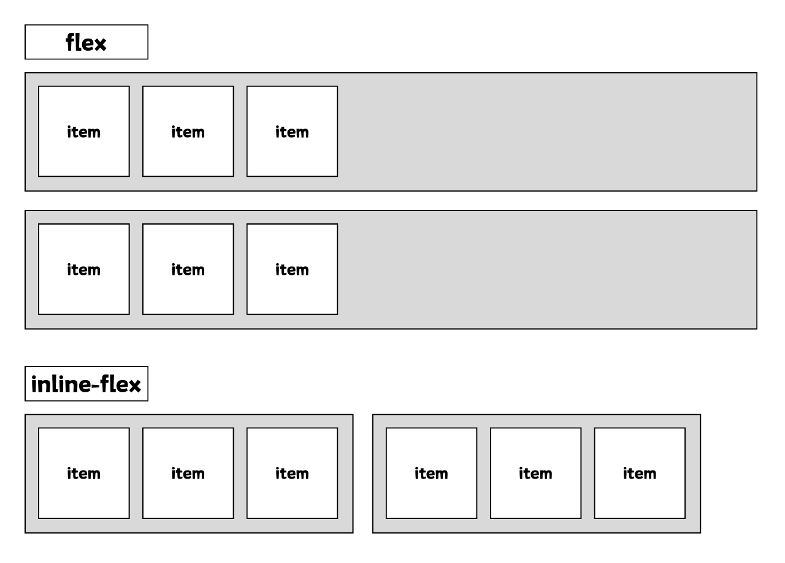
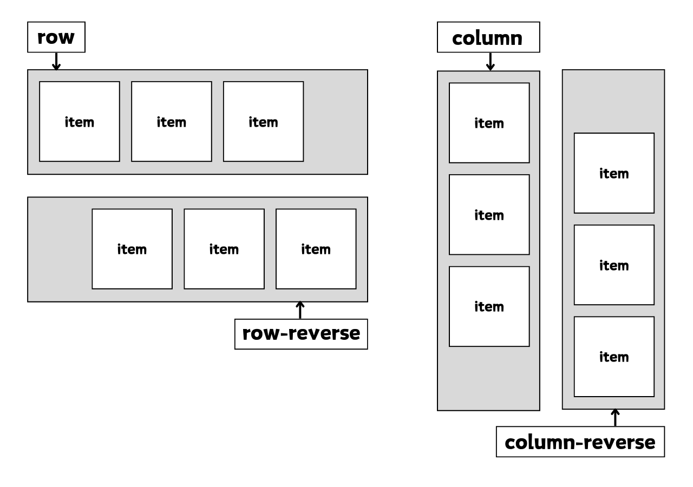
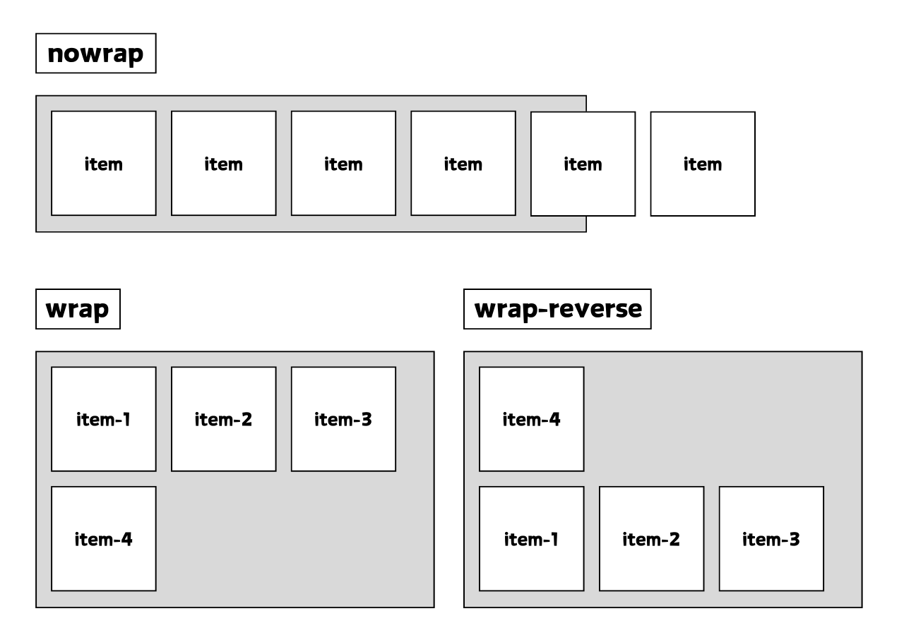
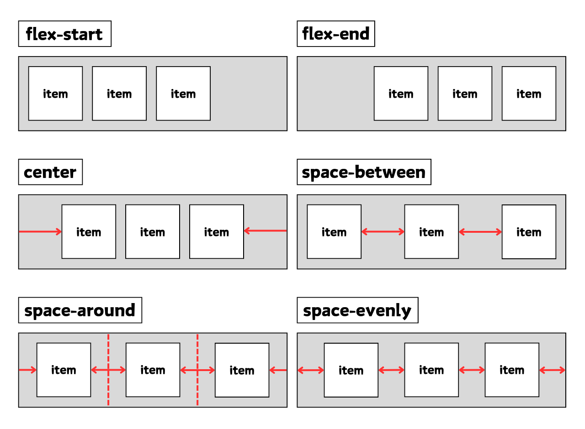
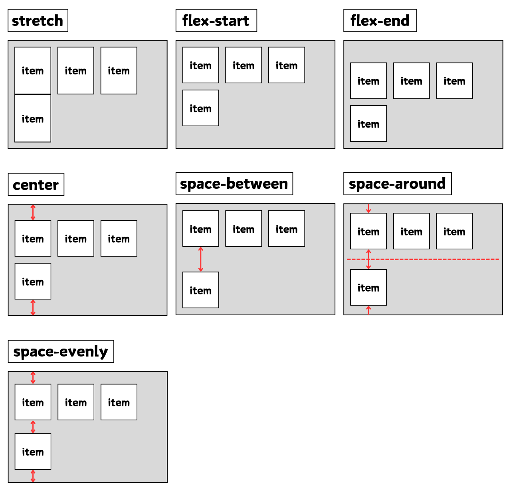
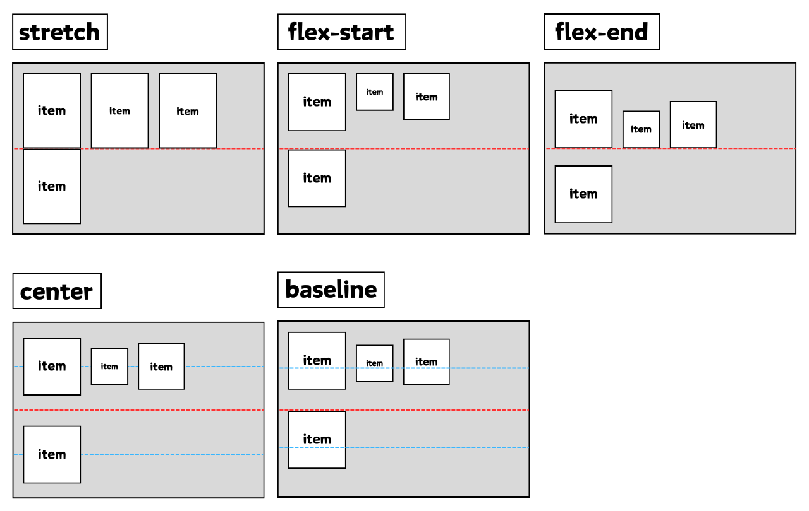
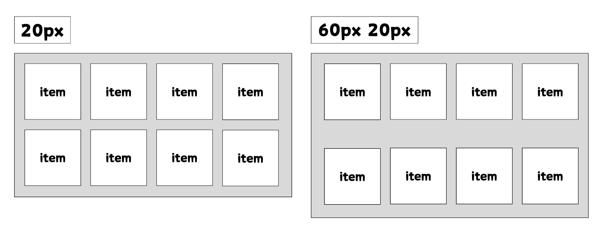
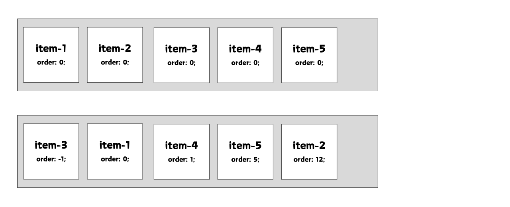
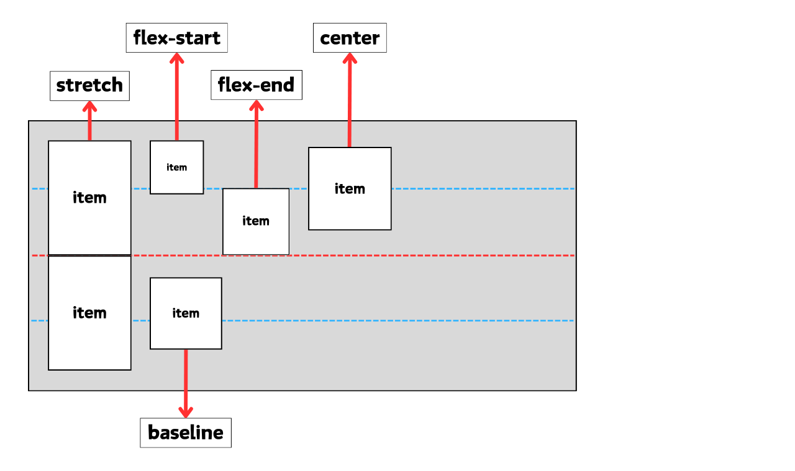

# Flex Container




<br />
<br />


## display
- Flex Container를 정의한다.
  - `display: flex;`
  - `display: inline-flex;`
    - `container`가 `inline` 속성이 된다.

<br />




<br />
<br />


## flex-flow
- `flex-direction`과 `flex-wrap`을 한꺼번에 지정할 수 있는 단축 속성이다.

  - `flex-flow: row wrap;`


<br />
<br />


## flex-direction
- 아이템들이 배치되는 축의 방향을 결정하는 속성이다.

  - `flex-direction: row;`
    - 기본값
    - 아이템들이 행(가로) 방향으로 배치된다.
  - `flex-direction: row-reverse;`
    - 아이템들이 행(가로)의 역순 방향으로 배치된다.
  - `flex-direction: column;`
    - 아이템들이 열(세로) 방향으로 배치된다.
  - `flex-direction: column-reverse;`
    - 아이템들이 열(세로) 역순 방향으로 배치된다.

<br />




<br />
<br />


## flex-wrap
- 아이템들의 줄바꿈을 어떻게 할지 결정하는 속성이다.

  - `flex-wrap: nowrap;`
    - 기본값
    - 줄바꿈을 하지 않는다.
    - 넘치면 틀 밖으로 빠져 나간다.
  - `flex-wrap: wrap;`
    - 줄바꿈을 한다.
  - `flex-wrap: wrap-reverse;`
    - 줄바꿈을 하고 역순으로 배치한다.

<br />




<br />
<br />


## justify-content
- 메인축 방향으로 아이템을들 정렬하는 속성이다.

  - `justify-content: flex-start;`
    - 기본값
    - 아이템들을 시작점으로 정렬한다.
  - `justify-content: flex-end;`
    - 아이템들을 끝점으로 정렬한다.
  - `justify-content: center;`
    - 아이템들을 가운데로 정렬한다.
  - `justify-content: space-between;`
    - 아이템들 사이에 균일한 간격을 만들어 정렬한다.
  - `justify-content: space-around;`
    - 아이템들의 좌우에 균일한 간격을 만들어 정렬한다.
  - `justify-content: space-evenly;`
    - 아이템들의 사이와 좌우 양 끝에 균일한 간격을 만들어 정렬한다.

<br />




<br />
<br />


## align-content
- 교차축 방향 정렬을 결정하는 속성이다.

- `flex-wrap: wrap;` 상태에서 아이템들의 행이 2줄 이상이고 여백이 있을 경우에만 사용이 가능하다.

- 아이템들이 한 줄일 경우 `align-items` 속성을 사용하는게 좋다.
  - `align-content: stretch;`
    - 기본값
    - Container의 교차축을 채우기 위해 아이템들을 늘린다.
  - `align-content: flex-start;`
    - 아이템들을 시작점으로 정렬한다.
  - `align-content: flex-end;`
    - 아이템들을 끝점으로 정렬한다.
  - `align-content: center;`
    - 아이템들을 가운데로 정렬한다.
  - `align-content: space-between;`
    - 아이템들을 사이에 균일한 간격을 만들어 정렬한다.
  - `align-content: space-around;`
    - 아이템들의 상하에 균일한 간격을 만들어 정렬한다.
  - `align-content: space-evenly;`
    - 아이템들의 사이와 상하 양 끝에 균일한 간격을 만들어 정렬한다.

<br />




<br />
<br />


## align-items
- 교차축 방향 정렬을 결정하는 속성이다.

- 아이템들이 한 줄일 경우 많이 사용한다.

- 아이템들의 행이 2줄 이상일 경우에는 `align-content` 속성이 우선시 된다.

- 따라서 `align-items`를 사용하려면 `align-content` 속성은 기본값으로 설정되어 있어야 한다.
  - `align-items: stretch;`
    - 기본값
    - Container의 교차축을 채우기 위해 아이템들을 늘린다.
  - `align-items: flex-start;`
    - 아이템들을 각 줄의 시작점으로 정렬한다.
  - `align-items: flex-end;`
    - 아이템들을 각 줄의 끝점으로 정렬한다.
  - `align-items: center;`
    - 아이템들을 각 줄의 가운데로 정렬한다.
  - `align-items: baseline;`
    - 아이템들을 문자 기준선에 정렬한다.

<br />




<br />
<br />


## gap
- 각 아이템 사이의 간격을 설정한다.

  - `gap: 15px;`
    - 아이템 전체에 15px 간격을 설정한다.
  - `gap: 30px 15px;`
    - 아이템 상하에 30px, 좌우에 15px 간격을 설정한다.

<br />




<br />
<br />
<br />
<br />
<br />
<br />
<br />
<br />


# Flex Items

<br />

## order
- 아이템들의 순서를 설정하는 속성이다.

- HTML 구조와 상관없이 순서를 변경할 수 있다.

- 기본값 : `0`

- 음수가 허용된다.

<br />




<br />
<br />


## align-self
- 특정 아이템만 개별적으로 정렬 위치를 설정하는 속성이다.

  - `align-self: auto;` 
    - 기본값
  - `align-self: stretch;`
    - 아이템을 가운데 정렬한다.
  - `align-self: flex-start;`
    - 아이템을 가운데 정렬한다.
  - `align-self: flex-end;`
    - 아이템을 가운데 정렬한다.
  - `align-self: center;`
    - 아이템을 가운데 정렬한다.
  - `align-self: baseline;`
    - 아이템을 가운데 정렬한다.

<br />




<br />
<br />


## flex
- `flex-grow`, `flex-shrink`, `flex-basis`를 한 번에 쓸 수 있는 축양형 속성이다.

- `flex-basis`를 생략해서 쓰면 `flex-basis` 값은 0이 된다.

- 단위를 사용하면 `flex-basis`가 적용된다.

```css
.item-1 { flex: 1; }
/* flex-grow: 1; flex-shrink: 1; flex-basis: 0; */

.item-1 { flex: 1 20px; }
/* flex-grow: 1; flex-shrink: 1; flex-basis: 20px; */

.item-1 { flex: 1 1 auto; }
/* flex-grow: 1; flex-shrink: 1; flex-basis: auto; */
```


<br />
<br />


## flex-grow
- 아이템의 여백을 얼마나 차지할지를 결정하는 속성이다.

- 기본값 : `0` (남은 공간을 차지하지 없음)

- 값의 범위 : 정수 또는 소수 (0 이상)

- Flex Container 안의 남은 공간이 있을 경우, `flex-grow` 값에 따라 아이템의 크기가 증가한다.

- `flex-grow` 값이 큰 아이템이 더 많은 공간을 차지한다.


<br />
<br />


## flex-shrink
- 아이템이 컨테이너보다 클 때 얼마나 줄어들지를 결정하는 속성이다.

- 기본값 : `1` (컨테이너 크기를 초과하면 줄어듬)

- 값의 범위 : 정수 또는 소수 (0 이상)

- Flex Container가 작아져 아이템 전체를 담을 수 없을 경우, `flex-shrink` 값에 따라 아이템의 크기가 줄어든다.

- `flex-shrink` 값이 큰 아이템이 더 많이 줄어든다.

- 값이 `0`이면 해당 아이템은 절대 줄어들지 않는다.


<br />
<br />


## flex-basis
- 아이템의 기본 크기를 설정하는 속성으로 아이템이 주축 방향에서 얼마나 큰 공간을 차지할지를 결정하는 속성이다.

- 기본값 : `auto` (아이템의 본래 크기나 컨텐츠 크기에 따라 결정)

- 값의 범위
  - 고정크기 (`px`, `em`, `%` 등)
  - `auto` (컨텐츠 크기에 따라 자동 조정)
  - `0` (기본 크기 없이 작동, 다른 flex 속성에 따라 크기 결정)