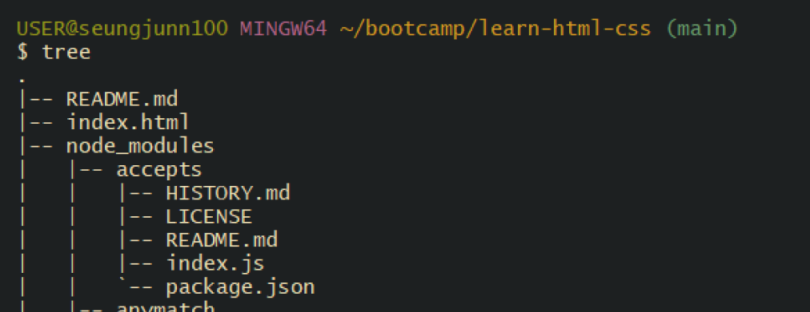

# Shell과 CLI

- [Shell](#shell)
  - [주요 Shell의 특징](#주요-shell의-특징)
- [rc ( run commands )](#rc--run-commands)
- [CLI ( Commang Line Interface )](#cli--commang-line-interface)
  - [CLI 주요 명령어](#cli-주요-명령어)

 
 

## Shell

`셸(Shell)`은 사용자가 운영체제(OS)와 소통할 수 있도록 도와주는 **프로그램**이다.

셸은 주로 `CLI(Command Line Interface)`방식으로 동작하며, 사용자가 텍스트로 명령어를 입력해서 운영체제와 성호 작용할 수 있다.

 

### 주요 Shell의 특징

`Bash(Bourne Again Shell)`

-   가장 널리 사용되는 셸 중 하나
-   대부분의 Linux 배포판과 macOS의 기본 셸(Catalina 이전 버전)
-   스크립팅 기능, 명령어 완성, 명령어 히스토리 등 제공

`Zsh(Z Shell)`

-   Bash와 호환되면서 추가 기능 제공
-   더 강력한 자동 완성 기능
-   테마와 플러그인을 통한 높은 사용자 정의 가능성
-   macOS Catalina부터 기본 셸로 채택됨

`PowerShell`

-   Microsoft에서 개발한 셸
-   Windows에서 주로 사용되지만 크로스 플랫폼 지원
-   객체 지향적 접근 방식으로 다른 셸과 차별화

 
 

## rc ( run commands )

`rc`는 UNIX 계열 시스템에서 시작 시 실행되는 스크립트 파일이나 설정 파일을 가르킨다.

초창기 UNIX에서 부팅할 때 실행되는 스크립트를 `/etc/rc`라고 불렀다. 이 파일이 바로 시스템 초기화 과정에서 실행(run)할 명령어(commands)를 모아둔 곳이라서 `rc`라고 부르게 되었다.

UNIX는 **작고 단순한 스크립트를 조합해서 사용하는 철학**을 갖고있기 때문에, `rc` 파일 개념이 여러 프로그램 설정 방식으로 퍼져나가게 되었다.

-   `.bashrc` : Bash Shell의 설정 파일
-   `.zshrc` : Zsh Shell의 설정 파일
-   `.vimrc` : Vim 편집기의 설정 파일
-   `.prettierrc` : Prettier 코드 포맷터의 설정 파일

**UNIX는 현대 운영체제의 뿌리이자 철학**이고, 현재 우리가 쓰는 `macOS`, `iOS`, `Android`, `Linux` 서버 등은 모두 UNIX 철학을 계승한 운영체제이다.

 
 

## CLI ( Commang Line Interface )

`CLI(Commang Line Interface)`는 사용자가 명령어를 입력하면 운영체제가 그 명령을 해석해서 실행하는 방식이다. 디렉토리와 파일을 생성 및 이동, 복사, 삭제, 이름 변경 등 다양한 명령어를 사용하여 실행할 수 있다.

운영체제는 기본적으로 CLI를 제공하며 지원하는 CLI 명령어가 다르다. 

`유닉스/리눅스` 계열은 대부분 `Bash`를 가장 많이 사용한다. `macOS`는 Catalina 이전 버전에서는 Bash를 기본으로 사용했지만, Catalina 버전 부터는 `zsH`가 기본으로 채택되었다. 

`Windosws`는 기본적으로 `CMD(Command Prompt)`를 사용해오다가, 최신에 `Power Shell`이 추가되어 함께 사용되고 있다.

하지만 각 운영체제에서 다른 셸을 사용할 수 있는 옵션도 있다. `Windosws`를 사용한다면 `Git bash`를 사용할 수 있다. Git Bash는 Git을 설치하면 자동으로 같이 설치된다. 추가적으로 Windows는 프로젝트 폴더의 계층 구조를 시각적으로 보여주기 위한 `tree` 명령어를 사용하려면 별도의 설치 과정이 필요하다.

1. <a href="../src/files/tree-1.5.2.2-bin.zip" download>tree-1.5.2.2-bin.zip</a> 파일을 다운로드 받은 후 압축을 푼다.

2. tree-1.5.2.2-bin/bin 폴더 안에 있는 tree.exe 파일을 c:/Program Files/Git/usr/bin 폴더로 이동 또는 복사한다.

3. Git Bash를 실행한 후 `tree` 명령어를 입력하여 동작하는지 확인한다.

 

### CLI 주요 명령어

#### 현재 사용자명을 확인

- `whoami`

#### 현재 작업중인 폴더 확인

- `pwd` : print working directory

#### 현재 폴더에 폴더 생성

- `mkdir` : Make Directory
- `mkdir <디렉토리 이름>`

#### 디렉토리 이동

- `cd` : change Directory
- `cd <디렉토리 경로>`
- `cd .` : 현재 디렉토리 (생략 가능)
- `cd ..` : 상위 경로로 한 단계 이동
- `cd ../..` : 상위 경로로 두 단계 이동
- `cd ~/Desktop` : 데스크탑 디렉토리로 바로 이동

#### 디렉토리 및 파일 목록 출력

- `ls` : List Segments
- `ls <디렉토리 경로>`
- `ls -l <디렉토리 경로>` : 폴더 목록을 출력할 때 사용 권한, 소유자, 그룹, 크기, 날짜 등 상세 정보를 함께 표시
- `ls -a <디렉토리 경로>` : 폴더 목록을 출력할 때 숨겨진 항목을 포함하여 모든 내용을 출력
- `ls -al <디렉토리 경로>` : 폴더 목록을 출력할 때 숨겨진 항목을 포함하여 사용 권한, 소유자, 그룹, 크기, 날짜 등 상세 정보를 함께 표시

#### 파일 생성

- `touch` : 빈 파일을 생성할 경우
  - `touch index.html` : 내용이 없는 빈 `index.html`파일 생성
- `echo` : 간단한 내용이 들어있는 파일을 생성할 경우
  - `echo 'let me = "Frontend Developer"' > js/index.js` : 덮어쓰기
  - `echo 'console.log(me)' >> js/index.js` : 이어쓰기

#### 파일 내용 확인하기

- `cat` : Concatenate

#### 파일, (비어있지 않은)디렉토리 삭제

- `rm` : Remove
- `rm <제거할 파일> or <디렉토리 이름>`
- `rm -r assets` : `assets` 폴더 내부 하위 디렉토리까지 모두 삭제
- `rm -rf assets` : `assets` 폴더 안의 하위 디렉토리까지 모두 삭제하되 **경고를 나타내지 않음**
- `rm -r -f js`, `rm -rf js`, `rm -f -r js` : 옵션의 순서가 바뀌어도 동일하게 동작
- `rm -r -f .` : 절대 사용하지 않도록 조심해야 한다. `.`은 현재 디렉토리를 의마하므로 현재 디렉 토리 안에 있는 모든 파일과 모든 디렉토리를 강제로 확인 없이 삭제함

#### (비어있는)디렉토리 삭제

- `rmdir` : Remove Directory
- `rmdir <디렉토리 이름>`

#### 파일/디렉토리 이동 및 이름 변경

- `mv` : Move(이미 존재하는 파일/디렉토리의 경우 이름 변경이 가능)
- `mv index.html html/index.html` : `index.html` 파일을 `html` 폴더로 이동
- `mv js/index.js js/app.js` : `js` 폴더에 있는 `index.js` 파일명을 `app.js`로 변경

#### 파일/디렉토리 복사

- `cp` : Copy
- `cp index.html main.html` : `index.html` 파일을 동일한 폴더에 복사한 후 파일명을 `main.html`로 변경
- `cp index.html html/main.html` : `index.html` 파일을 `html` 폴더에 복사한 후 파일명을  `main.html` 로 변경