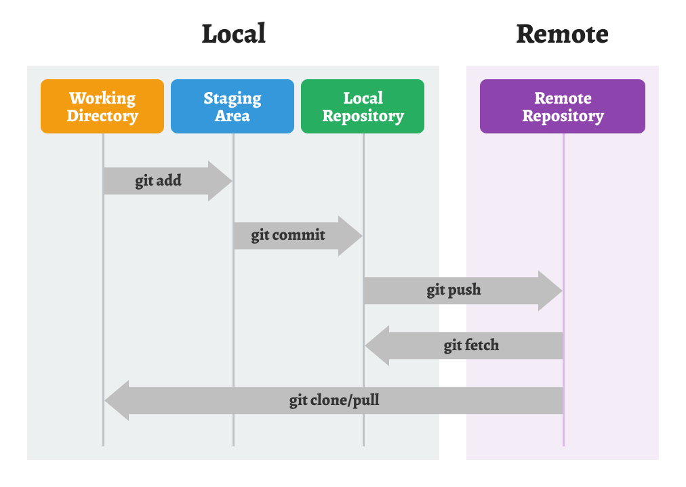

# Git을 활용한 버전 관리

- [버전 관리(Version Control)](#버전-관리version-control)
  - [버전 관리 시스템의 종류](#버전-관리-시스템의-종류)
- [Git을 활용한 버전 관리](#버전-관리version-control)
  - [Git을 사용하는 이유](#git을-사용하는-이유)


<br />
<br />


## 버전 관리(Version Control)

소프트웨어 등을 개발할 때 어떤 내용을 어느 시점에 누가 변경했는지에 대한 **소스 코드 내역을 관리**하는 것을 의미한다.

- 프로젝트의 변경 사항과 작업자를 추적할 수 있다.
- 이전 버전으로의 복원이나 협업에 용이하다.
- 소프트웨어 개발 생명 주기를 관리하는 도움을 준다.

이러한 버전 관리를 효과적으로 수행할 수 있는 도구를 **버전 관리 시스템 - VCS(Version Control System)이라고** 부른다.

<br />

### 버전 관리 시스템의 종류

**로컬 버전 관리 시스템(Local Version Control System)**

- 서버 없이 로컬 컴퓨터 내에서 데이터 베이스를 사용하여 파일의 버전을 관리한다.
- `SCCS`, `RCS`

**중앙 집중형 버전 관리 시스템(Centralized Version Control System)**

- 서버에서 최종 버전을 관리하는 방식으로 로컬에서 서버의 파일을 다운받아 수정한 후 수정 내용을 서버에 반영하여 관리한다.
- 단, 서버에 문제가 생기면 버전 관리가 어렵다.
- `CVS`

**분산형 버전 관리 시스템(Distributed Version Control System)**

- 서버가 있는 것은 중앙 집중식과 동일하지만 로컬에서도 다운 받아 관리할 수 있다.
- 서버에 문제가 생기더라도 로컬에 내용이 남아있어 안정적으로 버전을 관리할 수 있다.
- `SVN`, `Mercurial`, `Git`⭐


<br />
<br />


## `Git`을 활용한 버전 관리

Git은 소프트웨어 개발 프로세스를 효율적으로 관리하고 협업을 가능하게 해주는 분산형 버전 관리 시스템이다.

<br />

### Git을 사용하는 이유

- **버전 관리**

  Git은 파일 및 프로젝트의 모든 변경 사항을 추적하여 이전 버전으로 쉽게 돌아갈 수 있게 해준다. 이를 통해 실수를 복구하거나 변경 이력을 관리할 수 있다.

- **협업**

  여러 명의 개발자가 동시에 작업할 때, Git을 사용하면 각자의 작업을 분리하여 충돌을 방지하고 변경 사항을 효과적으로 병합할 수 있다.

- **분산된 저장소**

  Git은 중앙 서버에 의존하지 않고 각 개발자가 로컬 저장소를 가지고 있어 작업을 빠르게 진행할 수 있습니다. 또한 인터넷 연결이 없는 환경에서도 작업할 수 있다.

- **빠른 속도와 유연성**

  Git은 빠른 속도로 대용량 프로젝트를 처리할 수 있으며, 브랜치 및 병합 기능을 통해 유연하게 작업할 수 있다.

- **오픈 소스**

  Git은 오픈 소스이며, 다양한 툴과 플랫폼에서 지원되기 때문에 개발자들 사이에서 널리 사용된다.

<br />

### Git의 기본 작업 흐름



#### `Local`

**Working Directory(작업 디렉토리)**

- 실제로 파일을 수정, 추가, 삭제하는 작업 공간이다.
- `git add`를 통해 수정된 파일을 **Staging Area**로 올린다.

**Staging Area(준비 영역, Index)**

- `git add`를 통해 수정된 파일을 올려두는 임시 저장 공간이다.
- 다음 커밋에 포함할 파일 목록을 정하는 단계이기도 하다.
- `git commit`을 통해 **Local Repository**에 새로운 버전을 생성한다.
  - 메시지와 함께 기록되어 버전 관리가 시작된다.

**Local Repository(로컬 저장소)**

- `git commit`을 통해 확정된 버전이 기록되는 곳이다.
- `.git` 폴더 안에 저장되며, 버전 히스토리가 관리된다.
- `git push`를 통해 **Remote Repository**로 업로드한다.

#### `Remote`

**Remote Repository(원격 저장소, 서버)**

- `GitHub`과 같은 원격 저장소 전용 서버에서 관리된다.
- 여러 사람이 협업할 때 코드의 공유, 백업의 역할을 한다.
- `git pull`을 통해 **Remote Repository**의 최신 버전을 **Local Repository**로 가져올 수 있다.
- `git clone`을 통해 **Remote Repository**를 **Local**로 복사해 올 수 있다.

<br />

### Git 명령어

#### `git init` : 저장소 생성

```bash
# 현재 디렉토리를 Git 저장소로 생성
# .git 숨김 폴더가 생성
git init

# Git 저장소를 지우는 방법
rm -rf .git
```

#### `.git status` : 현재 상태를 확인

```bash
git status

# 변경된 파일명이 빨간색으로 보일 경우 Working Directory 상태
# 변경된 파일명이 초록색으로 보일 경우 Staging Area 상태
# nothing to commit, working tree clean의 경우 변경 내용이 없음을 나타냄
```

#### `git diff` : 파일의 변경내용을 비교

```bash
# 파일의 변경내용을 터미널에서 비교
git diff

# 파일의 변경내용을 GUI 툴을 이용하여 비교
git difftool

# CLI로 difftool 등록할 경우
git config --global diff.tool vscode
git config --global difftool.vscode.cmd "code --wait --diff $LOCAL $REMOTE"
```

#### `git add` : 파일의 변경 사항을 **Staging Area**에 추가

```bash
# 특정 파일을 Staging Area 추가
git add

# 변경 내용이 있는 모든 파일을 Staging Area에 추가
git add .
```

#### `git restore` : 작업 내용 취소

```bash
# Working Directory에 변경 내용을 취소할 경우
git restore <file>

# Staging Area에 변경 내용을 Working Directory로 되돌릴 경우
git restore --staged <file>
```

#### `git commit` : 파일의 변경 사항에 대한 이력 생성

```bash
# Staging Area에 올린 변경 내용을 Local Repository에 새로운 버전으로 저장
git commit -m "커밋 메시지"

# 마지막 커밋 메시지 수정
git commit --amend
```

#### `git rebase` : 커밋 수정

```bash
# 전체 커밋을 최신 버전 위에 다시 올림
git rebase

# 특정 커밋의 메시지, 내용을 직접 수정
git rebase -i <hash>
```

#### `git log` : 커밋 이력 확인

```bash
# Log를 한줄, 그래프 형태로 보기
git log --oneline
git log --oneline --graph
```

#### `git checkout` : 과거 커밋 이력 확인

```bash
# 이전 2개의 커밋으로 이동
git checkout HEAD~2

# 특정 커밋으로 이동
git checkout <hash>

# 마지막 커밋으로 복귀
git checkout main
```

#### `git reset` : 커밋을 취소하거나 변경 내용 복원

```bash
# 이전 2개의 커밋으로 돌아가기 (--mixed : default)
# 커밋 기록은 삭제되지만 Working Directory에 변경 사항은 남김
git reset HEAD~2

# 커밋 기록은 삭제되지만 Working Directory와 Staging Area에 변경 사항은 남김
git reset --soft HEAD~2

# HEAD~2 커밋으로 복원되며 이후에 변경된 커밋 기록은 모두 삭제
git reset --hard HEAD~2
```

#### `git branch` : 브랜치 생성 및 이동

```bash
# likelion이라는 브랜치를 생성
git branch likelion

# likelion이라는 브랜치로 이동
# checkout 명령이 여러 기능을 가지고 있기때문에 Git 2.23.0 버전에서는
# 브랜치 이동을 위한 기능으로 switch 명령이 추가 됨 (checkout, switch 모두 사용 가능)
git checkout likelion
git switch likelion

# main 브랜치로 복귀
git switch main

# likelion 브랜치를 main 브랜치로 병합
git merge likelion

# likelion 브랜치 삭제
git branch -d likelion

# likelio 브랜치 이름을 techit으로 변경
git branch -m likelion techit

# 브랜치를 만들고 바로 이동
git switch -c <브랜치명>
git checkout -b <브랜치명>
```

#### `git remote` : 리모트(Remote) 브랜치

```bash
# 리모트 브랜치 조회
git remote -v

# 리모트 브랜치 추가
git remote add origin <https://github.com/ID/REPOSITORY>

# 리모트 브랜치 삭제
git remote remove origin
git remote rm origin
```

#### `git merge` : 브랜치 병합하기

```bash
# 브랜치를 main 브랜치에 병합
git merge <브랜치명>

# CLI로 mergetool 등록할 경우
git config --global merge.tool vscode
git config --global mergetool.vscode.cmd "code --wait $MERGED"

# 충돌시 mergetool을 활용해 해결
```

#### `git push` : 로컬의 변경 이력을 리모트로 전송

```bash
# Local Repository의 변경 이력을 Remote Repository로 전송
git push
```

#### `git pull` : 리모트의 내용을 로컬에 반영

```bash
# `git fetch` + `git merge`의 역할
# Remote Repository의 최신 버전을 Local Repository로 가져옴
# 가져온 최신 커밋들을 현재 작업 중인 Local branch에 병합
# 병합 과정에서 Working Directory의 파일들이 업데이트되어 반영
git pull
```

#### `git clone`

```bash
# 복사할 Remote Repository의 모든 정보를 포함하는 것들을 Local로 복사
# Working Directory, Staging Area, Local Repository
git clone <원격저장소_URL>
```

<br />

## 참고

- [나무위키 - 버전 관리 시스템](https://namu.wiki/w/%EB%B2%84%EC%A0%84%20%EA%B4%80%EB%A6%AC%20%EC%8B%9C%EC%8A%A4%ED%85%9C)
- [git - git에 관한 모든 것](https://git-scm.com/book/ko/v2)
- 부트캠프 강의 내용

<br />
<hr />
<br />

<!-- [실습 내용 확인하러 가기]() -->
