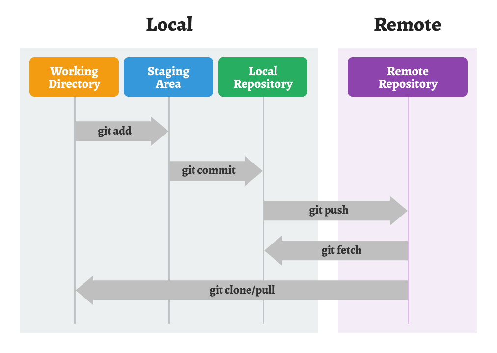

# Git을 활용한 버전 관리

- [버전 관리(Version Control)](#버전-관리version-control)
  - [버전 관리 시스템의 종류](#버전-관리-시스템의-종류)
- [Git을 활용한 버전 관리](#버전-관리version-control)
  - [Git을 사용하는 이유](#git을-사용하는-이유)
  - [Git의 기본 작업 흐름](#git의-기본-작업-흐름)

 
 

## 버전 관리(Version Control)

소프트웨어를 개발할 때 `어떤 내용`을 `어느 시점`에 `누가 변경`했는지에 대한 **소스 코드 내역을 관리하는 것을 의미**한다. 프로젝트의 변경 사항과 작업자를 추적할 수 있고, 소스 코드의 경우 이전 버전으로의 복원이나 협업에 용이하다. 이러한 버전 관리를 효율적으로 수행할 수 있는 도구를 `버전 관리 시스템 - VCS(Version Control System)`라고 부른다.

 

### 버전 관리 시스템의 종류

**로컬 버전 관리 시스템(Local Version Control System)**

서버없이 로컬 컴퓨터 내에서 데이터 베이스를 사용하여 파일의 버전을 관리한다.

- `SCCS`, `RCS`

 

**중앙 집중형 버전 관리 시스템(Centralized Version Control System)**

서버에서 최종 버전을 관리하는 방식으로 로컬에서 서버의 파일을 다운받아 수정한 후 수정 내용을 서버에 반영하여 관리한다. 단, 서버에 문제가 생기면 버전 관리가 어렵다.

- `CVS`

 

**분산형 버전 관리 시스템(Distributed Version Control System)**

서버가 있는 것은 중앙 집중식과 동일하지만 로컬에서도 다운 받아 관리할 수 있다. 서버에 문제가 생기더라도 로컬에 내용이 남아있어 안정적으로 버전을 관리할 수 있다.

- `SVN`, `Mercurial`, `Git`⭐

 
 

## Git을 활용한 버전 관리

Git은 소프트웨어 개발 프로세스를 효율적으로 관리하고 협업을 가능하게 해주는 `분산형 버전 관리 시스템`이다.

 

### Git을 사용하는 이유

`버전 관리`

Git은 파일 및 프로젝트의 모든 변경 사항을 추적하여 이전 버전으로 쉽게 돌아갈 수 있게 해준다. 이를 통해 실수를 복구하거나 변경 이력을 관리할 수 있다.

`협업`

여러 명의 개발자가 동시에 작업할 때, Git을 사용하면 각자의 작업을 분리하여 충돌을 방지하고 변경 사항을 효과적으로 병합할 수 있다.

`분산된 저장소`

Git은 중앙 서버에 의존하지 않고 각 개발자가 로컬 저장소를 가지고 있어 작업을 빠르게 진행할 수 있습니다. 또한 인터넷 연결이 없는 환경에서도 작업할 수 있다.

`빠른 속도와 유연성`

Git은 빠른 속도로 대용량 프로젝트를 처리할 수 있으며, 브랜치 및 병합 기능을 통해 유연하게 작업할 수 있다.

`오픈 소스`

Git은 오픈 소스이며, 다양한 툴과 플랫폼에서 지원되기 때문에 개발자들 사이에서 널리 사용된다.

 

### Git의 기본 작업 흐름

`Local`

**Working Directory(작업 디렉토리)**

- 실제로 파일을 수정, 추가, 삭제하는 작업 공간이다.
- `git add`를 통해 수정된 파일을 **Staging Area**로 올린다.

**Staging Area(준비 영역, Index)**

- `git add`를 통해 수정된 파일을 올려두는 임시 저장 공간이다.
- 다음 커밋에 포함할 파일 목록을 정하는 단계이기도 하다.
- `git commit`을 통해 **Local Repository**에 새로운 버전을 생성한다.
  - 메시지와 함께 기록되어 버전 관리가 시작된다.

**Local Repository(로컬 저장소)**

- `git commit`을 통해 확정된 버전이 기록되는 곳이다.
- `.git` 폴더 안에 저장되며, 버전 히스토리가 관리된다.
- `git push`를 통해 **Remote Repository**로 업로드한다.

 

`Remote`

**Remote Repository(원격 저장소, 서버)**

- `GitHub`과 같은 원격 저장소 전용 서버에서 관리된다.
- 여러 사람이 협업할 때 코드의 공유, 백업의 역할을 한다.
- `git pull`을 통해 **Remote Repository**의 최신 버전을 **Local Repository**로 가져올 수 있다.
- `git clone`을 통해 **Remote Repository**를 **Local**로 복사해 올 수 있다.