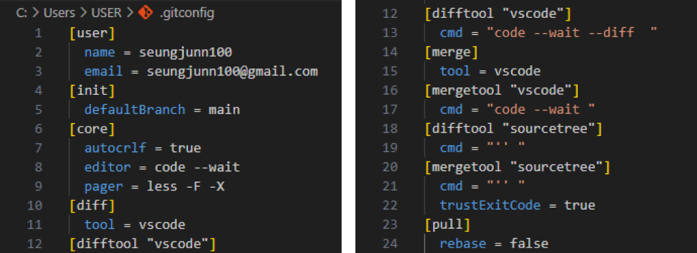

# Git 환경 설정

- [Git CLI 명령어를 사용한 환경 설정](#git-cli-명령어를-사용한-환경-설정)
  - [사용자 정보 설정](#사용자-정보-설정)
  - [기본 브랜치 설정](#기본-브랜치-설정)
  - [기본 줄바꿈 설정](#기본-줄바꿈-설정)
  - [기본 에디터 설정](#기본-에디터-설정)
  - [기본 difftool, mergetool 설정](#기본-difftool-mergetool-설정)
  - [Git의 출력 결과를 어떻게 보여주는지 설정](#git의-출력-결과를-어떻게-보여주는지-설정)
  - [pull 방식 설정](#pull-방식-설정)
  - [Git 설정 조회](#git-설정-조회)


<br />
<br />


## Git CLI 명령어를 사용한 환경 설정

Git을 설치한 후에는 사용자 정보(user.name, user.email)같은 기본적인 환경을 설정해주어야 한다. 전역(global) 설정을 하면 컴퓨터의 모든 저장소에 공통으로 적용되고 한번만 설정해 두면 된다. 설정은 Git을 업그레이드해도 유지된다.

Git은 CLI(Command Line interface)로 사용할 수도 있고 GUI(Graphical User Interface)를 사용할 수도 있다. 하지만, GUI는 Git 기능 중에서 지원하지 않는 부분도 있다. CLI를 사용하면 세밀한 작업까지 가능하다. 그래서 GUI를 사용하기 보다는 CLI를 사용할 줄 아는 상태에서 GUI는 보조로 사용하는 것이 좋을 것 같다.

환경 설정하기 전에 VSCode에서 CLI를 bash 셸로 사용하기 위해 `gitbash`를 기본 셸로 설정해 준다.

<br />

### 사용자 정보 설정

```
git config --global user.name "seungjunn100"
git config --global user.email "seungjunn100@gmail.com"
```

커밋에 표시될 이름, 이메일 주소(GitHub 계정을 사용하는 것이 좋다.)

<br />

### 기본 브랜치 설정

```
git config --global init.defaultBranch main
```

로컬 환경에서 `git init` 명령어를 통해 Git 저장소를 초기화하면 기본 브랜치가 `main`이 되도록 설정한다.

<br />

### 기본 줄바꿈 설정

```
# Windows
git config --global core.autocrlf true

# macOS/Linux
git config --global core.autocrlf input
```

운영체제마다 줄바꿈 문자가 다르기 때문에 Git이 이를 변경 사항으로 인식해서 불필요한 커밋이 생길 수 있다. Winodws는 `CRLF(Carriage Return + Line Feed)`, Unix, Linux, macOS는 `LF(Line Feed)` 방식을 사용한다. CRLF는 `\r\n`(16진수 : 0D 0A), LF는 `\n`(16진수 : 0A) 문자를 사용한다. 이러한 문제로 협업 시 호환성에 문제가 생길 수 있으므로 줄바꿈 설정을 통해 일관성을 유지하는게 좋다.

<br />

### 기본 에디터 설정

```
git config --global core.editor "code --wait"
```

커밋 메시지 입력, 리베이스 편집 등에 `VS Code`를 사용하기 위해 설정한다. 예를 들어 `git commit`을 `-m`없이 실행하면 Git은 `core.editor`에 지정된 편집기(`code`)로 VS Code를 열고, `--wait` 옵션 때문에 메시지를 저장하고 창을 닫을 때까지 다음 단계로 진행하지 않는다.

<br />

### 기본 difftool, mergetool 설정

```
git config --global diff.tool vscode
git config --global difftool.vscode.cmd "code --wait --diff $LOCAL $REMOTE"
git config --global merge.tool vscode
git config --global mergetool.vscode.cmd "code --wait $MERGED"
```

Git의 difftool(비교 도구), mergetool(병합 도구)를 `VS Code`를 사용하기 위해 설정한다. `git difftool` 실행 시 VS Code로 비교 편집창을 열어 로컬 저장소와 원격 저장소에 있는 파일을 비교할 수 있게 해준다. `git mergetool`도 마찬가지로 실행 시 VS Code로 병합 편집창을 열어 병합해야 할 내용을 확인하고 저장할 수 있게 해준다. 둘 다 마찬가지로 창을 닫을 때까지 다음 단계로 진행하지 않는다.

<br />

### Git의 출력 결과를 어떻게 보여주는지 설정

```
git config --global core.pager "less -F -X"
```

출력이 긴 명령을 실행할 때 사용할 `pager` 프로그램을 설정한다. `less`는 터미널에서 긴 출력물을 스크롤해서 볼 수 있게 해주는 표준 도구이다. `-F`는 출력이 한 화면에 다 들어오면 굳이 pager에 들어가지 않고 바로 종료된다. `-X`는 종료할 때 화면을 지우지 않도록 해준다. 이 외에도 `-R`(색상 코드를 표시)이나 `-S`(줄바꿈 끄기) 옵션도 있지만 기본적으로는 `less -F -X` 옵션을 기본으로 사용하는 것 같다.

<br />

### pull 방식 설정

```
git config --global pull.rebase false
```

`git pull`시 어떤 방식으로 pull을 할지 설정해줘야 한다. git pull을 실행했을 때 `git fetch` 후에 `git rebase`를 실행하지 않고 `git merge`를 실행하게 된다.

<br />

### Git 설정 조회

```
# 터미널에서 확인
git config --list

# 기본 에디터(VS Code)에서 설정 확인
git config --global -e
```

