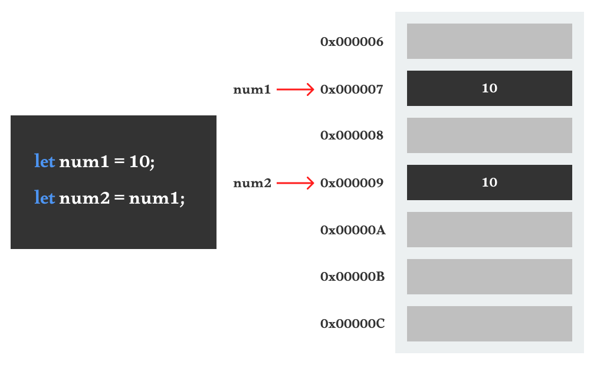

# 변수와 데이터 타입 (feat. 메모리)

- [메모리](#메모리)
  - [프로그램 실행 과정](#프로그램-실행-과정)
  - [프로그램 실행 시 메모리의 구조](#프로그램-실행-시-메모리의-구조)
- [변수 ( Variable )](#변수--variable)
  - [var](#var)
  - [let](#let)
  - [const](#const)
  - [식별자 명명 규칙](#식별자-명명-규칙)
- [리터럴 ( Literal )](#리터럴--literal)
- [데이터 타입 ( Data Type )](#데이터-타입--data-type)
  - [데이터 타입과 메모리](#데이터-타입과-메모리)
  - [number : 숫자](#number--숫자)
  - [BigInt : 큰 정수](#bigint--큰-정수)
  - [string : 문자열](#string--문자열)
  - [boolean : 논리값](#boolean--논리값)
  - [undefined : 값이 정의되지 않음](#undefined--값이-정의되지-않음)
  - [null : 값이 없음을 명시적으로 지정](#null--값이-없음을-명시적으로-지정)
  - [Symbol : 고유한 값](#symbol--고유한-값)
  - [참조 ( Reference ) 타입](#참조--reference--타입)
- [값과 참조의 차이](#값과-참조의-차이)


<br />
<br />


## 메모리

`메모리`는 데이터를 빠르게 읽고 쓰기 위해, **데이터를 임시로 저장하는 공간**이다. 프로그램 실행시 CPU가 하드디스크에 있는 파일 데이터를 복사하여 메모리로 올려 사용한다.

메모리셀이라고 불리는 저장 단위가 연속으로 이루어져 있으며, **각 셀에는 고유한 메모리 주소가 부여**되어 CPU가 필요한 데이터를 빠르게 찾아 접근할 수 있다.

<br />

### 프로그램 실행 과정

사용자가 프로그램을 실행하게 되면 어떤 과정을 거치고 메모리는 무슨 역할을 하는지 알아보자.

1. **프로그램 실행**

   사용자가 프로그램을 실행하면 운영체제가 요청을 받고 `CPU`가 `하드디스크`로부터 파일 데이터를 요청한다.

2. **메모리에 적재**
   
   요청한 파일 데이터를 하드디스크에서 처리하기에는 속도가 느리기 때문에, CPU는 파일 데이터를 `메모리`에 임시로 복사하여 데이터를 빠르게 읽고 쓸 수 있게 한다.

3. **CPU의 동작**
   
   CPU가 메모리에 올라온 파일 데이터를 읽고 화면에 내용을 보여주고, 사용자의 입력에 따라 편집 작업을 수행한다. 사용자가 편집하는 내용들은 메모리상에서 실시간으로 처리하고 화면에 반영된다.

4. **저장**
  
   사용자가 작업한 내용을 저장하면, 메모리에 있는 데이터가 다시 하드디스크에 저장된다. 프로그램을 종료하면 메모리로 복사하여 작업한 해당 데이터는 사라진다.

<br />

### 프로그램 실행 시 메모리의 구조

- `Code` : 프로그램을 실행하기 위한 함수와 같은 실행 코드가 저장된다.

- `Data` : 프로그램 전반에서 공통적으로 사용되는 전역 변수와 같은 코드가 저장된다.

- `Stack` : 함수 호출 시 생성되는 지역 변수, 매개 변수와 같은 코드가 저장되며, 함수 호출 순서에 따라 저장된다.

- `Heap` : 동적으로 생성된 객체나 참조형 데이터 타입들이 저장된다.


<br />
<br />


## 변수 ( Variable )

`변수`는 값을 저장할 수 있는 이름이 주어진 공간이다. 변수에 값을 저장한 후 그 값이 필요할 때 변수를 통해서 값을 사용할 수 있다.

<br />

### 변수 선언과 초기화

변수는 변수명을 선언하고 선언한 변수명을 초기화할 수 있다. 초기화는 변수에 처음으로 값을 할당하는 것을 의미한다.

```javascript
// 변수 선언
let apple;

// 초기화
apple = '🍎';
console.log(apple); // 🍎

// 재할당
apple = '🍏';
console.log(apple); // 🍏
```

<br />

### `var`

변수 선언하는 키워드없이 선언 & 할당이 가능하다. 위에서 할당한 후 재할당하는 건지 구분하기 어렵다.

```JavaScript
banana = '🍌';
console.log(banana); // 🍌
```

중복 선언이 가능하다. 변수를 재선언하여 할당하면 이전에 값이 덮어 씌어진다.

```JavaScript
var apple = '🍎';
var apple = '🍏';
console.log(apple); // 🍏
```

블록 레벨 스코프를 지원하지 않는다. 블록 안에서 지역변수로 사용하고 싶지만, 전역변수와 동일해진다.

```JavaScript
var apple = '사과';
{
  var apple = '🍎';
}
console.log(apple); // 🍎

var apple = '사과';
{
  var apple = '🍎';
  {
    var apple = '🍏';
  }
}
console.log(apple); // 🍏
```

함수 레벨 스코프만 지원된다.

```JavaScript
function fruit() {
  var pear = '🍐';
}
console.log(pear); // ReferenceError: pear is not defined
```

<br />

### `let`

블록 스코프의 범위를 가진다.

```JavaScript
let apple = '🍎';
if (true) {
  let apple = '🍏';
  console.log(apple); // 🍏
}
console.log(apple); // 🍎
```

재할당 가능

```JavaScript
let apple = '🍎';
console.log(apple); // 🍎
apple = '🍏';
console.log(apple); // 🍏
```

<br />

### `const`

변수 선언시 초기값을 생략하면 에러가 발생한다.

```JavaScript
const apple; // SyntaxError: Missing initializer in const declaration
```

재할당 불가능

```JavaScript
const apple = '🍎';
apple = '🍏'; // TypeError: Assignment to constant variable.
```

블록 스코프의 범위를 가진다.

```JavaScript
const apple = '🍎';
if (true) {
  const apple = '🍏';
  console.log(apple); // 🍏
}
console.log(apple); // 🍎
```

값이 절대 바뀌지 않아야 할 때 상수처럼 사용한다. 항상 대문자로, 단어와 단어 사이에는 UnderScore로 분리해줘야한다.

```JavaScript
const PI = 3.14;
const MAX_FRUITS = 5;
```

재할당이 불필요한 경우에는 const를 사용하는게 좋다.

```JavaScript
const apple = {
  name: 'apple',
  color: 'red',
  display: '🍎',
};
console.log(apple); // { name: 'apple', color: 'red', display: '🍎' }
```

<br />
<br />

자바스크립트가 처음 만들어졌을 때 변수를 선언하기 위해서는 `var` 키워드만 사용할 수 있었다. 하지만 `var`의 특성 때문에 에러가 발생하기 쉬웠다. 이러한 문제를 개선하기 위해 `ES6`부터 `let`과 `const` 키워드가 도입되어 현재는 `var` 대신 `let`과 `const`를 사용하는 것이 일반적이다.

프로그래밍할 때 `let`보다 `const`를 우선적으로 사용하는 것이 좋다. 재할당이 불가능해 안정적인 코드 작성이 가능하고, 값이 바뀔 수 없으므로 코드의 의도를 명확하게 보여줄 수 있다. 필요한 경우에만 `let`을 사용하는 것이 좋다.

<br />

### 식별자 명명 규칙

저장된 값을 **잘 나타낼 수 있는**, **의미 있는**, **구체적인** 이름일수록 좋다. 변수명, 함수명, 클래스명 등의 이름을 지을 때 규칙을 따르는게 좋다.

- 라틴문자(0-9, a-z, A-Z)

- 대소문자를 구분

- 한국어 ❌

- 숫자로 시작 ❌

- 특수문자 ❌ ( _ , $ 두가지는 예외 )

- 이모지 ❌

- 예약어 ❌

> 예약어
> > JavaScript 언어에서 기본적으로 쓰고 있는 키워드가 있다. 이 키워드는 **문법에서 특정한 동작을 수행하도록 정의된 예약 키워드**이다.

#### 관례적인 명명 규칙

- 변수명, 함수명 - Camel Case ( `userName`, `userAge` )

- 클래스명 - Pascal Case ( `UserName`, `UserAge` )

- 상수 - 대문자, Screaming Snake Case ( `PI`, `COLOR_BLUE`, `COLOR_RED` )


<br />
<br />


## 리터럴 ( Literal )

코드에서 값을 나타내는 `표기법`

- 숫자 리터럴 : `123`, `3.14`, `1e3`

- 문자 리터럴 : `'123'`, `"Hello"`

- 불리언 리터럴 : `참 - true`, `거짓 - false`

- 객체 리터럴 : `{ name: '춘식', age: 10 }`

- 배열 리터럴 : `[ 1, 2, 3 ]`

- 함수 리터럴 : `function () { }`

- BigInt 리터럴 : `123n`

- 템플릿 리터럴 : 런타임에 일반 문자열로 변환되어 처리된다. 
  
  백틱 기호를 사용하여 문자를 작성해서 템플릿을 만들 수 있다. 문자를 작성할 때 변수의 값(`${}`)을 평가해서 값으로 문자에 포함 시켜 문자열 양식을 만들 수 있다.

  ```JavaScript
  // 일반 문자열
  let id = "승준";
  let greetings = "'안녕!, " + id + "👋\n즐거운 하루 보내!'"
  console.log(greetings);
  /*
  '안녕!, 승준👋
  즐거운 하루 보내!'
  */


  // 템플릿 리터럴
  greetings = `'안녕!, ${id}👋👋
  즐거운 하루 보내!'`;
  console.log(greetings);
  /*
  '안녕!, 승준👋👋
  즐거운 하루 보내!'
  */
  ```


<br />
<br />


## 데이터 타입 ( Data Type )

변수는 다양한 데이터 타입의 데이터를 담을 수 있다. `원시(Primitive)` 타입과 `참조(Reference)` 타입으로 나누어져 있다. `원시(Primitive)` 타입은 딱 하나의 **단일 데이터**를 담을 수 있고, `참조(Reference)` 타입은 **복합 데이터**를 담을 수 있다.

- `원시(Primitive)` 타입
  - number
  - BigInt
  - string
  - boolean
  - undefined
  - null
  - Symbol

- `참조(Reference)` 타입
  - object ( Array )
  - function
  - 원시 타입을 제외한 모든 타입

<br />

### 데이터 타입과 메모리

`원시(Primitive)` 타입은 변수가 어디에 선언되었는지에 따라 메모리의 `Data` 또는 `Stack` 영역에 저장된다. 전역 변수로 선언된 경우 `Data` 영역에 저장되고, 지역 변수로 선언된 경우 `Stack` 영역에 저장된다.

`객체(Object)` 타입은 여러 데이터를 묶어서 보관할 수 있기 때문에 사이즈가 정해져 있지 않다. 즉, 하나의 메모리 셀 안에 모두 담을 수 없기 때문에 메모리 관리가 유연한 `Heap` 영역에 저장된다.

<br />

### `number` : 숫자

자바스크립트에서는 정수, 실수, 음수, 양수 모두 동일한 숫자 타입으로 처리할 수 있다. 반면, Java나 C와 같은 언어에서는 숫자의 크기나 정밀도에 따라 `int`, `long`, `float`, `double` 등 보다 세밀하게 타입이 구분되어 있다.

```JavaScript
let integer = 123; // 정수
let negative = -123; // 음수
let double = 1.23; // 실수
console.log(integer); // 123
console.log(negative); // -123
console.log(double); // 1.23

let binary = 0x11110111; // 2진수
let octal = 0o173; // 8진수
let hex = 0x7b; // 16진수
console.log(binary); // 123
console.log(octal); // 123
console.log(hex); // 123
```

#### 숫자를 나눌 때 발생할 수 있는 값

```JavaScript
console.log(0 / 123); // 0
console.log(123 / 0); // Infinity
console.log(123 / -0); // -Infinity
console.log(123 / 'text'); // NaN (Not a Number)
```

<br />

### `BigInt` : 큰 정수

안전하게 다룰 수 있는 정수 범위를 넘어간 정수를 안전하게 다루기 위해 추가된 타입이다. 정수의 안전한 범위는 `-2^53+1 ~ 2^53-1(약 9000조)`이다. 범위를 벗어나는 정수를 다루게 되면 정수의 정밀도가 떨어져 정확하게 표현할 수 없다. 값 뒤에 n을 붙이거나 Bigint() 함수를 사용하는 방법이 있다.

```JavaScript
let bigInt = 12312498273492374982734981724988;
console.log(bigInt); // 1.2312498273492375e+31

// 값 뒤에 n을 붙여 사용
bigInt = 12312498273492374982734981724988n;
console.log(bigInt); // 12312498273492374982734981724988n

// Bigint() 함수를 사용
bigInt = BigInt("90071992547409911234567890");
console.log(bigInt); // 90071992547409911234567890n
```

<br />

### `string` : 문자열

큰 따옴표나 작은 따옴표 안에 문자열을 작성하여 처리할 수 있다.

```JavaScript
let string = "안녕하세요!";
console.log(string); // 안녕하세요!

string = '안녕하세요!';
console.log(string); // 안녕하세요!
```

#### 특수 문자 출력하는 법

```JavaScript
let string = "안녕!";

// 따옴표 출력
string = "'안녕!'";
console.log(string); // '안녕!'

string = '"안녕!"';
console.log(string); // "안녕!"

// 이스케이프 문자를 사용
string = "안녕!,\n만나서\t\t반가워!!\u09AC"
console.log(string);
/*
안녕!,
만나서               반가워!!ব
*/
```

<br />

### `boolean` : 논리값

`참(true)` 또는 `거짓(false)` 둘 중 하나의 값을 가지는 데이터

#### 참과 거짓을 담고 있는 변수 이름 작성법

```JavaScript
let isFree = true;
let isActivated = false;
let isEnrolled = true;
console.log(isFree); // true
console.log(isActivated); // false
console.log(isEnrolled); // true
```

#### 값의 타입에 따른 참과 거짓

```JavaScript
// !! - 특정한 값을 불리언 타입으로 변환해주는 연산자

// Falshy - 거짓인 값
console.log(!!0); // false
console.log(!!-0); // false
console.log(!!''); // false
console.log(!!null); // false
console.log(!!undefined); // false
console.log(!!NaN); // false

// Truthy - 참인 값
console.log(!!1); // true
console.log(!!-1); // true
console.log(!!'text'); // true
console.log(!!{}); // true
console.log(!!Infinity); // true
console.log(!!-Infinity); // true
```

<br />

### `undefined` : 값이 정의되지 않음

메모리 상에 어떤 데이터도 들어있지 않고 정해지지 않은 상태이다.

```JavaScript
let variable; // 변수를 초기화만 해놓고 값은 설정하지 않은 상태
console.log(variable); // undefined
```

<br />

### `null` : 값이 없음을 명시적으로 지정

변수에 값이 없다라는 것을 의도적으로 명시할 때 사용한다.

```JavaScript
variable = null;
console.log(variable); // null
```

<br />

### `Symbol` : 고유한 값

불변하고 고유함이 보장되는 값을 지정할 때 사용한다. 주로 객체의 속성을 정의할 때 다른 속성키와 충돌하지 않도록 지정하여 사용한다.

```javascript
var greeting1 = Symbol('hello');
var greeting2 = Symbol('hello');
console.log(greeting1 === greeting2); // false
```

<br />

### `참조 ( Reference )` 타입

참조 타입 또는 `객체(Object)` 타입이라고도 부른다. 연관있는 데이터 타입을 한번에 묶어서 보관할 수 있는 `복합 데이터` 타입이다.

```JavaScript
// Key - Value 형태로 데이터를 보관한다.
// Value - 값에는 원시, 객체 타입을 담을 수 있다.
{ Key: value }


// 연관된 데이터를 한 덩어리로 그룹 지을 수 있는 것이 객체이다.
let apple = {
  name: 'apple',
  color: 'red',
  display: '🍎',
};
console.log(apple); // { name: 'apple', color: 'red', display: '🍎' }
console.log(apple.name); // apple
console.log(apple.color); // red
console.log(apple.display); // 🍎


let orange = {
  name: 'orange',
  color: 'orange',
  display: '🍊',
};
console.log(orange); // { name: 'orange', color: 'orange', display: '🍊' }
console.log(orange.name); // orange
console.log(orange.color); // orange
console.log(orange.display); // 🍊
```

<br />

### 타입 확인 법 (typeof)

`컴파일러`를 가지고 있는 프로그래밍 언어는 `정적 타입(Static Type)`이다. 즉, 컴파일할 때 코드에 있는 모든 데이터 타입들이 정적으로 타입이 결전된다.

`인터프리터`를 가지고 있는 프로그래밍 언어는 `동적 타입(Dynamic Type)`이다. 런타임시 동적으로 코드를 한 줄씩 읽고 바로 실행하므로 타입들이 `동적`으로 결정된다.

> 정적
> > 고정되어 변하지 않음
> 
> 동적
> > 상황에 따라 변함

자바스크립트는 실행될 때 할당된 값에 따라 타입이 결정되는 동적 타입이다.

```JavaScript
// typeof : 데이터 타입을 확인, 값을 타입 문자열로 반환해주는 연산자
let variable;
console.log(typeof variable); // undefined

variable = '';
console.log(typeof variable); // string

variable = 123;
console.log(typeof variable); // number

variable = {};
console.log(typeof variable); // object

variable = function () {};
console.log(typeof variable); // function

variable = Symbol();
console.log(typeof variable); // symbol
```


<br />
<br />


## 값과 참조의 차이

변수를 선언하고 값을 할당하게 되면 메모리 어딘가에 데이터가 저장된다. 메모리 셀마다 `메모리 주소`를 가지고 있으며, 변수 이름은 메모리 주소를 가르키며 대신 불러오는 식별자이다.

<br />

`원시(Primitive)` 타입은 `값` 자체가 변수에 들어 있다. 변수를 복사할 땐 `값` 자체가 복사되어 할당된다.



```JavaScript
// 원시 타입은 값이 복사되어 전달된다.
let a = 1;
let b = a;
console.log(a); // 1
console.log(b); // 1

b = 2;
console.log(a); // 1
console.log(b); // 2
```

<br />

`참조(Reference)` 타입은 객체가 저장되어 있는 `참조값(메모리 주소, Reference)`이 변수에 들어 있다. 변수를 복사할 땐 `참조값(메모리 주소, Reference)`이 복사되어 할당된다.


```JavaScript
// 객체 타입은 참조 값(메모리 주소, Reference)이 복사되어 전달된다.
let apple = {
  name: 'apple',
};
let orange = apple;
console.log(apple); // { name: 'apple' }
console.log(orange); // { name: 'apple' }

orange.name = 'orange';
// 동일한 참조된 메모리의 주소를 가르키고 있으므로 한 곳에서만 수정을 해도 동일한 값이 출력이 된다.
console.log(apple); // { name: 'orange' }
console.log(orange); // { name: 'orange' }
```