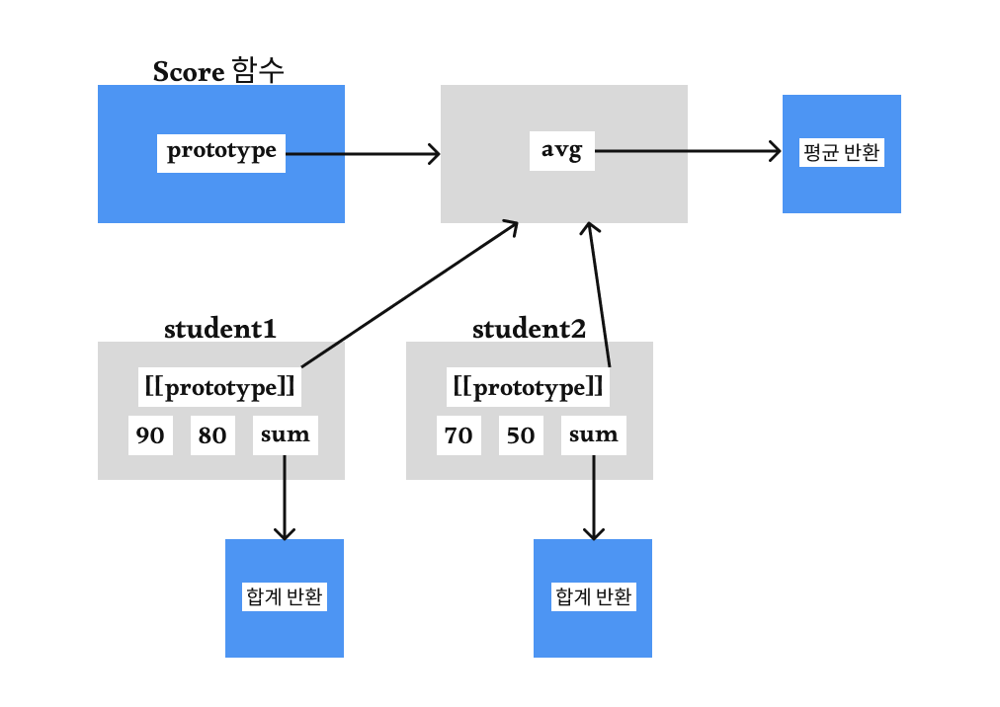
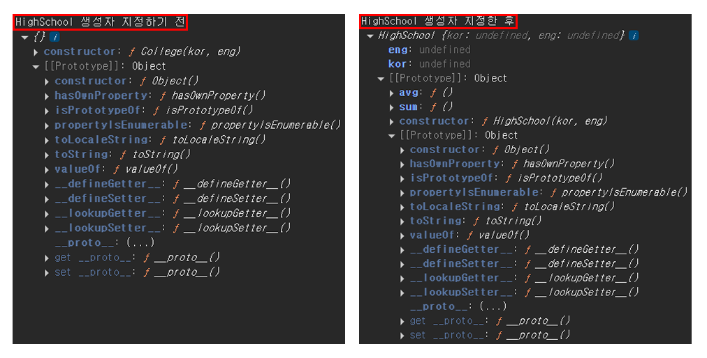
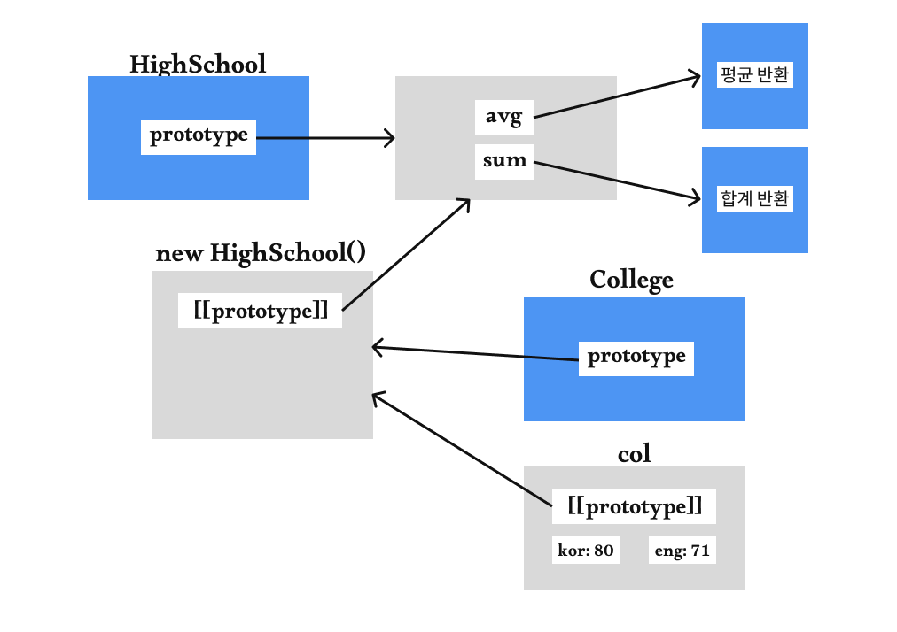

# 프로토타입 ( Prototype )

- [프로토타입](#프로토타입)
- [프로토타입 체인을 이용한 상속](#프로토타입-체인을-이용한-상속)
  - [중계 함수를 이용한 개선 코드](#중계-함수를-이용한-개선-코드)


<br />
<br />
<br />
<br />


## 프로토타입

`Java`, `C++`과 같은 클래스 기반 객체지향 프로그래밍 언어와 달리 자바스크립트는 프로토타입 기반 객체지향 프로그래밍 언어이다. 

자바스크립트의 **모든 객체는 자신의 부모 역할을 담당하는 객체와 연결**되어 있다. 그리고 부모 객체의 프로퍼티와 메서드를 상속받아 사용할 수 있게 한다. 이러한 부모 객체를 `프로토타입 객체` 또는 `프로토타입`이라 하며, 이 연결 관계를 **프로토타입 체인(prototype chain)이라고** 한다.

프로토타입은 생성자 함수에 의해 생성되는 객체(인스턴스)들이 공통으로 사용할 수 있도록 프로퍼티나 메서드를 정의하는 역할을 한다.

```javascript
/**
 * 국어, 영어 점수를 매개변수로 받는 생성자 함수
 * @param {number} kor 국어 점수
 * @param {number} eng 영어 점수
 */
const Score = function (kor, eng) {
  this.kor = kor;
  this.eng = eng;
  this.sum = function () {
    return this.kor + this.eng;
  };
};

Score.prototype.avg = function () {
  return this.sum() / 2;
};

const student1 = new Score(90, 80);
const student2 = new Score(70, 50);

// 생성자 함수내에 선언한 함수를 실행
console.log('student1 총점', student1.sum()); // student1 총점 170
console.log('student2 총점', student2.sum()); // student2 총점 120

// 생성자 함수의 Score.prototype에 선언한 함수를 실행
// 함수를 실행할 때 생성자 함수내에 선언된 함수가 없다면, 
// 프로토타입 체인을 통해 부모 프로토타입에 있는 함수를 찾아 실행한다.
console.log('student1 평균', student1.avg()); // student1 평균 85
console.log('student2 평균', student2.avg()); // student2 평균 60

// sum은 각각의 인스턴스에서 선언하여 다른 메모리 주소를 갖게된다.
console.log(student1.sum === student2.sum); // false
// avg는 인스턴스를 만든 부모의 프로토타입에 선언하여 하나의 메모리 주소를 갖게된다.
console.log(student1.avg === student2.avg); // true
// avg처럼 메서드는 프로토타입에 정의해야 함수의 중복 생성을 막을 수 있다.

// Object.prototype.hasOwnProperty(): 프로퍼티의 소유 유무
// 프로토타입 체인을 통해 마지막 객체인 Object.prototype의 프로퍼티나 메서드를 사용할 수 있다.
console.log(student1.hasOwnProperty('sum')); // true
console.log(student1.hasOwnProperty('avg')); // false
```

도식화하여 보면 이해하기 쉽다. `sum` 함수는 Score 인스턴스를 생성할때마다 매번 생성되는걸 볼 수 있다. `avg` 함수는 인스턴스를 만든 부모 객체의 프로토타입에 선언하여 프로토타입 체인을 통해 인스턴스가 동일하게 접근하여 사용할 수 있다. 이렇게 메서드는 프로토타입에 정의하면 함수의 중복 생성을 막을 수 있다.

 

크롬 개발자 도구의 콘솔에서 객체를 확인한 결과이다.

```javascript
console.log('student1', student1);
console.log('student2', student2);
```

 

**1. 생성자 함수에 의해 생성된 인스턴스**

   생성자 함수 내에서 this에 정의한 속성과 메서드는 각각의 객체 인스턴스에 추가된다. 그리고 Score 생성자 함수의 `Score.prototype`을 상속받는다.

   크롬 개발자 도구의 콘솔에서 `[[Prototype]]: Object` 이렇게 보이는 이유는 내부 구조를 축약해서 보여주기 때문이다.

<br />

**2. 인스턴스의 부모인 생성자 함수의 프로토타입**
  
   `Score.prototype`에 정의한 메서드는 인스턴스의 부모 객체인 `Score.prototype` 객체에 정의된다. 그리고 프로토타입 체인의 마지막 객체인 `Object.prototype`을 상속받는다.

<br />

**3. 프로토타입 체인의 마지막 객체**

   `Number`, `String`, `Array`, `Function` 등의 내장 객체와 `Score`와 같은 사용자가 정의한 객체는 모두 프로토타입 체인에 의해 마지막 객체인 `Object`에 도달하게되며 `Object.prototype`을 상속받는다.


<br />
<br />


## 프로토타입 체인을 이용한 상속

```javascript
/**
 * 고등학교 성적관리 생성자 함수(총점과 평균 계산)
 * @param {number} kor 국어 점수
 * @param {number} eng 영어 점수
 */
function HighSchool(kor, eng){
  this.kor = kor;
  this.eng = eng;
}
HighSchool.prototype.sum = function(){
  return this.kor + this.eng;
};
HighSchool.prototype.avg = function(){
  return this.sum() / 2;
};

const hs = new HighSchool(100, 91);
console.log('hs', hs.kor, hs.eng); // 100, 91
console.log('hs 총점', hs.sum()); // 191
console.log('hs 평균', hs.avg()); // 95.5


/**
 * 대학교 성적관리 생성자 함수(총점, 평균과 학점 계산)
 * @param {number} kor 국어 점수
 * @param {number} eng 영어 점수
 */
function College(kor, eng){
  this.kor = kor;
  this.eng = eng;
}
College.prototype.sum = function(){
  return this.kor + this.eng;
};
College.prototype.avg = function(){
  return this.sum() / 2;
};

const col = new College(80, 71);
console.log('col', col.kor, col.eng); // 80, 71
console.log('col 총점', col.sum()); // 151
console.log('col 평균', col.avg()); // 75.5
```

각 생성자 함수의 프로토타입에 정의한 메서드가 동일한 동작을 한다면, 자식 생성자의 프로토타입(College.prototype)을 부모 생성자의 객체(new HighSchool)로 지정하여 부모 객체의 프로퍼티와 메서드를 상속받아 사용할 수 있다. 즉, `College.prototype`은 `HighSchool`의 인스턴스가 되는 것이다.

```javascript
function College(kor, eng){
  this.kor = kor;
  this.eng = eng;
}

console.log('HighSchool 생성자 지정하기 전', College.prototype);
College.prototype = new HighSchool();
console.log('HighSchool 생성자 지정한 후', College.prototype);

const col = new College(80, 71);
console.log('col', col.kor, col.eng); // 80, 71
console.log('col 총점', col.sum()); // 151
console.log('col 평균', col.avg()); // 75.5
// 결과는 동일하게 나온다.
```



HighSchool 생성자를 지정하기 전에는 `College.prototype`은 기본값만 설정되어 있는 객체였지만, HighSchool 생성자를 지정한 후에는 `College.prototype`은 HighSchool의 프로퍼티와 메서드를 상속받아 사용할 수 있게된다. 

HighSchool의 인자를 전달하지 않아 `undefined` 값을 갖게된다. 하지만 `kor`, `eng`의 값은 College의 값을 사용하기 때문에, HighSchool의 `kor`, `eng` 프로퍼티는 사용하지 않아도 되며 실제 동작에 영향을 주지 않는다. 이를 해결하기 위해 중계 함수를 이용해 프로토타입만 상속받을수 있게 할 수 있다.


<br />

### 중계 함수를 이용한 개선 코드

```javascript
function College(kor, eng){
  this.kor = kor;
  this.eng = eng;
}

inherit = function (Parent, Child) {
  const Func = function () {};
  Func.prototype = Parent.prototype;
  Child.prototype = new Func();
};
inherit(HighSchool, College);
// 중계 함수를 이용하기위해 기본 값만 갖는 생성자 함수를 만들어준다.
// Func 라는 중계 함수가 만들어지며, 중계 함수의 프로토타입에 HighSchool의 프로토타입을 할당해주면,
// 중계 함수는 HighSchool의 프로토타입만 갖게되는 생성자 함수가 된다.
// College의 프로토타입에 중계 함수를 이용한 인스턴스를 생성하게되면,
// College의 프로토타입은 HighSchool의 프로토타입만 갖게된다.

const col = new College(80, 71);
console.log('col', col.kor, col.eng); // 80, 71
console.log('col 총점', col.sum()); // 151
console.log('col 평균', col.avg()); // 75.5
```



#### 더 간단한 개선 코드

```javascript
inherit = function (Parent, Child) {
  const Func = function () {};
  Func.prototype = Parent.prototype;
  Child.prototype = new Func();
};

// Object.create: 지정한 prototype 객체를 참조하는 객체 생성
inherit = function (Parent, Child) {
  Child.prototype = Object.create(Parent.prototype);
};
```