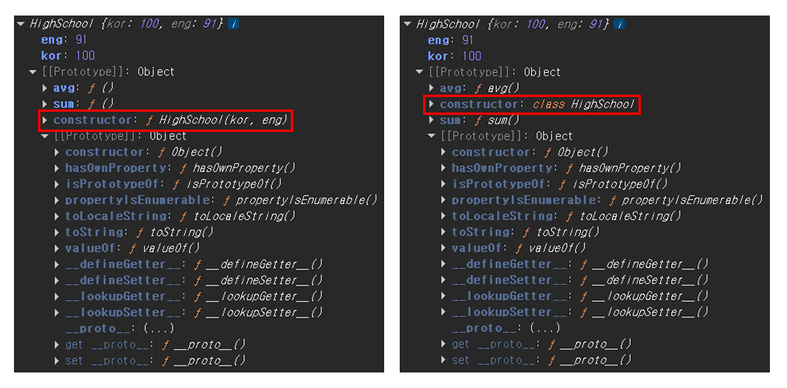

# 클래스 ( Class )

- [클래스의 기본](#클래스의-기본)
- [클래스 상속 ( extends )](#클래스-상속--extends)
- [Private class fields](#private-class-fields)


<br />
<br />


## 클래스의 기본

클래스는 생성자 함수와 마찬가지로 객체를 생성할 수 있으며, 만들어진 객체를 `인스턴스`라고 한다. 

클래스는 `ECMAScript6(2015)`에 추가된 문법이다.

대부분의 객체지향 프로그래밍 언어에서는 클래스를 기반으로 객체지향 프로그래밍을 가능하게 한다. 자바스크립트의 **클래스는 생성자 함수를 쉽게 표현하기 위해 만들어진 겉모습만 클래스**인 `문법적 설탕(Syntactic Sugar)`이다. **내부적으로는 여전히 생성자 함수와 프로토타입을 기반으로 동작**한다.

> 객체지향 프로그래밍
>
> > 프로그래밍을 할 때 단순히 절차적으로 코드를 작성하는 것이 아니라, 서로 밀접하게 연관된 데이터와 기능을 하나의 객체로 구성하고, 이러한 객체들끼리 호환 가능하고 상호작용할 수 있도록 설계하는 것이다.

```javascript
// 생성자 함수
function HighSchool(kor, eng){
  this.kor = kor;
  this.eng = eng;
};
HighSchool.prototype.sum = function () {
  return this.kor + this.eng;
};
HighSchool.prototype.avg = function () {
  return this.sum() / 2;
};

const hs = new HighSchool(100, 91);
console.log('hs', hs.kor, hs.eng); // 100, 91
console.log('hs 총점', hs.sum()); // 191
console.log('hs 평균', hs.avg()); // 95.5


// 클래스
class HighSchool {
  // 인스턴스 레벨의 속성
  constructor (kor, eng) {
    this.kor = kor;
    this.eng = eng;
  }

  // 인스턴스 레벨의 메서드
  // 클래스의 본문에 정의한 메서드는 내부적으로 prototype에 추가된다.
  sum () {
    return this.kor + this.eng;
  }
  avg () {
    return this.sum() / 2;
  }
};

const hs = new HighSchool(100, 91);
console.log('hs', hs.kor, hs.eng); // 100, 91
console.log('hs 총점', hs.sum()); // 191
console.log('hs 평균', hs.avg()); // 95.5
```

생성자 함수로 만든 객체(인스턴스)와 클래스로 만든 객체(인스턴스)의 내부를 살펴보면, 생성자만 다르고 프로퍼티와 메서드, 프로토타입은 동일하다는걸 볼 수 있다.




<br />
<br />


## 클래스 상속 ( extends )

```javascript
// 부모 클래스
class HighSchool {
  constructor (kor, eng) {
    this.kor = kor;
    this.eng = eng;
  }

  sum () {
    return this.kor + this.eng;
  }
  avg () {
    return this.sum() / 2;
  }
};

const hs = new HighSchool(100, 91);
console.log('hs', hs.kor, hs.eng); // 100, 91
console.log('hs 총점', hs.sum()); // 191
console.log('hs 평균', hs.avg()); // 95.5


// 부모 클래스를 상속하는 자식 클래스
class College extends HighSchool {
  constructor (kor, eng) {
    super(kor, eng); // 부모의 constructor를 호출할 수 있다.
  }

  // 자식에 메서드를 재정의하여 부모의 메서드를 덮어씌울 수 있다.
  avg () {
    return Math.round(this.sum() / 2);
  }

  // 자식에서 사용할 새로운 메서드를 추가할 수 있다.
  grade () {
    const avg = this.avg();
    let level = 'F';
    if (avg >= 90 && avg <= 100) {
      level = 'A';
    } else if (avg >= 80) {
      level = 'B';
    } else if (avg >= 70) {
      level = 'C';
    } else if (avg >= 60) {
      level = 'D';
    } else {
      level;
    }

    return level
  }
};

const col = new College(80, 71);
console.log('col', col.kor, col.eng); // 80, 71
console.log('col 총점', col.sum()); // 151
console.log('col 평균', col.avg()); // 76
console.log('col 학점', col.grade()); // C
```


<br />
<br />


## Private class fields

인스턴스 내부에서만 접근 가능한 속성이나 메서드를 만들 때 사용한다. 외부에서 접근이 불가능하고 자식 클래스로 상속도 되지 않도록 `캡슐화` 해놓을 수 있다.

다른 프로그래밍 언어에서는 `private`(외부에서 접근이 불가능), `public`(외부에서 볼 수 있고 접근이 가능), `protected`(외부에서는 볼 수 없지만 상속된 자식클래스에서만 접근이 가능) 키워드를 가지고 접근을 제어할 수 있다.

자바스크립트에서 `public`은 기본으로 설정되어 있고 `private`은 `#` 키워드를 사용해서 접근을 제어할 수 있다.

```javascript
class HighSchool {
  // private field 선언
  #kor = 0;
  #eng = 0;

  constructor(kor, eng) {
    this.#kor = kor;
    this.#eng = eng;
  }
  
  // private method 선언
  #sum() {
    return this.#kor + this.#eng;
  };

  avg() {
    return Math.round(this.#sum() / 2);
  };
}

const hs = new HighSchool(100, 91);
console.log('hs', hs.kor, hs.eng); // undefined, undefined
console.log('hs 총점', hs.sum()); // Uncaught TypeError: h1.sum is not a function
console.log('hs 평균', hs.avg()); // 96
```

자바스크립트 엔진은 `class` 키워드를 만나면 클래스 정의 환경을 만드는데, 그 안에서 모든 `private` 이름은 `Private Name Environment`에 등록한다. 이후에 등록된 `private` 이름만 클래스 내부에서 유효하게 인식할 수 있게된다. 클래스에 의해 만들어진 인스턴스도 값으로 가지기 때문에 접근할 수 있어야 한다.

그런데 `private field`를 선언하지 않으면, 엔진은 `private` 이름을 갖고있지 않다고 판단해 `constructor` 메서드가 실행되어 `#kor`, `#eng`을 찾으려할 때 등록되지 않은걸 접근하려하기 때문에 에러가 발생한다.

`private method`는 클래스의 프로토타입에 저장되므로 인스턴스가 가지고있지 않아도 되므로 따로 필드 선언을 해줄 필요가 없다.