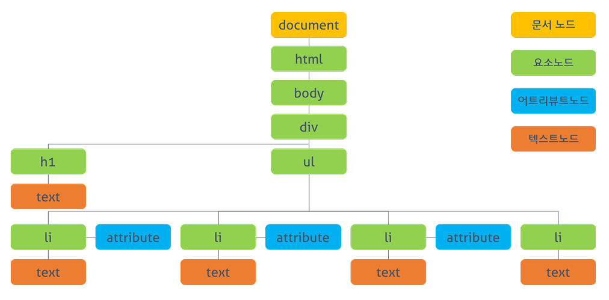

# DOM ( Document Object Model )

- [DOM](#dom)
- [요소 노드 접근](#요소-노드-접근)
  - [id 속성을 이용한 접근](#id-속성을-이용한-접근)
  - [class 속성을 이용한 접근](#class-속성을-이용한-접근)
  - [태그 이름을 이용한 접근](#태그-이름을-이용한-접근)
  - [CSS 선택자를 이용한 접근](#css-선택자를-이용한-접근)
- [노드 탐색 접근](#노드-탐색-접근)
  - [공백 텍스트 노드](#공백-텍스트-노드)
  - [자식 노드 탐색 접근](#자식-노드-탐색-접근)
  - [부모 노드 탐색 접근](#부모-노드-탐색-접근)
  - [형제 노드 탐색 접근](#형제-노드-탐색-접근)
- [요소 노드 내부 텍스트 제어]()
  - [nodeValue]()
  - [textContent]()
  - [innerText]()
  - [innerHTML]()
  - [outerHTML]()
  - [insertAdjacentHTML]()
- [DOM 컨텐츠 제어]()
  - [노드 생성]()
  - [노드 추가]()
  - [노드 삽입]()
  - [노드 이동]()
  - [노드 교체]()
  - [노드 삭제]()
  - [노드 복사]()
- [속성(Attribute) 제어]()
- [스타일(Style) 제어]()
- [DOM 표준]()


<br />
<br />
<br />
<br />
<br />


## DOM

브라우저의 렌더링 엔진은 HTML 문서를 로드한 후 파싱하여 브라우저가 이해할 수 있는 구조로 구성하여 메모리에 적재하는데 이를 `DOM(Document Object Model)`이라 한다. 여기서 구성된 구조는 모든 요소와 요소의 속성, 컨텐츠를 각각의 **객체로 만들어 부자 관계를 표현할 수 있는 구조**로 `DOM Tree`라고 한다.

이 `DOM`은 자바스크립트를 통해 동적으로 제어할 수 있는데, 일반적으로 프로퍼티와 메서드를 갖는 자바스크립트 객체로 제공된다. 이를 `DOM API`라고 부른다. 즉, `DOM API`는 `DOM`에 접근하고 변경할 수 있는 프로퍼티와 메서드의 집합이다.

#### HTML 문서
```html
<!DOCTYPE html>
<html lang="ko">
<head>
  <style>
    .red  { color: #ff0000; }
    .blue { color: #0000ff; }
  </style>
</head>
<body>
  <div>
    <h1>Cities</h1>
    <ul>
      <li id="one" class="red">Seoul</li>
      <li id="two" class="red">London</li>
      <li id="three" class="red">Newyork</li>
      <li id="four">Tokyo</li>
    </ul>
  </div>
</body>
</html>
```

#### DOM Tree


위 사진(PoiemaWeb | DOM 참조)에서 보듯이 `DOM Tree`는 각각의 노드(객체)로 구성된다. 노드의 종류는 12가지 정도가 있는데, 이 중에서 대표적을 4가지 종류로 구성된다.

- 문서노드(document node) : 문서 전체를 대표하는 최상위 노드
- 요소노드(element node) : HTML 태그
- 속성노드(attribute node) : 태그의 속성
- 텍스트노드(text node) : 태그 내의 텍스트를 표현하는 최종 노드


<br />
<br />
<br />
<br />


## 요소 노드 접근

HTML의 구조나 내용 또는 스타일 등을 자바스크립트를 통해 동적으로 제어하려면 먼저 요소 노드에 접근해야한다. 접근 방법에는 여러가지 방법이 있다. 그리고 요소 노드에 접근할 땐 문서 전체에서 접근할 수 있고, 지정한 요소 노드를 통해서 접근할 수도 있다.

<br />

### id 속성을 이용한 접근

HTML에서 해당 `id 속성 값을 가진 요소 노드`를 찾아서 **반환**한다. 여러개가 선택된 경우, 첫번째 요소만 반환한다.

```html
<!DOCTYPE html>
<html lang="ko">
<head>
  <meta charset="UTF-8">
  <meta name="viewport" content="width=device-width, initial-scale=1.0">
  <title>쇼핑목록</title>
</head>
<body>
  <h1>쇼핑 목록</h1>
  <p>마트에서 사야할 목록</p>
  <ul id="buy-list" class="list">
    <li>두부</li>
    <li>계란</li>
    <li>라면</li>
  </ul>
</body>
</html>
```

```javascript
const buyList = document.getElementById('buy-list');
console.log(buyList);
/*
  <ul id="buy-list" class="list">
    <li>두부</li>
    <li>계란</li>
    <li>라면</li>
  </ul>
*/
```

<br />

### class 속성을 이용한 접근

HTML에서 해당 `class 속성 값을 가진 모든 요소 노드`를 찾아서 유사 배열 객체(HTMLCollection) 형태로 **반환**한다.

```html
<!DOCTYPE html>
<html lang="ko">
<head>
  <meta charset="UTF-8">
  <meta name="viewport" content="width=device-width, initial-scale=1.0">
  <title>쇼핑목록</title>
</head>
<body>
  <h1>쇼핑 목록</h1>
  <p>마트에서 사야할 목록</p>
  <ul class="list">
    <li>두부</li>
    <li>계란</li>
    <li>라면</li>
  </ul>
  <ul class="list">
    <li>두부</li>
    <li>계란</li>
    <li>라면</li>
  </ul>
  <ul class="list">
    <li>두부</li>
    <li>계란</li>
    <li>라면</li>
  </ul>
</body>
</html>
```

```javascript
// <ul class="list"> 요소 노드가 하나만 있을 경우
const list = document.getElementsByClassName('list');
console.log(list); // HTMLCollection [ul.list]

// <ul class="list"> 요소 노드가 여러개가 있을 경우
const list = document.getElementsByClassName('list');
console.log(list); // HTMLCollection(3) [ul.list, ul.list, ul.list]

// 여러개가 있을 경우 인덱스로 요소 노드를 선택할 수 있다.
const list = document.getElementsByClassName('list')[0];
console.log(list);
/*
  <ul class="list">
    <li>두부</li>
    <li>계란</li>
    <li>라면</li>
  </ul>
*/
```

<br />

### 태그 이름을 이용한 접근

문서 전체 또는 지정한 요소 노드에서 `태그명에 해당하는 하위 모든 요소 노드`를 유사 배열 객체(HTMLCollection) 형태로 **반환**한다.

```html
<!DOCTYPE html>
<html lang="ko">
<head>
  <meta charset="UTF-8">
  <meta name="viewport" content="width=device-width, initial-scale=1.0">
  <title>쇼핑목록</title>
</head>
<body>
  <h1>쇼핑 목록</h1>
  <p>마트에서 사야할 목록</p>
  <ul id="buy-list" class="list">
    <li>두부</li>
    <li>계란</li>
    <li>라면</li>
  </ul>
  <ul>
    <li>1</li>
    <li>2</li>
    <li>3</li>
    <li>4</li>
  </ul>
</body>
</html>
```

```javascript
// 문서 전체
const liList = document.getElementsByTagName('li');
console.log(liList); // HTMLCollection(7) [li, li, li, li, li, li, li]

// 지정한 요소 노드
const buyList = document.getElementById('buy-list');
const liList = buyList.getElementsByTagName('li'); // HTMLCollection(3) [li, li, li]
```

<br />

### CSS 선택자를 이용한 접근

#### document.querySelector(selector)

`CSS에서 사용하는 노드 선택 구문인 셀렉터를 사용하여 지정한 셀렉터에 해당하는 요소 노드`를 찾아서 **반환**한다. 여러개가 선택된 경우, 첫번째 요소만 반환한다.

#### document.querySelectorAll(selector)

`지정한 셀렉터의 요소 노드`를 찾아서 유사 배열 객체(NodeList) 형태로 **반환**한다.

```html
<!DOCTYPE html>
<html lang="ko">
<head>
  <meta charset="UTF-8">
  <meta name="viewport" content="width=device-width, initial-scale=1.0">
  <title>쇼핑목록</title>
</head>
<body>
  <h1>쇼핑 목록</h1>
  <p>마트에서 사야할 목록</p>
  <ul class="list">
    <li>두부</li>
    <li>계란</li>
    <li>라면</li>
    <li>두부</li>
    <li>계란</li>
    <li>라면</li>
  </ul>
  <ul id="buy-list" class="list">
    <li>두부</li>
    <li>계란</li>
    <li>라면</li>
  </ul>
</body>
</html>
```

```javascript
const buyList = document.querySelector('#buy-list');
console.log(buyList);
/*
  <ul id="buy-list" class="list">
    <li>두부</li>
    <li>계란</li>
    <li>라면</li>
  </ul>
*/

// 여러개가 선택된 경우, 첫번째 요소만 반환한다.
const buyList = document.querySelector('.list');
console.log(buyList);
/*
  <ul class="list">
    <li>두부</li>
    <li>계란</li>
    <li>라면</li>
    <li>두부</li>
    <li>계란</li>
    <li>라면</li>
  </ul>
*/

// 여러개가 선택된 경우, 첫번째 요소만 반환한다.
const liList = document.querySelector('li');
console.log(liList);
/*
  <li>두부</li>
*/

// 다양한 셀렉터 사용 가능
const liList = document.querySelector('#buy-list > li:nth-child(2)');
console.log(liList);
/*
  <li>계란</li>
*/


// querySelectorAll
const buyList = document.querySelectorAll('#buy-list');
console.log(buyList); // NodeList [ul#buy-list.list]

const buyList = document.querySelectorAll('.list');
console.log(buyList); // NodeList(2) [ul.list, ul#buy-list.list]

// 여러개가 있을 경우 인덱스로 요소 노드를 선택할 수 있다.
const buyList = document.querySelectorAll('.list')[0];
console.log(buyList);
/*
  <ul class="list">
    <li>두부</li>
    <li>계란</li>
    <li>라면</li>
    <li>두부</li>
    <li>계란</li>
    <li>라면</li>
  </ul>
*/

const liList = document.querySelectorAll('li');
console.log(liList); // NodeList(9) [li, li, li, li, li, li, li, li, li]

// 여러개가 있을 경우 인덱스로 요소 노드를 선택할 수 있다.
const liList = document.querySelectorAll('li')[0];
console.log(liList);
/*
  <li>두부</li>
*/

// 지정한 요소 노드
const buyList = document.querySelector('#buy-list');
const buyliList = buyList.querySelectorAll('li');
console.log(buyliList); // NodeList(3) [li, li, li]
```


<br />
<br />


## 노드 탐색 접근

요소 노드에 접근한 다음 해당 요소 노드를 기점으로 `DOM tree`의 노드를 옮겨 다니며 부모, 형제, 자식 노드 등을 탐색하여 접근할 수 있다.

<br />

### 공백 텍스트 노드

HTML 마크업을 할 때 요소 사이의 스페이스, 탭, 줄바꿈(개행) 등의 공백 문자는 공백 텍스트 노드를 생성한다. 노드를 탐색할 때 공백 텍스트 노드를 탐색하는 걸 주의해야 한다.

```html
<ul id="buy-list" class="list">
  <li>두부</li>
  <li>계란</li>
  <li>라면</li>
</ul>
```

`<ul id="buy-list" class="list">` 태그 다음에 `<li>두부</li>` 요소 노드가 아니라, 엔터와 탭을 이용해 생긴 공백에 대한 `공백 텍스트 노드`가 생성된다.

<br />

### 자식 노드 탐색 접근

```html
<ul id="buy-list" class="list">
  <li>두부</li>
  <li>계란</li>
  <li>라면</li>
</ul>
```

```javascript
// #buy-list
const buyList = document.getElementById('buy-list');
```

#### childNodes

`텍스트 노드를 포함한 모든 자식 노드`를 탐색하여 유사 배열 객체(NodeList) 형태로 **반환**한다.

```javascript
console.log(buyList.childNodes);
// NodeList(7) [text, li, text, li, text, li, text]
// 여기서 text의 값은 "\n    " 줄바꿈과 스페이스의 공백 문자를 포함하는 텍스트 노드이다.
```

#### children

`자식 요소 중에서 Element type 요소 노드`만 탐색하여 유사 배열 객체(HTMLCollection) 형태로 **반환**한다.

```javascript
console.log(buyList.children); // HTMLCollection(3) [li, li, li]
```

#### firstChild, lastChild

텍스트 노드를 포함한 모든 자식 요소 노드 중 `첫번째 자식 노드 또는 마지막 자식 노드`를 **탐색하여 반환**한다.

```javascript
console.log(buyList.firstChild); // #text, "\n    " 공백 텍스트 노드를 반환한다.

console.log(buyList.lastChild); // #text, "\n  " 공백 텍스트 노드를 반환한다.
```

#### firstElementChild, lastElementChild

자식 요소 중 `Element type 요소 노드`에서 `첫번째 자식 요소 노드 또는 마지막 자식 요소 노드`를 **탐색하여 반환**한다.

```javascript
console.log(buyList.firstElementChild); // <li>두부</li>

console.log(buyList.lastElementChild); // <li>라면</li>
```

#### 자식 요소 노드 존재 확인

```javascript
// hasChildNodes(), 텍스트 노드를 포함하여 자식 요소 노드의 존재 확인
console.log(buyList.hasChildNodes()); // true

// childElementCount, 텍스트 노드를 포함하지 않고 자식 요소 노드의 존재 확인
console.log(buyList.childElementCount); // 3

// children.length, 텍스트 노드를 포함하지 않고 자식 요소 노드의 존재 확인
console.log(buyList.children.length); // 3
```

<br />

### 부모 노드 탐색 접근

```html
<ul id="buy-list" class="list">
  <li>두부</li>
  <li>계란</li>
  <li>라면</li>
</ul>
```

```javascript
// #buy-list
const buyList = document.getElementById('buy-list');

// <li>두부</li>
const firstLi = buyList.firstElementChild;
```

#### parentNode

모든 부모 노드를 탐색할 수 있으며, `부모 노드`를 **탐색하여 반환**한다. `<html>`의 부모인 `#document`(문서 전체)도 반환한다.

```javascript
console.log(firstLi.parentNode);
/*
  <ul id="buy-list" class="list">
    <li>두부</li>
    <li>계란</li>
    <li>라면</li>
  </ul>
*/
```

#### parentElement

부모가 요소인 경우에만 탐색할 수 있으며, `부모 요소 노드`만 **탐색하여 반환**한다.

```javascript
console.log(firstLi.parentElement);
/*
  <ul id="buy-list" class="list">
    <li>두부</li>
    <li>계란</li>
    <li>라면</li>
  </ul>
*/
```

<br />

### 형제 노드 탐색 접근

```html
<ul id="buy-list" class="list">
  <li>두부</li>
  <li>계란</li>
  <li>라면</li>
</ul>
```

```javascript
// #buy-list
const buyList = document.getElementById('buy-list');

// <li>두부</li>
const firstLi = buyList.firstElementChild;
```

#### previousSibling

부모 노드가 같은 **텍스트 노드를 포함한 형제 노드 중에서** 자신의 `이전 형제 노드`를 **탐색하여 반환**한다.

```javascript
console.log(firstLi.previousSibling); // #text, "\n    " 공백 텍스트 노드를 반환한다.
```

#### nextSibling

부모 노드가 같은 **텍스트 노드를 포함한 형제 노드 중에서** 자신의 `다음 형제 노드`를 **탐색하여 반환**한다.

```javascript
console.log(firstLi.nextSibling); // #text, "\n    " 공백 텍스트 노드를 반환한다.
```

#### previousElementSibling

부모 노드가 같은 **형제 요소 노드 중에서** 자신의 `이전 형제 노드`를 **탐색하여 반환**한다.

```javascript
console.log(firstLi.previousElementSibling); // null, 앞에 형제 요소 노드가 없다.
```

#### nextElementSibling

부모 노드가 같은 **형제 요소 노드 중에서** 자신의 `다음 형제 노드`를 **탐색하여 반환**한다.

```javascript
console.log(firstLi.nextElementSibling); // <li>계란</li>
```


<br />
<br />


## 요소 노드 내부 컨텐츠 제어

```html
<ul id="buy-list" class="list">
  <li>두부</li>
  <li>계란</li>
  <li>라면 <span hidden>안성탕면</span></li>
  <!-- <span hidden> 요소는 브라우저상에서 보이지 않는다. -->
</ul>
```

<br />

### nodeValue

요소의 텍스트는 텍스트 노드에 저장되어 있다. 이 텍스트에 접근하기 위해서는 다음과 같은 수순이 필요하다.

```javascript
// 요소 노드를 선택한다.
const liElem = document.querySelectorAll('#buy-list > li')[1];
console.log(liElem); // <li>계란</li>

// 텍스트 노드를 선택한다.
const liElemTextNode = liElem.firstChild;
console.log(liElemTextNode); // "계란"

// 텍스트 노드의 값에 접근할 수 있다.
console.log(liElemTextNode.nodeValue); // 계란

// 텍스트 내용 수정도 가능하다.
liElemTextNode.nodeValue = '새우';
console.log(liElem); // <li>새우</li>
console.log(liElemTextNode.nodeValue); // 새우
```

<br />

### textContent

요소의 텍스트 노드의 값에 접근하거나 수정할 수 있다.

```javascript
// 요소 노드를 선택
const liElem = document.querySelectorAll('#buy-list > li')[2];
console.log(liElem); // <li>라면 <span hidden>안성탕면</span></li>

// 텍스트 노드의 값에 접근
console.log(liElem.textContent); // 라면 안성탕면

// 텍스트 내용 수정
liElem.textContent = '국수';
console.log(liElem); // <li>국수</li>
console.log(liElem.textContent); // 국수
```

<br />

### innerText

요소의 텍스트 노드의 값에 접근하거나 수정할 수 있다. 하지만, `hidden` 속성을 가진 요소는 조회하지 않는다. 이러한 이유로 잘 사용되지 않는다.

```javascript
// 요소 노드를 선택
const liElem = document.querySelectorAll('#buy-list > li')[2];
console.log(liElem); // <li>라면 <span hidden>안성탕면</span></li>

// 텍스트 노드의 값에 접근
console.log(liElem.innerText); // 라면

// 텍스트 내용 수정
liElem.innerText = '국수';
console.log(liElem); // <li>국수</li>
console.log(liElem.innerText); // 국수
```

<br />

### innerHTML

해당 요소의 모든 자식 요소를 포함하는 모든 컨텐츠에 접근하거나 수정할 수 있다. `요소 자신은 제외`한다.

```javascript
// 요소 노드를 선택
const buyList = document.querySelector('#buy-list');
console.log(buyList);
/*
  <ul id="buy-list" class="list">
    <li>두부</li>
    <li>계란</li>
    <li>라면 <span hidden>안성탕면</span></li>
  </ul>
*/

// 공백 텍스트 노드, 요소 노드를 포함한 내부의 모든 컨텐츠에 접근할 수 있다.
console.log(buyList.innerHTML);
/* 

    <li>두부</li>
    <li>계란</li>
    <li>라면 <span hidden>안성탕면</span></li>
  
*/

// 텍스트 노드의 부모 요소 노드
const lastLi = buyList.lastElementChild;
console.log(lastLi); // <li>라면 <span hidden="">안성탕면</span></li>
console.log(lastLi.innerHTML); // 라면 <span hidden="">안성탕면</span>
```

<br />

### outerHTML

해당 요소의 모든 자식 요소를 포함하고 `요소 자신까지 포함`한 컨텐츠에 접근하거나 수정할 수 있다.

```javascript
// 요소 노드를 선택
const buyList = document.querySelector('#buy-list');
console.log(buyList);
/*
  <ul id="buy-list" class="list">
    <li>두부</li>
    <li>계란</li>
    <li>라면 <span hidden>안성탕면</span></li>
  </ul>
*/

// 자신을 포함한 공백 텍스트 노드, 요소 노드를 포함한 컨텐츠에 접근할 수 있다.
console.log(buyList.outerHTML);
/* 
<ul id="buy-list" class="list">
    <li>두부</li>
    <li>계란</li>
    <li>라면 <span hidden="">안성탕면</span></li>
  </ul>
*/

// 텍스트 노드의 부모 요소 노드
const lastLi = buyList.lastElementChild;
console.log(lastLi); // <li>라면 <span hidden="">안성탕면</span></li>
console.log(lastLi.outerHTML); // <li>라면 <span hidden="">안성탕면</span></li>
```

<br />

### insertAdjacentHTML(position, string)

매개변수로 전달 받은 **문자열을 HTML로 파싱하고 그 결과로 생성된 노드**를 `DOM tree`의 **지정된 위치에 삽입**한다. 첫번째 매개변수는 삽입 위치, 두번째 매개변수는 문자열을 받는다.

```html
<!-- 매개변수로 올 수 있는 삽입 위치 값 -->

<!-- beforebegin -->
<li>
  <!-- afterbegin -->
  두부
  <!-- beforeend -->
</li>
<!-- afterend -->
```

```javascript
// 요소 노드를 선택
const firstLi = document.querySelector('#buy-list > li:first-child');
console.log(firstLi); // <li>두부</li>

firstLi.insertAdjacentHTML('beforeend', ' <span>순두부</span>');
console.log(firstLi); // <li>두부 <span>순두부</span></li>
```


<br />
<br />


## DOM 컨텐츠 제어


<br />
<br />
<br />
<br />
<br />
<br />
<br />
<br />
<br />
<br />
<br />
<br />
<br />
<br />
<br />
<br />
<br />
<br />
<br />
<br />
<br />
<br />

브라우저는 웹서버에서 다운로드 받은 텍스트 기반의 HTML 문서를 파싱하면서 HTML 문서의 각 구성 요소를 트리구조의 객체로 만들어 자바스크립트로 제공

객체를 만든다는건 속성과 메서드를 만든다는 것

만약 li 태그로 만든 텍스트 문자를 찾는다면 찾기 어렵다.. 하지만 객체로 접근한다면 손쉽다.

Document -> Object Model -> 브라우저

요소노드는 태그노드를 뜻함

// 단수 복수
getElementByIdgetElementsByTagName

innerHTML을 많이 쓴다.

Create 회원 가입
Read 회원 정보
Update 회원 정보 수정
Delete 회원 탈퇴
=> CRUD


표준이 아닌 속성은 data- 형식으로 사용하는게 좋다.
format 같은 것은 표준 속성처럼 보이므로