# 라우팅용 특수 파일

- [loading](#loading)
- [error](#error)
- [not-found](#not-found)
- [route handler](#route-handler)
  - [Netlify 흐름도](#netlify-흐름도)
  - [Next.js 흐름도](#nextjs-흐름도)
  - [route handler 실습](#route-handler-실습)

 
 

## loading

- `loading` 파일을 만들어 두는 것 만으로도 내부적으로 `React Suspense`를 사용하여 컨텐츠가 로드되는 동안 대체할 컴포넌트로 사용된다.

  - `Next.js`는 `Page` 컴포넌트가 `async` 함수일 때 반환되는 `Promise`를 이용해서 로딩중인지(`pending`) 완료되었는지(`fulfilled, rejected`) 상태를 추적해서 `loading` 컴포넌트를 보여줄 수 있다.

  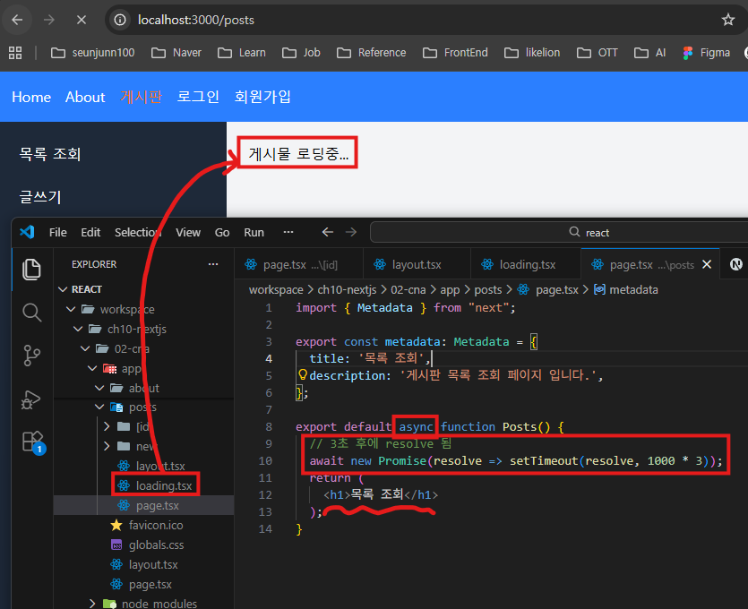

  - 3초 뒤에 `page`가 렌더링된다.

  - 로딩중 상태에서도 공통 레이아웃은 사용 가능하다.

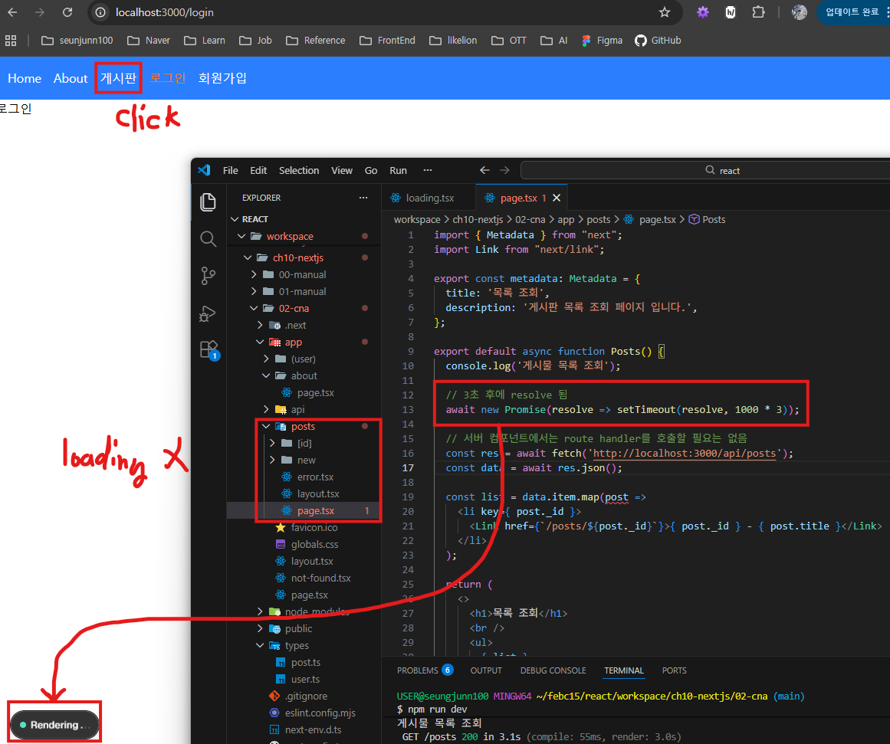

- 로딩 컴포넌트를 사용하지 않고 해당 페이지를 렌더링하게 되면, 3초동안은 아무 것도 렌더링되지 않는다.

- 사용자 입장에서 게시물 목록 조회 말고 게시물을 등록하기 위해 글쓰기 페이지에 들어가려고해도,
  
  -  3초 동안 기다린 후에 렌더링이 되고 들어가야 하므로 `UX` 측면에서 좋지 않다.

### 서스펜스를 이용한 스트리밍

- `SSR`을 사용하면 서버에서 페이지에 필요한 모든 데이터를 생성한 후 완성된 `HTML`을 전송하는데 까지 시간이 오래걸린다.

  - `<Suspense>`를 통해 스트리밍을 활성화하면 서버에서 레이아웃이나 중요 데이터를 먼저 전송할 수 있으며 클라이언트는 페이지의 일부를 더 빨리 표시할 수 있다.

  - 시간이 오래 걸리는 작업은 컨포넌트를 분리하고 `<Suspense>`로 감싸서 처리한다.

  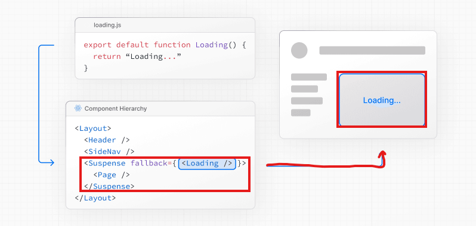

 
 

## error

- 정상적인 애플리케이션 흐름 중에 발생해서는 안 되는 버그나 문제를 처리하기 위해 사용한다.

- 컴포넌트 렌더링시 에러가 발생할 경우 `error` 파일에서 에러 처리 및 에러 `UI`를 보여준다.

  - 클라이언트 컴포넌트여야 한다.

- `posts` 하위의 `[id]` 페이지에서 에러가 발생했을 때 에러 파일이 없다면, 상위(`posts`)에 있는 에러 페이지를 렌더링하게 된다.

  - 하위의 파일들을 상위에서 한번에 해결할 수도 있다.

  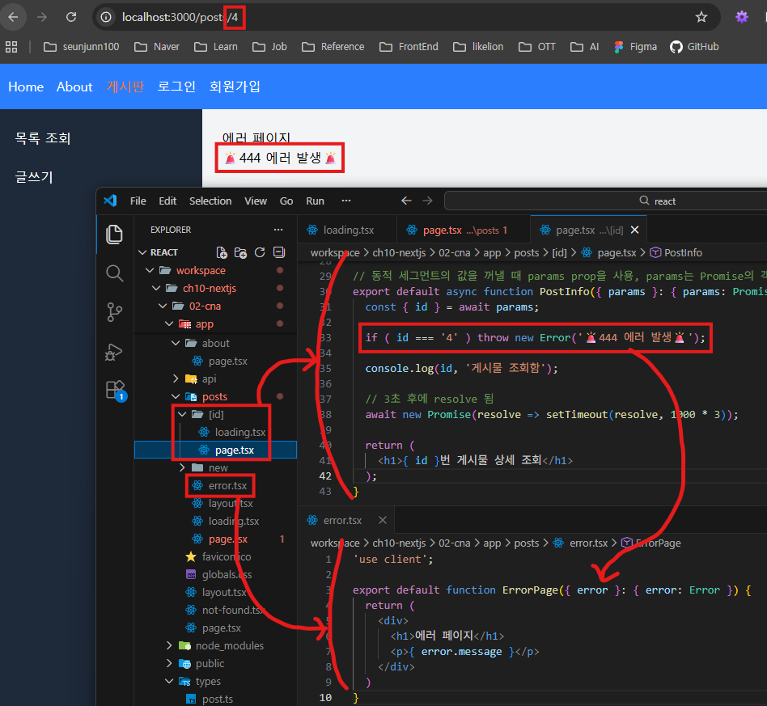

- `page`에서 에러가 발생할 경우 같은 폴더의 `error`에서 처리되고, `layout`에서 에러가 발생할 경우 상위 폴더의 `error`에서 처리된다.

  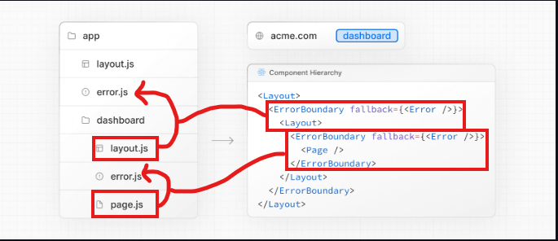

- 루트 레이이웃에서 에러가 발생할 경우 상위 폴더가 없으므로 에러 처리가 안되면,
  
  - 대신 `app/global-error.tsx` 파일에서 에러 처리

 
 

## not-found

- 해당 경로에서 `404`(페이지를 찾을 수 없음) 오류가 발생했을 때 보여줄 사용자 정의 `404` 페이지를 구현할 때 사용

- 이 파일이 존재하는 폴더 및 하위 경로에서 라우팅이 실패하거나, 서버 컴포넌트/서버 함수에서 `notFound()` 함수를 호출하면 자동으로 `not-found`에 정의된 `UI`가 렌더링됨

- 사용자에게 친절한 안내 메시지, 홈으로 이동 버튼 등 커스텀 `404` 화면을 제공하도록 작성

- 일반적으로 글로벌 `404` 처리를 위해 루트(`app`) 폴더에 `not-found` 파일을 둠

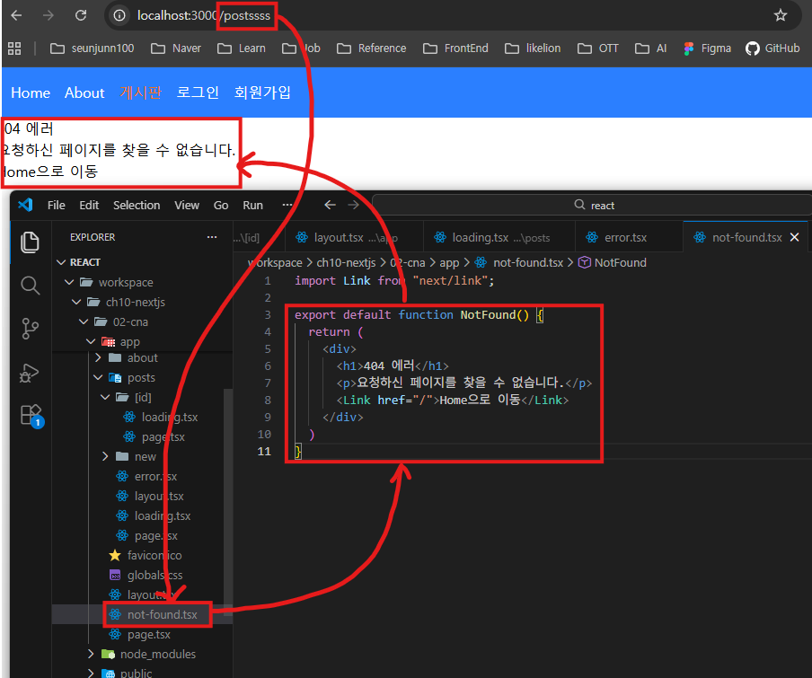

 
 

## route handler

- 서버에서 실행되고 데이터를 클라이언트에 반환하는 `API` 엔드포인트 생성

  - 클라이언트 컴포넌트에서 사용

  - 서버 컴포넌트에서는 직접 백엔드로부터 데이터를 가져오면 되므로 `route handler`를 호출할 필요 없음

- `route.js`, `route.ts` 이름으로 작성

- 외부 `API`를 호출할 때 `route handler`를 통해 호출하면 `API` 토큰 같은 민감한 정보를 클라이언트에 노출하지 않음

- `GET`, `POST`, `PUT`, `PATCH`, `DELETE`, `HEAD`, `OPTIONS` 메서드 지원

- 지원되지 않은 메서드 호출 시 405 Method Not Allowed 에러 응답

 

### Netlify 흐름도

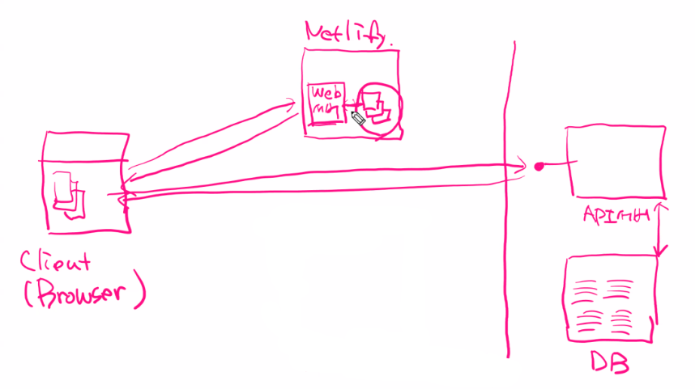

- `Netlify`에 배포하면 `HTML`, `JS`, `CSS` 같은 정적 파일들이 웹서버에 저장된다.

- 클라이언트(브라우저)는 페이지 요청 시 이미 만들어진 정적 파일을 전달받는다.

- 이 웹서버는 로직 실행 없이 요청에 대해 정해진 파일만 응답한다.

- 페이지가 렌더링되면서 브라우저에서 실행된 스크립트가 `API` 서버에 데이터 요청을 보낸다.

- `API` 서버는 `DB`에서 데이터를 조회해 다시 클라이언트에게 응답한다.

 

### Next.js 흐름도

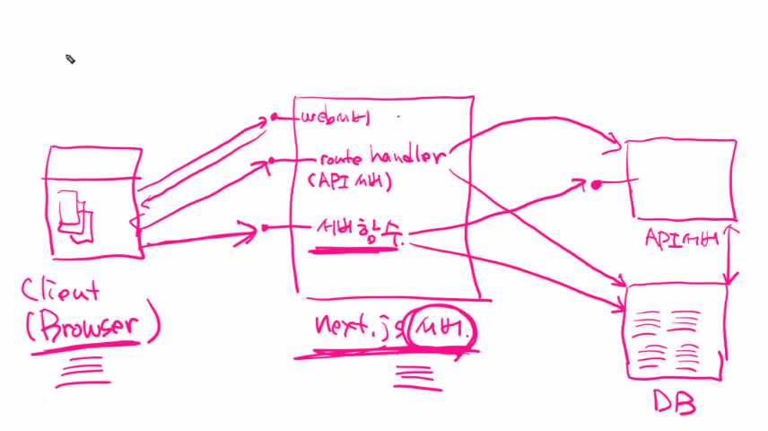

- `Next.js` 서버는 `Node.js` 기반 애플리케이션 서버이다.

- 단순 웹서버와 달리 요청에 대한 응답뿐 아니라, 데이터 가공, 추가 로직 처리가 가능하다.

- `Route Handler`를 사용하면 `Next.js` 안에서 `API` 서버를 직접 구현할 수 있다.

  - `DB`와 직접 연동할 수도 있고, 외부 `API` 서버와 연동할 수도 있다.

- 서버 함수를 통해 `API` 서버를 연동하던지 `DB`와 연동하던지 할 수 있다.

- 개발 시에는 `console.log`를 통해 코드가 클라이언트에서 실행되는지, 서버에서 실행되는지를 구분할 수 있어야 한다.

 

### route handler 실습

- GET 요청을 받는 `API` 엔드포인트를 생성

  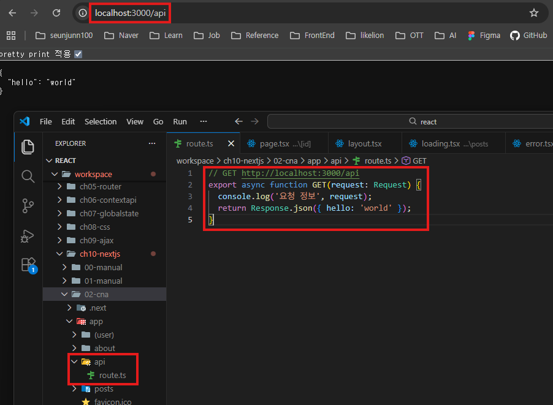

- 요청을 받아서 응답을 돌려주는 서버 코드

  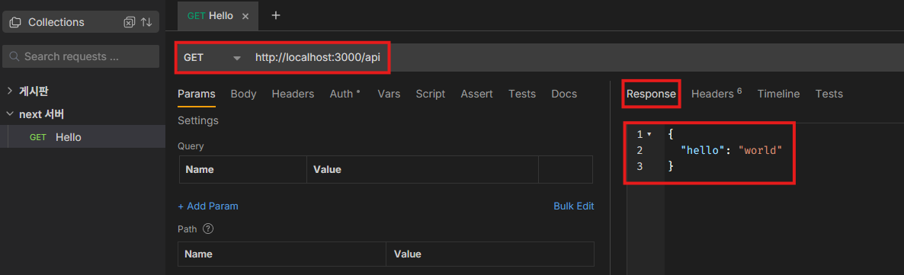

- 서버에서 동작한다.

  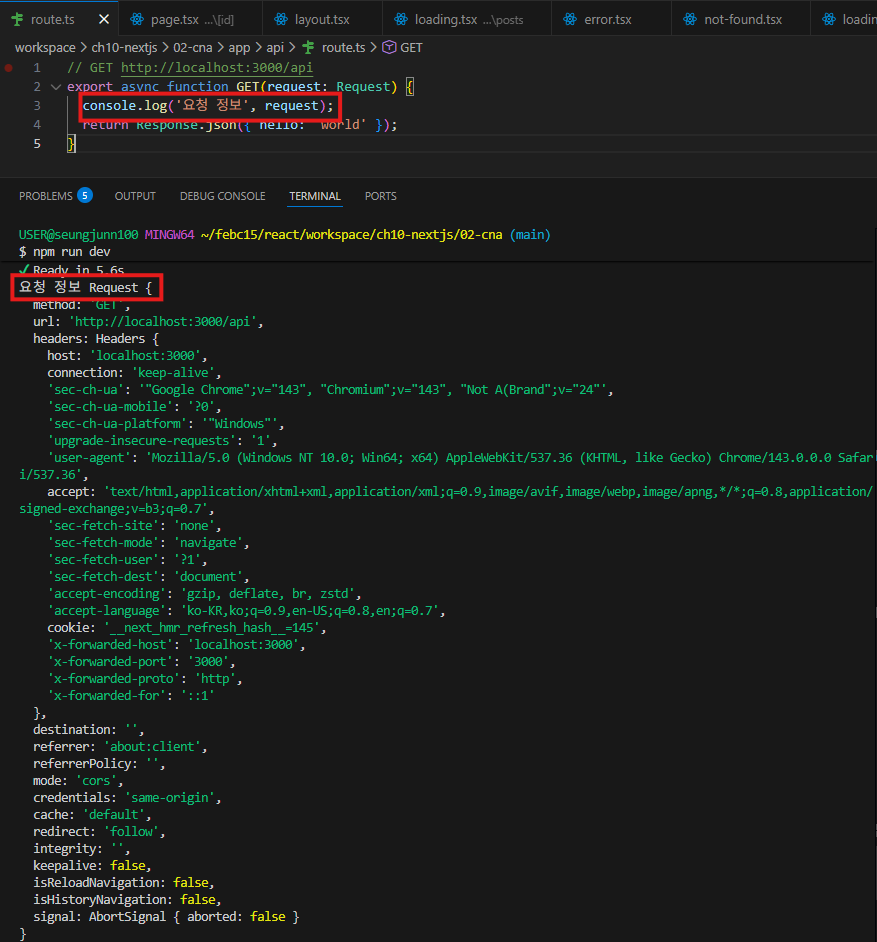

 

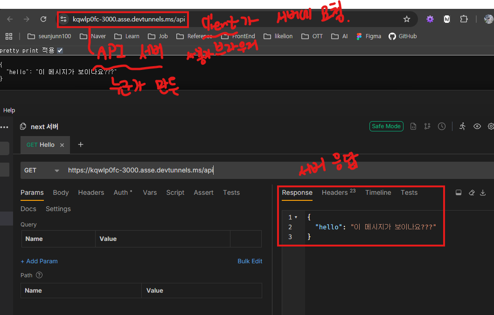
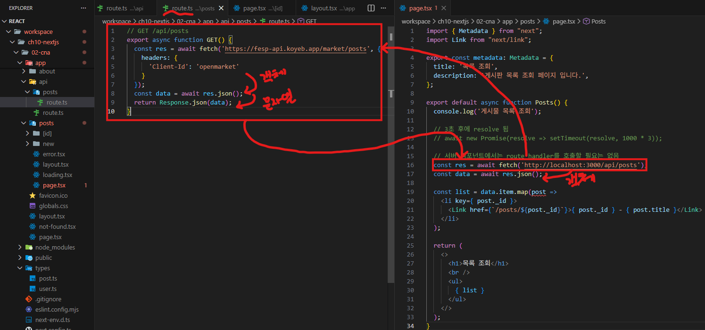

- 서버 컴포넌트에서 라우트 핸들러를 호출할 필요는 없다.

- 하지만 클라이언트 컴포넌트의 경우라면, 라우트 핸들러에서 외부 `API` 서버에 요청을 보낸다.

- 응답받은 값을 가공해서 사용해야 한다면 객체로 변환후 가공을 하고 다시 `HTTP` 응답용 `JSON` 문자열 형태로 변환 후 반환해주어야한다.

	- 가공하지 않아도 된다면 `res`를 바로 반환해도 된다.

 

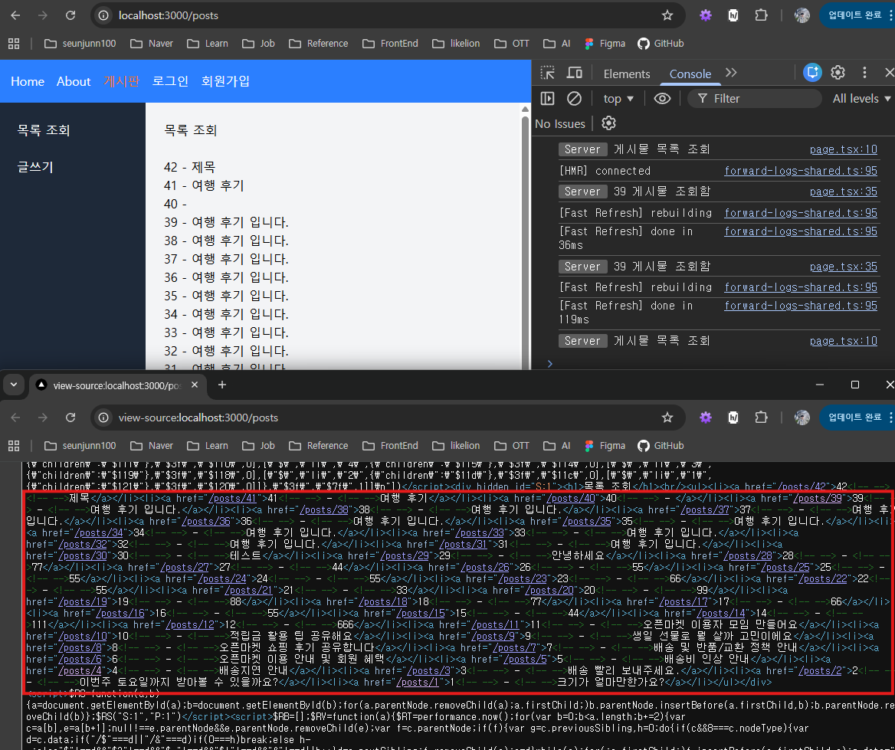

- `Next.js`에서는 서버 컴포넌트로 동작하므로 브라우저에 `HTML`이 이미 들어있다.

- 클라이언트 컴포넌트는 `JS` 실행에 의해 렌더링 되므로, `HTML` 소스에 코드는 존재하지 않는다.

 

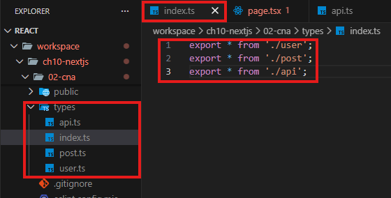

- 타입을 정의한 파일이 많다면 `index.ts` 파일에서 한번에 `export`할 수 있다.

 

#### API 서버와 통신 작업 - 서버 컴포넌트 전용

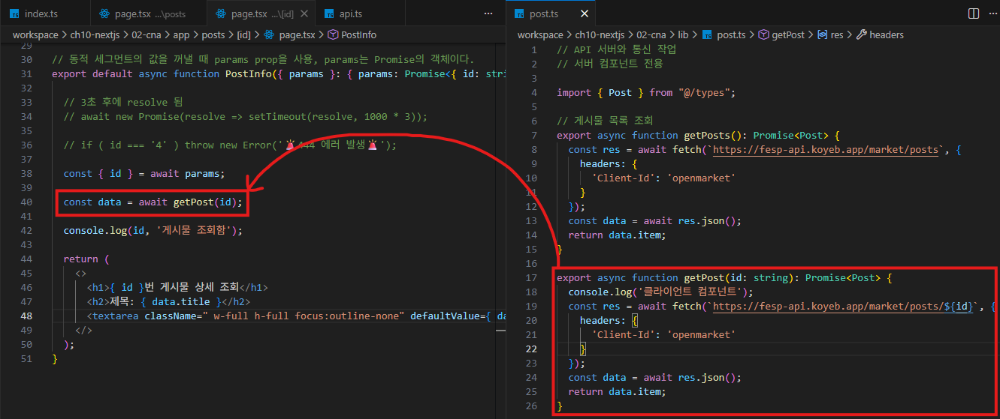

- 서버 컴포넌트는 라우트 핸들러를 거치지 않고 바로 API 서버와 통신한다.

- 서버 컴포넌트 안에 있는 `getPost` 함수는 서버에서 실행된다.

 

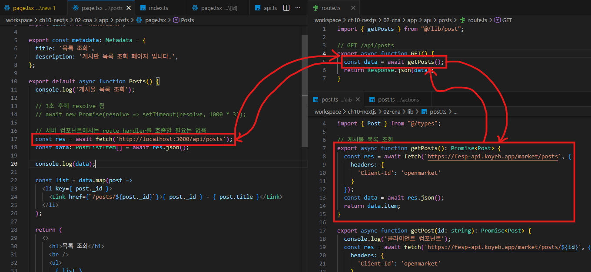

- 라우트 핸들러를 통해 외부 `API` 서버에 요청할 수도 있다.

- 서버 컴포넌트에서는 라우트 핸들러를 호출할 필요는 없다.

  - 클라이언트 컴포넌트에서 그대로 사용 가능하다.

 

#### API 서버와 통신 작업 - 클라이언트 컴포넌트 전용

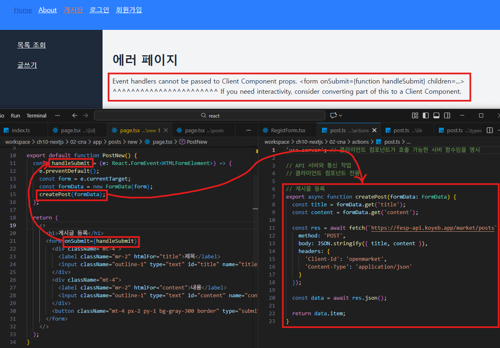

- 게시물을 등록하기 위해 버튼을 눌러 이벤트를 실행하여 `API` 서버에 요청을 보내야 한다.

- 하지만, 서버 컴포넌트에서는 사용자와 상호작용하는 핸들러는 브라우저에게 전달되지 않는다.

- 그래서 클라이언트 컴포넌트로 변경해주어야 한다.

 

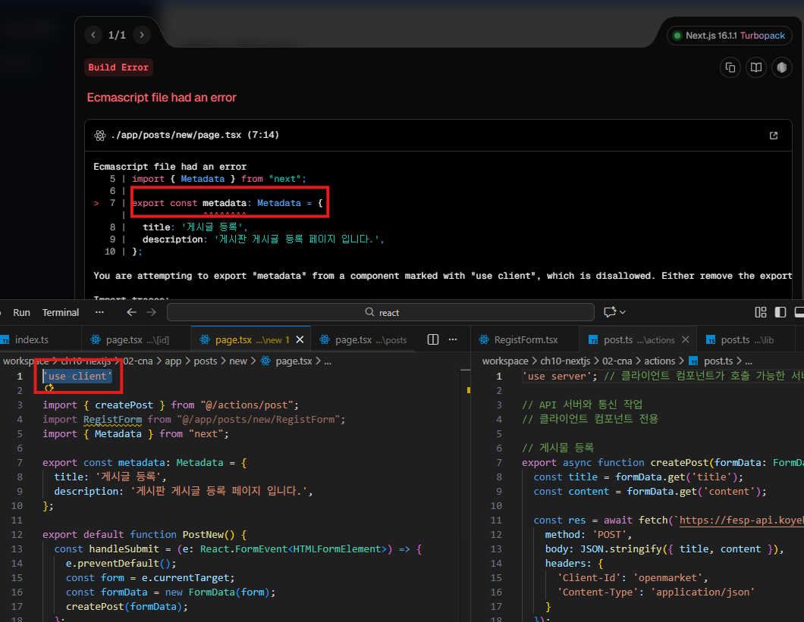

- `'use client'`를 명시해주어 클라이언트 컴포넌트로 동작하게 해주었지만,
  
  - `metadata`는 서버 컴포넌트에서만 동작할 수 있기 때문에 에러가 발생한다.

- 그래서 서버, 클라이언트 컴포넌트를 분리해서 사용해주어야 한다.

 

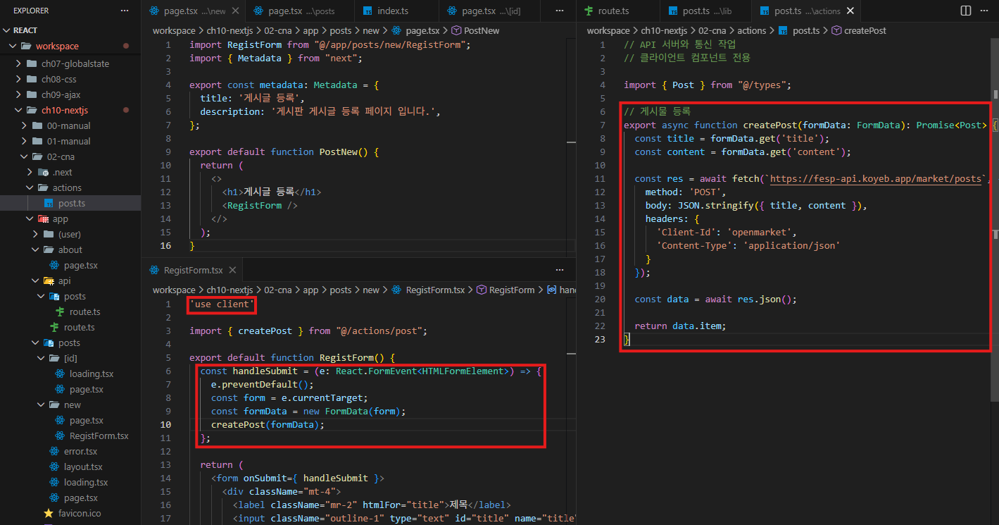

- 서버 컴포넌트와 클라이언트 컴포넌트를 분리하면 클라이언트 방식으로 동작하게 된다.

 

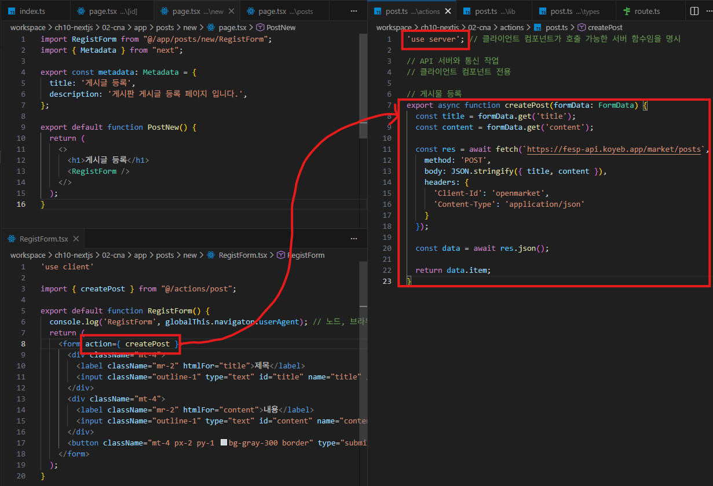

- 하지만, `API` 서버에 통신하는 함수를 서버 함수로 만들면,
  
  - 서버에서만 실행하게 되어 `API` 키를 숨겨서 동작하여 안전하게 사용할 수 있다.

- `'use server'`를 명시해 주면 이 함수는 브라우저로 내려가지 않고 서버에서만 동작하게 되는 서버 함수로 만들어 준다.

- 클라이언트 컴포넌트에서 해당 함수를 `<form action={createPost}>` 형식으로 사용 가능하다.
  
  - `submit`이 발생하면 `Next.js`가 내부적으로 `formData`를 수집해서 서버로 전송해주고 해당 서버 함수에서 전달받아 실행하여 동작하게 된다.