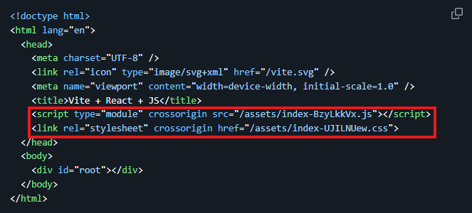

# 서버 컴포넌트, 클라이언트 컴포넌트

- [클라이언트와 서버](#클라이언트와-서버)
  - [렌더링](#렌더링)
  - [요청 - 응답 흐름](#요청---응답-흐름)
  - [네트워크 경계](#네트워크-경계)
- [렌더링 방식](#렌더링-방식-1)
  - [CSR(Client Side Rendering)](#csrclient-side-rendering)
  - [SSR(Server Side Rendering)](#ssrserver-side-rendering)
  - [RSC(React Server Component)](#rscreact-server-component)
  - [서버 컴포넌트(RSC)](#서버-컴포넌트rsc)
  - [클라이언트 컴포넌트](#클라이언트-컴포넌트)
  - [RSC를 활용한 렌더링 전략](#rsc를-활용한-렌더링-전략)

 
 

## 클라이언트와 서버

### 렌더링

- 리액트 컴포넌트를 호출해서 `HTML` 코드를 만드는 과정
  
  - 브라우저가 코드를 토대로 화면을 그린다.

#### 렌더링 환경

- 클라이언트 : 사용자의 웹 브라우저

- 서버 : 클라이언트의 요청을 받아서 응답을 주는 컴퓨터

#### 렌더링 방식

- `CSR (Client Side Rendering)` : 렌더링 주체가 클라이언트(브라우저)

- `SSR (Server Side Rendering)` : 렌더링 주체가 서버

 

### 요청 - 응답 흐름

1. 사용자

   주소 입력, 링크 클릭, `submit` 버튼 클릭 이벤트 발생

2. 클라이언트(브라우저)

   웹 브라우저가 요청 헤더, 바디 생성하여 `HTTP` 요청 전송

3. 서버

   클라이언트의 `HTTP` 요청을 분석해서 처리한 후, 헤더와 바디를 포함한 결과를 클라이언트로 응답

4. 클라이언트(브라우저)

   서버로부터 받은 응답 데이터를 해석하여 브라우저에 적절한 `UI`로 표시

5. 사용자

   페이지와 상호작용 할 수 있는 상태

 

### 네트워크 경계

실행 환경이 바뀌는 지점

- 브라우저

- 웹 서버

- `Next.js` 서버 (`Node.js`)

- `API` 서버

- `DB`

 
 

## 렌더링 방식

### CSR(Client Side Rendering)

- 리액트의 동작 방식으로 하나의 `HTML` 파일에서 동작되며, 
  
  - 모든 `CSS`, `JS` 파일들은 하나의 `CSS`, `JS` 파일로 합쳐져 동작하게된다.

- 클라이언트가 `HTML`을 파싱하면서 `CSS`, `JS` 파일을 요청하여 다운로드되면,

  - `JS` 파일에 정의된 컴포넌트에 의해 `HTML`을 생성하여 동적으로 화면을 렌더링한다.
    
    - 페이지가 하나인 웹 어플리케이션(`SPA`)으로 동작한다.

- 초기 `JS` 로딩에 시간이 걸림

- `SEO(Search Engine Optimization)` 안됨

 

### SSR(Server Side Rendering)

- 서버에서 `HTML`을 미리 만들어서 브라우저에 전송하는 방식으로, 초기 로딩 속도와 `SEO`를 개선할 수 있다.

- 초기 페이지 로드

   - 사용자가 사이트 접속 시 서버가 완성된 `HTML`을 생성해서 전송

- 정적 페이지 표시

   - 브라우저가 `HTML`을 받아 화면에 표시

   - 이 시점에서는 보이기만 하고 클릭 등의 동작은 안 됨

- 자바스크립트 다운로드

   - 백그라운드에서 상호작용에 필요한 `JS` 파일들을 다운로드

- 하이드레이션(`Hydration`)

   - 다운로드 받은 `JS`를 이용해서 가상 `DOM`을 만들어 브라우저 `DOM`과 동기화

     - 이벤트 리스너 등을 추가해 버튼 클릭 등이 가능해짐
     
       - 사용자와 상호작용이 가능해진 상태가 됨

- 일반 리액트 앱으로 동작

   - 하이드레이션 완료 후부터는 `CSR` 방식으로 작동

- 첫 페이지 로딩이 빨라짐

  - `CSR` : `JS` 다운로드 → `React` 렌더링 → 화면 표시

  - `SSR` : 완성된 `HTML` 즉시 전송 → 바로 화면 표시

- 효율적인 `SEO` 가능

  - 서버에서 보낸 `HTML`에 콘텐츠가 이미 포함되어 있음
  
  - 검색 엔진이 `JS` 실행 없이도 페이지 내용을 바로 수집 가능

 

### RSC(React Server Component)

`React 18`부터 도입된 새로운 컴포넌트 타입으로, 서버에서만 실행되는 컴포넌트

#### Next.js Pages Router 방식 (전통적인 SSR)

페이지 단위로 서버 렌더링

- 페이지 전체를 서버에서 `HTML`로 만들어 전송

- `getServerSideProps` 같은 특정 함수에서만 서버 작업(`DB` 조회, `API` 호출 등) 가능

  - 가져온 데이터는 `props`로 컴포넌트에 전달

- 페이지 일부만 동적이어도 전체를 매번 렌더링
  
  - 페이지 접속할 때마다 변하지 않는 헤더, 푸터 등 모든 컴포넌트를 서버에서 다시 렌더링

#### Next.js App Router 방식 (RSC)

컴포넌트 단위로 서버 렌더링 수행

- 관심사 분리

  - 페이지 : `UI` 구조만 담당

  - 각 컴포넌트 : 자신에게 필요한 데이터를 직접 가져옴

  - `props` 드릴링 없이 깔끔한 코드 구조

- 컴포넌트별 렌더링 전략 선택

  - `SSR(Server Side Rendering)` : 요청 시마다 서버에서 렌더링

  - `SSG(Static Site Generation)` : 빌드 시 정적 페이지 생성

  - `ISR(Incremental Static Regeneration)` : 정적 페이지를 주기적으로 재생성

- 페이지 내에서 자주 바뀌는 컴포넌트가 하나 있으면 해당 컴포넌트만 동적으로 렌더링하고 나머지는 정적으로 렌더링 가능

#### RSC 장점

- 백엔드 직접 접근 가능

  - 컴포넌트에서 바로 `DB`, `API` 호출
  
  - 서버와 `DB` 간 물리적으로 가까워 통신 속도가 빠름

- 민감한 정보를 클라이언트에 노출하지 않음

  - `API` 키, 액세스 토큰 등이 브라우저 코드에 포함되지 않음

  - 네트워크 탭에서도 확인 불가

- 효율적인 캐싱

  - 같은 요청은 `DB`/`API`에 다시 가지 않고 캐시 사용

  - 서버 자원 절약, 응답 속도 향상

- 자바스크립트 크기가 줄어듬

  - 서버 컴포넌트는 브라우저로 전송 안 됨

  - 전체 `HTML`을 기다릴 필요 없이 준비된 부분부터 보여줌

  - 사용자 경험 향상

- 초기 화면 표시(`FCP`)가 빨라짐

  - `FCP(First Contentful Paint)` : 페이지 로딩 후, 사용자에게 처음으로 의미 있는 콘텐츠가 보이는 시점

  - 서버가 HTML을 미리 만들어 전달

  - JS 실행 전에도 화면 표시 가능

- `SEO`에 유리

  - 완성된 `HTML`이 서버에서 내려옴

  - 검색 엔진이 `JS` 실행 없이도 콘텐츠 확인 가능

  - `FCP`는 구글 페이지 랭킹 요소 중 하나

- 렌더링 결과를 청크 단위로 분할해서 준비된 부분부터 스트리밍으로 전송

  - 전체 HTML을 다 기다릴 필요 없이 페이지 일부라도 먼저 보여줄 수 있음

- 컴포넌트 단위 자동 코드 분할
  
  - 필요한 JS만 내려보냄

 

### 서버 컴포넌트(RSC)

- `Next.js App Router`에서 모든 컴포넌트는 기본적으로 서버 컴포넌트

- 오직 서버에서만 실행 → 클라이언트로 자바스크립트 번들이 전송되지 않음

- 렌더링 결과물인 `RSC Payload`를 생성해서 클라이언트에 전달

#### 렌더링 과정

1. 라우트 세그먼트 분할 및 데이터 페칭

   - `URL`을 라우트 세그먼트 단위로 나눠 각각 렌더링 시작

     - `/posts/3` → `/posts`, `/3` 두 세그먼트로 분리

   - 각 세그먼트의 컴포넌트는 렌더링에 필요한 데이터를 `fetch`

   - `loading.tsx` 또는 `<Suspense>`가 있다면 데이터 로딩 중 `fallback UI`를 먼저 렌더링

   - 데이터 `fetch` 완료 후 결과를 스트리밍 방식으로 전송

2. `RSC Payload` 생성

   - 각 세그먼트의 렌더링 결과를 `RSC Payload`로 만듦

3. `HTML` 생성 (초기 접속 / 새로고침 시에만)

   - `RSC Payload`를 기반으로 `HTML` 생성

   - 서버 컴포넌트 → 서버에서만 실행되어 `HTML` 생성

   - 클라이언트 컴포넌트 → 서버에서도 실행되어 `HTML`에 포함되지만, 이벤트 핸들러는 포함되지 않음

4. 클라이언트에 전송

   - 초기 접속: `HTML` + `RSC Payload` 모두 전송

     - `HTML`은 브라우저가 즉시 렌더링 → 빠른 화면 표시

     - `RSC Payload`는 이후 하이드레이션에 사용

   - 이후 페이지 이동(`Link` 클릭 등): `RSC Payload`만 전송

     - 브라우저가 `RSC Payload`를 받아 DOM을 직접 업데이트

5. 하이드레이션 (클라이언트 컴포넌트가 있는 경우)

   - `RSC Payload`를 기반으로 필요한 클라이언트 컴포넌트 `JS` 번들 다운로드

   - 컴포넌트 실행 → 상태 초기화 (`useState`, `useActionState` 등)

   - `Virtual DOM` 생성 후 실제 브라우저 `DOM`과 동기화

   - 이벤트 핸들러 등록 → 인터렉션 가능한 상태가 됨

#### RSC Payload란

서버에서 렌더링된 컴포넌트 트리 정보를 담은 특수한 데이터 포맷

  - 컴포넌트 트리 구조 및 타입 정보

  - 클라이언트 컴포넌트가 들어갈 자리(`placeholder`)와 `JS` 번들 경로

  - 서버 → 클라이언트로 전달되는 `props` (직렬화)

  - `Suspense` 경계 및 스트리밍 청크 정보

#### 데이터 전송 방식

- 초기 접속/새로고침 : `HTML` + `RSC Payload` 모두 전송

- 페이지 이동(`Link` 클릭) : `RSC Payload`만 전송 (`HTML` 없음)

 

### 클라이언트 컴포넌트

- 파일 첫 줄에 `'use client'` 지시어 추가

- 서버와 클라이언트 양쪽에서 실행 (초기 `HTML` 생성 시 서버에서도 실행됨, 단 이벤트 핸들러 제외)

- 브라우저 `API`, 이벤트 처리, `useState`/`useEffect` 등이 필요할 때 사용

#### 핵심 특성

- 클라이언트 컴포넌트가 `import`하는 모든 자식 컴포넌트는 암묵적으로 클라이언트 컴포넌트가 됨

- 클라이언트 컴포넌트에서 서버 컴포넌트를 직접 `import`할 수 없고 `children`으로 전달해야 함

#### 하이드레이션 과정

1. `RSC Payload`를 기반으로 필요한 클라이언트 컴포넌트 `JS` 번들 다운로드

2. 컴포넌트 실행 → 상태 초기화 (`useState` 등)

3. `Virtual DOM` 생성 후 실제 `DOM`과 동기화

4. 이벤트 핸들러 등록 → 인터렉션 가능한 상태

 

### RSC를 활용한 렌더링 전략

- 정적 렌더링(`Static Rendering`)

  - `SSG(Static Site Generation)`

  - 빌드 시점에 서버 측에서 `HTML`을 생성하고 클라이언트 요청 시 미리 생성된 `HTML`을 바로 응답하므로 빠름

  - 데이터가 바뀌지 않는 정적인 페이지에 사용

- 동적 렌더링(`Dynamic Rendering`)

  - 클라이언트 요청 시 매번 `HTML`을 생성해서 응답하므로 느림

  - 최신 데이터를 반영해야 하거나 사용자 맞춤형 데이터가 있는 동적인 페이지에 사용

- 스트리밍(`Streaming`)

  - 서버의 작업이 완료되지 않더라도 응답이 여러 청크로 분할되어 클라이언트로 스트리밍 됨

  - 클라이언트는 전체 렌더링이 완료되기 전에 페이지의 일부를 즉시 볼 수 있음

  - 앱 라우터를 사용하면 기본으로 동작

- `ISR(Imcremental Static Regeneration)`

  - 정적으로 렌더링된 이후에 일정 시간이 지나면 다시 서버에서 렌더링 됨

    - `revalidate` 옵션 사용