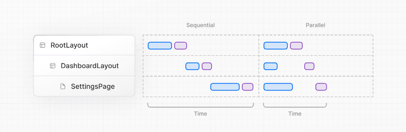

# Data Fetching

- [데이터를 가져오는 방법](#데이터를-가져오는-방법)
  - [](#)


<br />
<br />


## 데이터를 가져오는 방법

컴포넌트 종류에 따라 데이터를 가져올 수 있는 방법이 다르다.

<br />

### 서버 컴포넌트 (권장)

- `API` 서버 직접 호출

- 백엔드 코드 직접 작성 (풀스택)

- 서버에서 직접 데이터를 가져오기 때문에 `API` 키 등 민감한 정보가 클라이언트에 노출되지 않고, 
  
  - 서버와 데이터 리소스가 지리적으로 가까워 네트워크 지연도 줄어든다.

    - 가능하면 서버 컴포넌트에서 데이터를 가져오는 것이 좋다.

<br />

### 클라이언트 컴포넌트

- `API` 서버 직접 호출

- `route handler` 호출 → `route handler` 내부에서 `API` 서버 호출

- `서버 함수` 호출 → `서버 함수` 내부에서 `API` 서버 호출

- 클라이언트 컴포넌트에서 외부 `API`를 직접 호출하면 `API` 키가 브라우저에 노출될 수 있다. 
  
  - 이를 방지하려면 `route handler`나 `서버 함수`를 통해 서버를 경유하는 방식을 사용한다.

#### route handler란

- `app/api` 경로에 만드는 서버 측 `API` 엔드포인트

- 클라이언트가 직접 외부 `API`를 호출하는 대신 `route handler`를 거치면 민감한 정보를 서버에서만 관리할 수 있다.


<br />
<br />


## Next.js의 `fetch` 함수

표준 `fetch` `API`를 확장한 함수로, `GET` 요청에 대해 메모이제이션을 지원한다.

- 동일한 `URL`과 옵션으로 여러 컴포넌트에서 `fetch`를 호출해도 실제 요청은 한 번만 발생

- 각 컴포넌트가 필요한 데이터를 직접 `fetch`해도 성능에 영향 없음 → `props` 드릴링 불필요

- 메모이제이션된 데이터는 컴포넌트 트리 렌더링이 완료될 때까지 유지

- 단, `route handler`는 컴포넌트 트리의 일부가 아니므로 메모이제이션 적용 안됨


<br />
<br />


## `서버 함수`와 `서버 액션`

### `서버 함수`

`use server` 지시어로 정의되는 함수. 클라이언트 컴포넌트에서 서버의 비동기 함수를 호출할 수 있게 해준다.

#### 작동 원리

1. 빌드 시점에 프레임워크가 `서버 함수`에 대한 고유 식별자(`action ID`)를 생성해 클라이언트에 전달

2. 클라이언트에서 호출 시 이 식별자를 통해 서버로 네트워크 요청을 보냄

3. 서버에서 해당 식별자에 매핑된 실제 함수를 실행하고 결과를 반환

4. 실제 함수 코드는 서버에만 존재하며 클라이언트에는 노출되지 않음

#### 주요 특징

- 매개변수와 반환값은 직렬화 가능한 타입이어야 함 (`string`, `number`, `FormData`, `Array`, `Object` 등)

- 네트워크를 경유하는 호출이므로 대부분 `async` 함수로 작성

<br />

### `서버 액션`

`서버 함수` 중에서 `form`의 `action` `prop`으로 전달되거나 `form` 핸들러 내부에서 호출되는 함수.

- `POST`, `PUT`/`PATCH`, `DELETE` 등 서버의 데이터 변경 작업에 주로 사용

- `form` `submit` 시 입력값들이 `FormData` 객체로 자동 변환되어 첫 번째 인자로 전달됨

- 자바스크립트가 로드되기 전에도 폼 제출 가능 (로드 전 제출 시 하이드레이션 우선 처리)

- `submit` 이후 새로고침 없음

<br />

### 용어 구조

```
서버에서 실행되는 모든 함수
├── 일반 함수 ('use server' 없음)
│   └── 서버 컴포넌트 내부에서만 사용
└── 서버 함수 ('use server' 있음): 클라이언트 컴포넌트에서 호출하는 함수
    ├── 서버 액션 (form과 연관)
    │   ├── form의 action prop으로 직접 사용: <form action={serverFn}>
    │   ├── useActionState와 함께 사용
    │   └── useTransition과 함께 사용
    └── 나머지 (form과 무관, 직접 호출)
        └── 클라이언트 컴포넌트에서 직접 호출
```

<br />

### `서버 함수` 정의 방법

#### 인라인 수준 정의

- 서버 컴포넌트 내부에서 함수별로 `'use server'` 지시어 추가
- `props`로 클라이언트 컴포넌트에 전달 가능.

```tsx
export default function ServerComponent() {
  async function createPost() {
    'use server'
    await db.posts.create({ title: '새글' });
  }

  return (
    <form action={createPost}>
      <button type="submit">등록</button>
    </form>
  );
}
```

#### 모듈 수준 정의 (권장)

- 파일 첫 줄에 `'use server'` 지시어를 추가해 모든 `export` 함수를 `서버 함수`로 정의
- 재사용성이 높고 `props` 드릴링을 방지할 수 있어 권장된다.

```tsx
// actions/post.ts
'use server'

export async function createPost(formData: FormData) {
  const title = formData.get('title');
  const content = formData.get('content');
  const res = await fetch('https://example.com/api/posts', {
    method: 'POST',
    body: JSON.stringify({ title, content }),
    headers: { 'Content-Type': 'application/json' },
  });
  return res.json();
}
```

```tsx
// app/posts/new/RegistForm.tsx
'use client'
import { createPost } from '@/actions/post';

export default function RegistForm() {
  return (
    <form action={createPost}>
      <input type="text" name="title" />
      <input type="text" name="content" />
      <button type="submit">등록</button>
    </form>
  );
}
```


<br />
<br />


## 데이터 페칭 모범 사례



### 병렬 `fetch`

데이터 간 종속성이 없을 때 (권장)

```tsx
// 병렬 fetch - 두 요청이 동시에 시작됨
const artistData = getArtist(username);
const albumsData = getArtistAlbums(username);
const [artist, albums] = await Promise.all([artistData, albumsData]);
```

<br />

### 순차 `fetch`

이전 데이터가 다음 요청에 필요할 때

```tsx
// 순차 fetch - artist 조회 후 그 id로 playlists 조회
const artist = await getArtist(username);
const playlists = await getArtistPlaylists(artist.id);
```

```tsx
export default async function Page({ params: { username } }) {
  const artist = await getArtist(username);

  return (
    <>
      <h1>{artist.name}</h1>
      {/* artist 로딩 완료 후 Playlists는 자체적으로 fetch하며 로딩 상태 표시 */}
      <Suspense fallback={<div>Loading...</div>}>
        <Playlists artistID={artist.id} />
      </Suspense>
    </>
  );
}
```

- 순차 `fetch`는 폭포수(`waterfall`) 현상이 발생한다.

- `<Suspense>`로 감싸면 데이터를 기다리는 동안 전체 페이지가 블로킹되는 것을 방지할 수 있다.

<br />

### 스트리밍과 `Suspense` 활용


- 데이터가 필요 없는 부분은 즉시 렌더링하고, 데이터를 기다리는 부분은 `<Suspense>`로 감싸 로딩 상태를 표시한다. 

- 전체 로딩이 끝나기 전에도 이미 렌더링된 부분과 인터렉션이 가능해 사용자 경험이 향상된다.