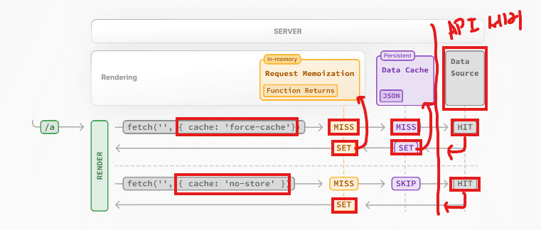
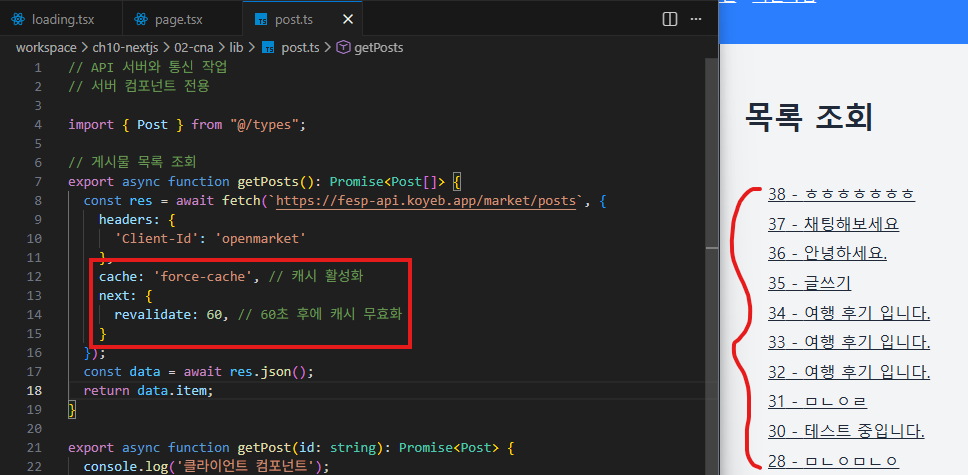
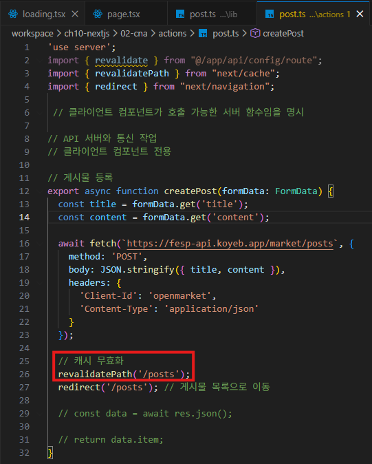
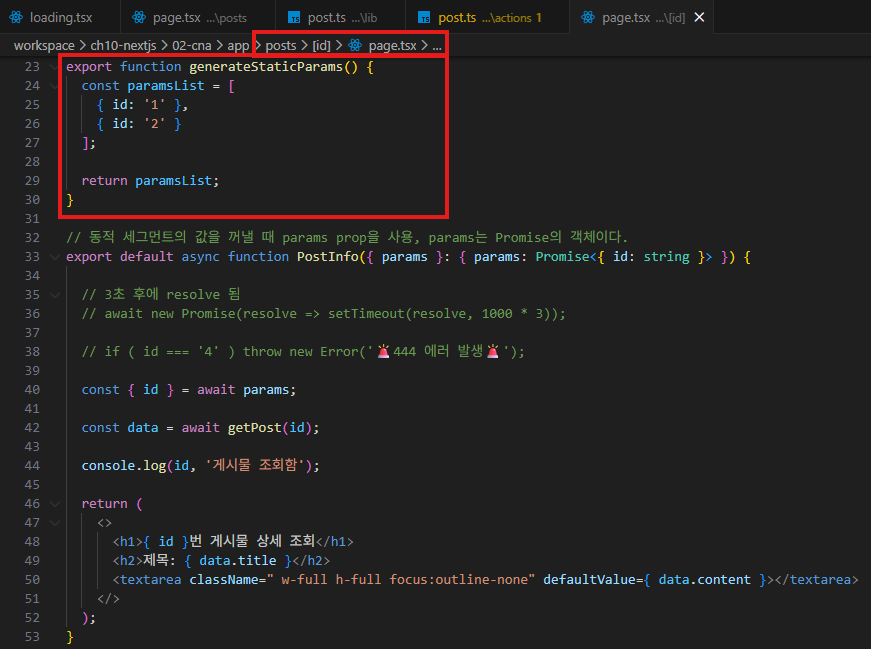
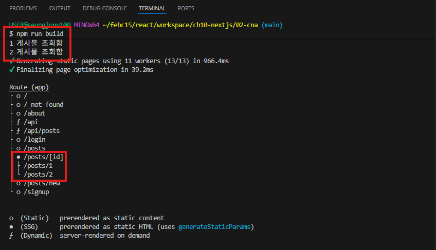
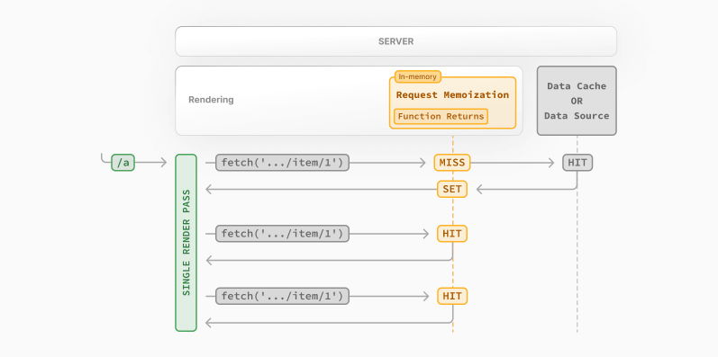

# 캐싱(Caching)

- [Data Cache](#data-cache)
  - [동작 흐름](#동작-흐름)
  - [Next.js의 fetch API](#nextjs의-fetch-api)
  - [캐시 재검증](#캐시-재검증)
- [Full Route Cache](#full-route-cache)
  - [generateStaticParams() 함수](#generatestaticparams-함수)
  - [export const dynamic 설정](#export-const-dynamic-설정)
- [Request Memoization](#request-memoization)


<br />
<br />


## Data Cache

`Next.js` 서버 내부에서 `fetch`한 데이터 결과를 저장해두고 재사용하는 캐시다.

- 동일한 데이터 요청을 여러 클라이언트가 보낼 때 빠른 응답을 하기 위함이다.

- 매 요청마다 `API`를 다시 호출하면, 서버 부하 + `API` 비용 + 응답 속도 등 성능이 떨어진다.

- 명시적으로 무효화하기 전까지 유지된다.

<br />

### 동작 흐름



- 첫 번째 요청 시 서버에서 데이터를 가져와 캐시에 저장하고,

- 이후 동일한 요청은 캐시에서 직접 응답하여 빠른 응답 시간을 제공한다.

<br />

### Next.js의 fetch API

`fetch`의 반환값을 서버의 데이터 캐시에 자동으로 캐시하도록 구성할 수 있다.

- 빌드시, 요청시 데이터를 캐시하고 재사용

- 기본적으로 캐시되지 않으므로, 캐시가 필요한 경우 명시적으로 캐시 옵션을 지정해야 한다.

```tsx
// 서버 컴포넌트: 기본적으로 캐시되지 않음
fetch('https://fesp-api.koyeb.app/market/posts');

// 캐시 강제 (명시적으로 캐시 사용)
fetch('https://fesp-api.koyeb.app/market/posts', { cache: 'force-cache' });

// 캐시 비활성화 (명시적으로 캐시 안함)
fetch('https://fesp-api.koyeb.app/market/posts', { cache: 'no-store' });
```

<br />

### 캐시 재검증

- 데이터 캐시를 제거하고 최신 데이터를 다시 가져오는 프로세스

- 재검증 시도시 오류가 발생하면 마지막 성공한 데이터 캐시를 사용하고 다음 요청에서 재검증을 다시 시도

#### 시간 기반 재검증 동작 흐름



- 1분 동안은 새로고침을해도 현재 리스트만 보인다.

- 하지만 1분이 지나면 캐시가 무효화되어 다시 요청 받은 리스트로 1분을 캐싱한다.

#### 캐시 무효화 함수

- `revalidateTag(tag: string)` : 지정한 태그의 캐시 무효화

- `revalidatePath(path: string)` : 지정한 경로의 캐시 무효화



- 게시물 등록을하면 해당 경로의 캐시 무효화가 되고, 게시물 목록으로 이동한다.

- 하지만, 개발 서버에서 확인했을 때 게시물 목록을 보고있을 때, 누군가 게시물을 등록했을 때 게시물을 등록한 사람은 캐시 무효화되서 다시 볼 수가 있지만, 게시물 목록을 보고 있는 사람은 아직 1분이 지나지 않아 볼 수가 없다.

- 하지만 운영중인 서버에서는 여러 사용자들 중에 누군가가 게시물을 등록하면 캐시 무효화 함수를 실행하기때문에 다른사람이 목록 조회에서 설정했던 캐시 무효화 1분이지나지 않아도 바로 볼 수가 있다.


<br />
<br />


## Full Route Cache

`Data Cache`가 데이터를 저장하는 거라면, `Full Route Cache`는 페이지 결과물을 저장한다.

<br />

### generateStaticParams() 함수





- `generateStaticParams`함수가 반환한 배열 만큼 `PostInfo` 함수를 빌드 시점에 미리 호출한다.

- `.next/server/app/posts/1.html, 2.html` 파일을 정적으로 미리 생성한다.

- 정적으로 생성된 페이지의 빠른 제공(`SSG`), 빠른 `API` 응답 제공할 수 있다.

<br />

### export const dynamic 설정

```tsx
// app/api/config/route.ts
// 정적 캐싱 강제 (빌드 타임에 실행되어 응답을 캐시, 이후 요청은 캐시된 응답 반환)
export const dynamic = 'force-static';
export const revalidate = 60; // 60초 후 캐시 무효화

export async function GET() {
  // request 객체를 사용하면 에러 발생 (빌드 타임에는 실제 요청 객체가 없음)
  const res = await fetch(`https://fesp-api.koyeb.app/market/config`, {
    headers: {
      'Content-Type': 'application/json',
      'Client-Id': 'openmarket',
    },
  });
  const data = await res.json();
  return Response.json(data);
}
```


<br />
<br />


## Request Memoization

한 번 렌더링하는 동안 같은 `API`를 여러 컴포넌트에서 불러도 실제 네트워크 요청은 한 번만 간다.

- 해당 요청을 처리하는 동안만 유지 (렌더링 끝나면 사라짐)

- 별도로 설정할 필요가 없고 동일한 `URL`과 옵션으로 `fetch` 호출하면 자동으로 메모이제이션된다.



- 같은 렌더링 사이클 내에서 동일한 fetch 요청이 여러 번 발생하면, 
  
  - 첫 번째 요청만 실제로 서버에 전송되고 이후 요청은 메모이제이션된 결과를 재사용한다.
  
- 렌더링이 완료되면 메모이제이션 캐시는 삭제된다.