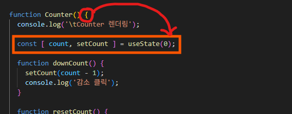
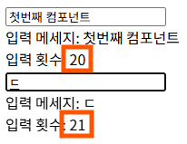
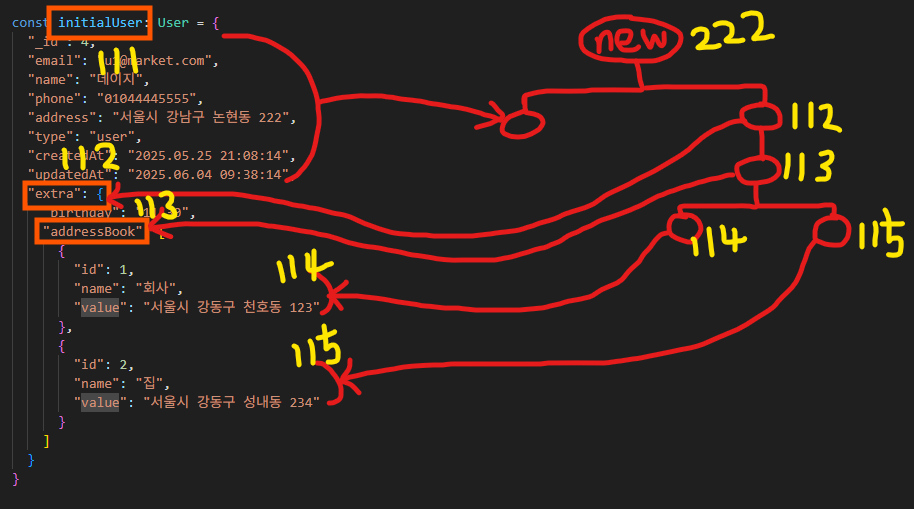
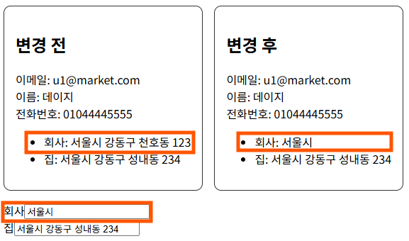

# 리액트 시작

- [리액트 특징](#리액트-특징)
- [JSX 문법](#jsx-문법)
- [가상(Virtual) DOM](#가상virtual-dom)
  - [가상 DOM 렌더링 과정](#가상-dom-렌더링-과정)
- [Props(속성)](#props속성)
  - [Props의 기본값 및 리액트 타입 설정](#props의-기본값-및-리액트-타입-설정)
- [State(상태)](#state상태)
  - [제어 컴포넌트](#제어-컴포넌트)
  - [`useState`가 필요한 이유](#usestate가-필요한-이유)
  - [`state` 값을 여러번 변경](#state-값을-여러번-변경)
  - [상태관리 대상이 객체일 경우](#상태관리-대상이-객체일-경우)
  - [상태관리 대상이 복합 객체일 경우](#상태관리-대상이-복합-객체일-경우)
  - [회원가입 상태 관리](#회원가입-상태-관리)


<br />
<br />


## 리액트 특징

- React는 상태(데이터)가 변경되면 반응(랜더링)하는 방식으로 동작

- JSX 문법을 통해 HTML 작성 생산성 향상

- 가상 DOM으로 성능 저하 최소

- 컴포넌트별로 상태 관리가 용이하며, 재사용성과 유지보수성 향상

- 전역 상태 관리를 위한 라이브러리가 많음 (zustand, recoil 등)

- 단방향 데이터 바인딩

  - 리액트의 UI는 `상태(State)`가 바뀌면 UI도 바뀌는 구조

  - UI의 변경은 `상태(State)`를 직접 수정하지 않고 이벤트 핸들러를 통해서만 바꿀 수 있다.

  ```javascript
    const [count, setCount] = useState(0); // 상태가 바뀌면 UI 리렌더링
    // ...
    <p>{count}</p> // 상태
    // ...
    <button onClick={() => setCount(count + 1)}>+1</button> // 이벤트 핸들러
  ```


<br />
<br />


## JSX 문법

리액트 컴포넌트 안에서는 HTML처럼 보이는 `JSX` 문법을 사용한다. 

실제로는 HTML이 아니라 자바스크립트가 이해할 수 있도록 변환되는 문법이며, 브라우저가 직접 이해하진 못한다.

- `JSX`는 `JavaScript + XML` 구조

- 브라우저가 직접 해석하지 못하므로 `Babel`이 자바스크립트 코드로 변환

  - CDN 방식으로 리액트를 사용할 경우, 스크립트에 `type="text/babel"` 설정 시 변환 가능

  ```javascript
  // JSX
  function TodoItem({ item, toggleDone, deleteItem }) {
    return (
      <li>
        <span>{ item.num }</span>  
        <span onClick={ () => toggleDone(item.num) }>
          { item.done ? <s>{ item.title }</s> : item.title }
        </span>  
        <button type="button" onClick={ () => deleteItem(item.num) }>삭제</button>
      </li>
    );
  }
  ```

  ```javascript
  // Babel 변환, JS
  function TodoItem({ item, toggleDone, deleteItem }) {
    return (
      React.createElement("li", null,
        React.createElement("span", null, item.num),
        React.createElement("span", {onClick: () => toggleDone(item.num)},
          item.done ? React.createElement("s", null, item.title) : item.title),
        React.createElement("button", {type: "button", onClick: () => deleteItem(item.num)}, "삭제")
      );
    );
  }
  ```

- `XML` 기반이라 문법이 엄격함

  - 모든 태그는 반드시 닫아야 함

  - 속성은 카멜 케이스 형태로 사용

    - `onClick`, `autoFocus` 등

- 자바스크립트 예약어로 인해 JSX에선 속성명이 바뀜

    - `class`는 `className` 사용

    - `for`는 예약어이므로 `htmlFor` 사용

- 변수를 넣거나 계산한 값을 출력하려면 자바스크립트 표현식이 필요

  - 중괄호 { } 안에서 표현식 사용 가능

- 단일 객체를 반환해야 함

  ```javascript
  // 여러 객체를 반환할 수 없음 ❌
  return (
    <h1>Todo List</h1>
    <div>...</div>
  );

  // 루트 요소 추가
  return (
    <div>
      <h1>Todo List</h1>
      <div>...</div>
    </div>
  );

  // Fragment 사용, 의미없는 태그 방지
  return (
    <Fragment>
      <h1>Todo List</h1>
      <div>...</div>
    </Fragment>
  );

  // Fragment 약어 사용
  return (
    <>
      <h1>Todo List</h1>
      <div>...</div>
    </>
  );
  ```

- `style` 속성은 객체 형태로 전달

  - 속성명은 카멜 케이스로 표기

  ```javascript
  <div style={{ backgroundColor: 'red', fontSize: '20px' }}>Hello</div>

  // 동적으로 사용
  const divStyle = {
    backgroundColor: 'red',
    fontSize: '20px',
    marginTop: '10px'
  };
  <div style={divStyle}>Hello</div>

  // 동적으로 사용
  const size = 24;
  <div style={{ color: 'red', fontSize: `${size}px` }}>Hello</div>
  ```


<br />
<br />


## 가상(Virtual) DOM

- 브라우저 `DOM`과 동일한 형태를 가진 가벼운 자바스크립트 객체 기반의 트리 구조

- 실제 `DOM`을 직접 건드리기 전에 중간 단계로 사용하는 UI의 복사본 

<br />

### 가상 DOM 렌더링 과정

- 상태 변경 시, 리액트가 변경된 상태를 기반으로 새로운 가상 `DOM` 생성

- 기존 가상 `DOM`과 비교(Diffing)

- 변화된 부분만 브라우저 `DOM`에 반영(Reconciliation)

- 불필요한 `DOM` 조작을 최소화하여 성능 최적화

<br />

### DOM API를 이용

- 부분 갱신

  - 변경된 요소만 찾아서 갱신하면 되므로 렌더링을 최소화하여 성능 좋음

  - 하지만 변경 감지, `DOM` 탐색 로직이 필요해 코드가 복잡해짐

- 전체 갱신

  - 기존 내용을 지우고 새 UI로 통째로 교체하면 되므로 포드가 간결

  - 필요한 부분만 수정해도 전체가 다시 렌더링되어 비효율적일 수 있음

- 리액트 라이브러리는 `DOM` 조작의 복잡함을 감추고, 상태 변경에 따라 필요한 부분만 자동으로 갱신


<br />
<br />


## Props(속성)

- 부모 컴포넌트에서 자식 컴포넌트로 데이터를 전달할 때 사용

  - `HTML` 태그의 속성을 지정하는 것처럼 사용

  ```javascript
  function Todo() {
    const initItemList = [
      { num: 1, title: '자바스크립트 공부', done: true },
      ...
    ];

    const [ itemList, setItemList ] = useState(initItemList);

    // 부모가 가진 상태 변경 함수들
    function addItem(title: string) {
      ... setItemList(newItemList);
    }
    function toggleDone(num: number) {
      ... setItemList(newItemList);
    }
    function deleteItem(num: number) {
      ... setItemList(newItemList);
    }

    // 부모 컴포넌트(Todo)에서 자식 컴포넌트(TodoInput, TodoList)로 데이터 전달
    return (
      <div id="main">
        <div id="container">
          <ul>
            <li>
              <h2>쇼핑 목록</h2>
              <TodoInput addItem={ addItem } />
              <TodoList 
                itemList={ itemList } 
                toggleDone={ toggleDone } 
                deleteItem={ deleteItem } 
              />
            </li>
          </ul>
        </div>
      </div>
    );
  }
  ```

- 자식 컴포넌트에서 부모 컴포넌트의 상태를 변경하려면 부모의 함수를 받아서 실행

  ```javascript
  function TodoInput({ addItem }: TodoInputProps) {
    ...
    const handleAdd = () => {
      ...
      // 부모의 함수를 받아서
      addItem(title.trim());
      ...
    };

    ...

    return (
      ...
        {/* 실행 */}
        <button type="button" onClick={ handleAdd }>추가</button> 
      ...
    );
  }
  ```

- 구조 분해 할당을 이용해서 필요한 속성을 바로 꺼내서 사용할 수 있음

  - 이름 기반으로 관리되므로 안정적

    - 순서 상관없이 이름만 맞으면 됨

    - 필요한 것만 선택적으로 사용 가능

  - 컴포넌트의 확장성/유지보수성/가독성을 극대화

  ```javascript
  // 구조 분해 할당
  function TodoItem({ item, toggleDone, deleteItem }: TodoItemProps) {
    return (
      <li>
        <span>{ item.num }</span>  
        <span onClick={ () => toggleDone(item.num) }>
          { item.done ? <s>{ item.title }</s> : item.title }
        </span>  
        <button type="button" onClick={ () => deleteItem(item.num) }>삭제</button>
      </li>
    );
  }
  ```

- `Props` 전달 방식

  - 전개 연산자 사용

    - 부모 컴포넌트의 `props` 전체를 자식에게 그대로 넘겨야할 때 사용하면 좋음

  - 왠만하면 명시적으로 전달하는 방식이 안정적

  ```javascript
  interface TodoListProps {
    itemList: TodoItemType[];
    toggleDone: (num: number) => void;
    deleteItem: (num: number) => void;
  }

  // 전개 연산자를 사용하여 props 전체를 전달
  function TodoList(props: TodoListProps) {
    const list = props.itemList.map(item => 
      <TodoItem 
        key={ item.num } 
        item={ item } 
        { ...props }
      />
    );

    return ... ;
  }

  // 필요한 props만 명시적으로 전달
  function TodoList({ itemList, toggleDone, deleteItem }: TodoListProps) {
    const list = itemList.map(item => 
      <TodoItem 
        key={ item.num } 
        item={ item } 
        toggleDone={ toggleDone } 
        deleteItem={ deleteItem }
      />
    );

    return ... ;
  }
  ```

<br />

### Props의 기본값 및 리액트 타입 설정

#### `Button` 컴포넌트

```javascript
interface ButtonProps {
  children: React.ReactNode;
  onClick?: React.MouseEventHandler<HTMLButtonElement>;
  type?: 'button' | 'submit' | 'reset'; // 버튼 타입의 종류
  // color?: string; // 다양한 색상을 받을 수 있음
  color?: 'red' | 'gray' | 'green'; // 색상을 지정해두면 동일한 UI를 가져갈 수 있음
}

function Button({ children, onClick, type='button', color="green" }: ButtonProps) {
  return (
    <button 
      type={ type } 
      onClick={ onClick } 
      className="rounded-button" 
      style={{ backgroundColor: color }}
    >
      { children }
    </button>
  );
}

export default Button;
```

#### `Counter` 컴포넌트

```javascript
import { useState } from "react";
import Button from "./Button";

function Counter() {
  const [ count, setCount ] = useState(0);

  function downCount() {
    setCount(count - 1);
  }

  function resetCount() {
    setCount(0);
  }

  function upCount() {
    setCount(count + 1);
  }

  return (
    <div id="counter">
      <Button type="submit" onClick={ downCount } color="red">-_-</Button>
      <Button onClick={ resetCount } color="gray">0_0</Button>
      <Button onClick={ upCount }>+_+</Button>
      <span>{ count }</span>
    </div>
  );
}

export default Counter;
```

- 리액트에 정의되어 있는 타입을 사용하면 정확한 타입을 제공하기 때문에 훨씬 안정적임

  - 직접 정의해서 사용하면, 오류 가능성이 높음

  - `ReactNode`

    - 리액트에서 렌더링할 수 있는 모든 값의 타입

  - `MouseEventHandler`

    - 마우스 이벤트가 발생했을 때 전달되는 이벤트 객체 타입

- 속성에 기본 값을 설정하여 컴포넌트 사용시 속성없이 리턴하면 기본 값으로 사용이 가능

- 컴포넌트안에 노드 추가하면 닫는태그 추가하여 사용


<br />
<br />


## State(상태)

- 상태(데이터)의 변경에 따라 컴포넌트가 리렌더링 된다.

  ```javascript
  const [state, setState] = useState(initialState);
  ```

  - `state` : 상태값

  - `setState` : 상태값을 변경하는 `setter` 함수

  - `initialState` : 상태값의 초기값

  - 초기 렌더링에만 초기값이 사용되고 그 뒤로 상태값을 변경하는 함수에 의해 변경된 상태값과 기존의 상태값이 다르면 리렌더링된다.

- `use`로 시작하는 함수들을 `훅(Hook)`이라고 한다.

  - 이런 훅들은 컴포넌트의 루트 레벨에서만 사용 가능하다.

  

  - `useState`는 호출되는 순서대로 리액트가 관리하는 배열에 저장된다.

    - 조건문, 반복문, 일반 함수 내부에서 호출하면 배열의 순서가 정확하지 않다.

<br />

### 제어 컴포넌트

리액트의 `state`와 `input` 요소의 `value`를 동기화하려면, `input` 요소에 `value`, `onChange` 속성은 세트 관계로 가져가야 한다.

```javascript
function Message() {

  const [ msg, setMsg ] = useState('');

  const handleChange = (e: React.ChangeEvent<HTMLInputElement>) => {
    setMsg(e.target.value);
  };

  return (
    <div>
      <input type="text" value={ msg } onChange={ handleChange } />
      <br />
      <span>입력 메세지: { msg }</span>
    </div>
  );
}
```

- 초기 렌더링시 현재 메세지에는 초기값으로 빈 문자열이 들어가게 된다.

- `input`은 `onChange`에 의해 메세지를 입력할 때마다 `handleChange` 변수에 저장된 함수를 실행한다.

- `setMsg` 함수 동작된다.

- `setMsg` 함수 내부에서 `input`에 입력한 새로운값을 상태값으로 지정한다.

- 그리고 기존에 있는 상태값과 비교하여 상태값이 변경되었으므로 컴포넌트가 리렌더링 된다.

- `useState` 함수가 실행된다.

- 이전에 `setMsg` 함수에 의해 `input`에 입력한 새로운값으로 지정된 상태값과 `setMsg` 함수를 다시 구조 분해 할당으로 받는다.

- 그래서 새로운 값을 받은 `msg`는 `input`의 `value`와 `span`의 값으로 사용하여 리렌더링된 컴포넌트를 보여줄 수 있다.

<br />

### `useState`가 필요한 이유

- 지역변수는 컴포넌트가 리렌더링되면 0으로 초기화된다.

  ```javascript
  function Message() {

    const [ msg, setMsg ] = useState('');

    // 지역 변수
    let count = 0;

    const handleChange = (e: React.ChangeEvent<HTMLInputElement>) => {
      setMsg(e.target.value);
      ++count;
    };

    return (
      <div>
        <input type="text" value={ msg } onChange={ handleChange } />
        <br />
        <span>입력 메세지: { msg }</span>
        <br />
        <span>입력 횟수: { count }</span>
      </div>
    );
  }
  ```

- 모듈 스코프 변수를 사용하면 컴포넌트가 리렌더링되어도 이전 상태값이 유지된다.

  - 하지만 상태값이 모든 `Message` 컴포넌트에서 공유된다.

    

    - 다른 컴포넌트임에도 `count` 상태값이 공유된다.

  - 컴포넌트의 독립성을 잃게 된다.

  ```javascript
  // 모듈 스코프 변수
  let count = 0;

  function Message() {

    const [ msg, setMsg ] = useState('');

    const handleChange = (e: React.ChangeEvent<HTMLInputElement>) => {
      setMsg(e.target.value);
      ++count;
    };

    return (
      <div>
        <input type="text" value={ msg } onChange={ handleChange } />
        <br />
        <span>입력 메세지: { msg }</span>
        <br />
        <span>입력 횟수: { count }</span>
      </div>
    );
  }
  ```

- `useState`가 필요한 이유

  - 상태값 변경은 컴포넌트 내부에서 동작하도록 해야한다.

  ```javascript
  function Message() {

    const [ msg, setMsg ] = useState('');

    const [ count, setCount ] = useState(0);

    const handleChange = (e: React.ChangeEvent<HTMLInputElement>) => {
      setMsg(e.target.value);
      setCount(count + 1);
    };

    return (
      <div>
        <input type="text" value={ msg } onChange={ handleChange } />
        <br />
        <span>입력 메세지: { msg }</span>
        <br />
        <span>입력 횟수: { count }</span>
      </div>
    );
  }
  ```

<br />

### `state` 값을 여러번 변경

- 이벤트 핸들러 안에서 `setter` 함수가 여러번 호출되어도 이벤트 핸들러의 모든 코드가 완전히 실행된 후에 한 번 리렌더링된다.

  - `count`는 동일한 값으로 계산되며 마지막 값이 적용되어 한 번 증가하게 된다.

  ```javascript
  function App() {

    const [ count, setCount ] = useState(0);

    const handleClick = () => {
      setCount(count + 1); // 0 + 1 = 1
      setCount(count + 1); // 0 + 1 = 1
      setCount(count + 1); // 0 + 1 = 1
    };
    
    ...
  }
  ```

- 이전 상태값을 순차적으로 업데이트해서 사용하려면 콜백 함수를 `setter` 함수에 전달해줘야 한다.

  - 콜백 함수의 인자값으로 현재 상태 값이 전달되고 콜백 함수의 리턴 값이 다음 `setter` 함수의 인자 값으로 전달되며 순차적으로 처리되어 마지막에 한 번 리렌더링된다.

  ```javascript
  function App() {
    const [ count, setCount ] = useState(0);

    const handleClick = () => {
      setCount((currCount) => currCount + 1); // 0 + 1 = 1
      setCount((currCount) => currCount + 1); // 1 + 1 = 2
      setCount((currCount) => currCount + 1); // 2 + 1 = 3
    };
    
    ...
  }
  ```

<br />

### 상태관리 대상이 객체일 경우

- 객체의 속성만 변경하면 객체의 참조 주소는 그대로 유지되므로
리액트는 이 변경을 감지할 수 없어 리렌더링되지 않는다.

  ```javascript
  function App() {
    const [ position, setPosition ] = useState({ x: 300, y: 200 });

    function handleMove(event: React.PointerEvent<HTMLDivElement>){
      const containerRect = event.currentTarget.getBoundingClientRect();
      
      position.x = event.clientX - containerRect.x;
      position.y = event.clientY - containerRect.y;
      
      setPosition(position);
    }

    return (
      <>
        <h1>13 상태관리 대상이 객체일 경우 주의 사항</h1>
        <div className="container" onPointerMove={ handleMove }>
          <div className="circle" style={{pointerEvents: 'none', transform: `translate(${position.x}px, ${position.y}px)`}}></div>
        </div>
      </>
    );
  }
  ```

  - `getBoundingClientRect()` 

    - 요소의 크기와 뷰포트 기준 위치를 반환하는 `DOM` 메서드로 `DOMRect` 객체를 반환한다.

    - `DOMRect`: `left(x)`, `top(y)`, `right`, `bottom`, `width`, `height` 속성을 가진다.

  - 객체의 속성만 바뀌고 객체의 참조 주소가 같아 변경된 점을 찾지 못해 리렌더링 되지 않는다.

- 이 문제를 해결하기 위해선 기존 객체의 상태값과 비교할 새로운 객체를 만들어서 비교해야 한다.

  ```javascript
    function App() {
      ...

        const newPosition = {
          x: event.clientX - containerReact.x,
          y: event.clientY - containerReact.y
        }

        setPosition(newPosition);
      
      ...
    }
  ```

<br />

### 상태관리 대상이 복합 객체일 경우

- 사용자의 복합 객체인 `addressBook`의 `value` 값을 `input`요소 입력값에 따라 바뀐 상태값으로 지정하고, 변경 전과 변경 후를 비교해 보려고 한다.

  ```javascript
  function App() {
    
    const initialUser: User = {
      "_id": 4,
      "email": "u1@market.com",
      "name": "데이지",
      "phone": "01044445555",
      "address": "서울시 강남구 논현동 222",
      "type": "user",
      "createdAt": "2025.05.25 21:08:14",
      "updatedAt": "2025.06.04 09:38:14",
      "extra": {
        "birthday": "11-30",
        "addressBook": [
          {
            "id": 1,
            "name": "회사",
            "value": "서울시 강동구 천호동 123"
          },
          {
            "id": 2,
            "name": "집",
            "value": "서울시 강동구 성내동 234"
          }
        ]
      }
    }

    const [ user, setUser ] = useState(initialUser);
    const [ prevUser, setPrevUser ] = useState(user);

    console.log('변경 전', user);
    console.log('변경 후', prevUser);

    function handleAddressChange(id: number, value: string) {
      console.log(id, value);

      const newUser = { ...user };
      const targetAddress = user.extra.addressBook.find(address => address.id === id);
      if (targetAddress) {
        targetAddress.value = value;
      }

      setPrevUser(user);
      setUser(newUser);
    }

    const list = user.extra.addressBook.map(address => {
      return (
        <Fragment key={ address.id }>
          <label htmlFor="1">{ address.name }</label>
          <input 
            id={ address.id.toString() } 
            type="text" 
            name={ address.id.toString() }
            value={ address.value }
            onChange={ event => handleAddressChange(address.id, event.target.value) }
          />
          <br />
        </Fragment>
      );
    });

    return (
      <>
        <h1>14 상태관리 대상이 복합 객체일 경우 불변성 (feat. immer)</h1>

        <div style={{ display: 'flex', gap: '1rem' }}>
          <UserInfo title="변경 전" user={ prevUser } />
          <UserInfo title="변경 후" user={ user } />
        </div>

        <p>
          { list }
        </p>
      </>
    );
  }
  ```

  - 사용자의 초기값은 입력값이 없어 변경된게 없으므로 정보는 같게 렌더링된다.

  - 이제 `input`에 입력값을 넣어 이벤트 핸들러 함수가 동작한다.

  - 기존 `user`의 데이터를 새로운 객체 `newUser`에 넣어 새로운 객체를 생성한다.

  - 변경한 `value` 값을 기존 `user` 주소의 할당한다.

  - 그리고 세터 함수에 의해 주소의 변경전과 변경후의 값을 비교해본다.

  - 하지만, 변경전과 변경후의 상태값은 동일하게 출력된다.

  - 그 이유는 복합 객체를 가진 객체는 얕은 복사의 원리 `1 Depth` 까지만 복사되기 때문이다.

  - 객체를 새로운 객체로 만들어 줬는데, 객체 안에 다른 참조 주소를 갖는 `object`가 있다면, 객체와 새로운 객체의 주소는 달라져도, 그 안에 있는 참조 주소는 같게되어 값을 확인해도 똑같이 렌더링된다.

    

    - 객체의 참조 주소만 다를뿐, 아래의 복합 객체들의 참조 주소는 모두 같아서 수정하면 같은 값으로 수정된다.

  - 참조형 데이터 타입은 상태의 불변성이 지켜지지 않는다.

    - 즉, 한번 정의한 상태는 그 값이 바뀌지 않도록 해야한다.

    - 참조형 데이터 타입은 불변성을 가지도록 객체나 배열을 복사해서 구현해야한다.

- 복합 객체의 모든 객체들의 참조 주소도 새롭게 만들어줘야 서로 분리된 객체를 생성할 수 있다.

  ```javascript
  function handleAddressChange(id: number, value: string) {
    console.log(id, value);

    const newAddressBook = user.extra.addressBook.map(address => { 
      if (address.id === id) {
        return { ...address, value };
      } else {
        return address;
      }
    });
    const newUser = {
      ...user,
      extra: {
        ...user.extra,
        addressBook: newAddressBook
      }
    };

    setPrevUser(user);
    setUser(newUser);
  }
  ```

  - 이벤트가 발생한 요소의 `id`값이랑 `value`값을 전달 받는다.
  - `user`의 `addressBook`는 배열이므로 새로운 배열을 리턴하는 `map` 메서드를 사용한다.
    - 이벤트가 발생한 요소의 `id`값과 `address`의 `id`값이 같으면 값이 변경된 상태이므로 새로운 객체를 만들어 반환한다.
      - 기존 `address`의 속성들을 받고 `value`의 값이 변경되었으므로 덮어씌운다.
    - 값의 변동이 없으면 기존 객체를 반환한다.
    - `address`의 객체들을 새로운 배열 `newAddressBook`에 담는다.
  - 변경된 사용자의 데이터 객체 `newUser`를 생성해준다.
    - 기존의 변경이 없는 값들은 그대로 받고, 변경된 `addressBook`에만 변경된 값을 전달받아 생성한다.
  - `setter` 함수에 의해 리렌더링해주면, 기존의 `user`는 변경되기 전의 데이터를 출력하고, 새로운 객체 `newUser`는 변경된 후의 데이터를 출력하게되어 차이를 확인할 수 있다.

  

<br />

#### immer 라이브러리

> 프록시(Proxy)
> > 객체를 감시하고 그 객체에 일어나는 모든 동작을 추적할 수 있는 중간 관리자

```javascript
function handleAddressChange(id: number, value: string) {
  const newUser = produce(user, (draft) => {
    const address = draft.extra.addressBook.find(address => address.id === id);
    if (address) {
      address.value = value;
    }
  });

  setPrevUser(user);
  setUser(newUser);
}
```

- 원본 `상태(user)`를 `Proxy`로 감싼 `draft(초안 상태)` 를 만든다.

- `draft`를 자유롭게 수정한다.

- `Proxy`가 어떤 값이 어떻게 변경되었는지를 추적한다.

- 변경된 부분만 복사하여 새로운 `불변 객체(newUser)` 를 생성한다.

- `원본 객체(user)`는 절대 건드리지 않는다.

<br />

### 회원가입 상태 관리

```javascript
// 이메일 검증 정규식
const emailExp = /^[a-zA-Z0-9._%+-]+@[a-zA-Z0-9.-]+\.[a-zA-Z]{2,}$/;
// 휴대폰 검증 정규식
const cellphoneExp = /^010[0-9]{3,4}[0-9]{4}$/;

...
```

- 검증할 대상의 정규식 설정해두고 `test()` 메서드를 통해 `true`인지 `false`인지 체크할 수 있다.

```javascript
interface Member {
  name: string;
  email: string;
  cellphone: string;
}

interface FormErrors {
  name?: { message: string };
  email?: { message: string };
  cellphone?: { message: string };
}

...
```

- 값의 타입이 어떤 타입으로 올지 정하고 오타가 발생하면 오타를 잡아주는 등 유지보수성과 안정성을 위해 타입을 설정

- `user`에 대한 타입과 `errors`에 대한 타입을 명시

  - `useState<FormErrors>`처럼 제네릭으로 타입이 설정된 이유는 

    - `errors`가 해당 타입의 형태여야 하고 `setErrors`에 전달되는 인자도 해당 타입의 형태가 되야하기 때문이다.

```javascript
function App() {

  const [ name, setName ] = useState('');
  const [ email, setEmail ] = useState('');
  const [ cellphone, setCellphone ] = useState('010');

  const user: Member = {
    name,
    email,
    cellphone
  }

  function handleNameChange(event: React.ChangeEvent<HTMLInputElement>) {
    setName(event.target.value);
  }

  function handelEmailChange(event: React.ChangeEvent<HTMLInputElement>) {
    setEmail(event.target.value);
  }

  function handleCellphoneChange(event: React.ChangeEvent<HTMLInputElement>) {
    setCellphone(event.target.value);
  }

  ...
```

- `input`의 입력값에 따라 상태값의 변경 유무를 확인하고 리렌더링할 수 있는 함수 설정

- `name`, `email`, `cellphone`은 각각의 하나의 회원 정보로 볼 수있는 연관된 데이터이므로 `user` 객체로 설정

```javascript
  const [ errors, setErrors ] = useState<FormErrors>({});

  function validate() {
    let newErrors = {};

    if (user.name.trim() === "") {
      newErrors = {
        name: { message: "이름을 입력하세요." }
      };
    } else if (user.name.trim().length < 2) {
      newErrors = {
        name: { message: "2글자 이상 입력하세요." }
      };
    } else if (user.email.trim() === "") {
      newErrors = {
        email: { message: "이메일을 입력하세요." }
      };
    } else if (emailExp.test(user.email) === false) {
      newErrors = {
        email: { message: "이메일 양식에 맞지 않습니다." },
      };
    } else if (user.cellphone.trim() === "") {
      newErrors = {
        cellphone: { message: "휴대폰 번호를 입력하세요." },
      };
    } else if (cellphoneExp.test(user.cellphone) === false) {
      newErrors = {
        cellphone: { message: "휴대폰 형식에 맞지 않습니다." },
      };
    }

    if (Object.keys(newErrors).length > 0) {
      setErrors(newErrors); // 입력값 검증 실패 메세지
    } else {
      console.log('서버 전송', user); // 입력값 검증 통과 메세지
    }
  }

  ...
```

- `input`의 입력값에 따라 검증을 순차적으로 확인하는 메서드

- 해당 요소에 대한 `errors`의 상태값을 새로운 `newErrors`에 저장하여 상태값의 변경 유무에 따라 리렌더링한다.

```javascript
  function registMember(event: React.FormEvent) {
    event.preventDefault();
    validate();
  }

  ...
```

- `submit` 버튼을 눌렀을 때 `form` 요소에서 발생할 이벤트 핸들러

- 원래 `submit` 버튼을 누르면, 브라우저 내에서 새로고침이 발생한다.

  - `event.preventDefault()` 코드를 추가하면 해당 동작을 막을 수 있다.

```javascript
  return (
    <>
      <h1>15 회원가입 입력값 상태 관리</h1>

      <form onSubmit={ registMember }>
        <label htmlFor="name">이름</label>
        <input id="name" name="name" value={ user.name } onChange={ handleNameChange } /><br />
        <div className="error-style">{ errors.name?.message }</div>

        <label htmlFor="email">이메일</label>
        <input id="email" name="email" value={ user.email } onChange={ handelEmailChange } /><br />
        <div className="error-style">{ errors.email?.message }</div>

        <label htmlFor="cellphone">휴대폰</label>
        <input id="cellphone" name="cellphone" value={ user.cellphone } onChange={ handleCellphoneChange } /><br />
        <div className="error-style">{ errors.cellphone?.message }</div>

        <button type="submit">가입</button>
      </form>

      <p>
        이름: { user.name } <br />
        이메일: { user.email } <br />
        휴대폰: { user.cellphone } <br />
      </p>
    </>
  )
}
```

- 각 요소의 이벤트 핸들러에 의해 데이터를 리렌더링

<br />

#### 공통된 부분을 하나로 코드 개선

```javascript
  const [ user, setUser ] = useState<Member>({
    name: '',
    email: '',
    cellphone: '010'
  });

  function handleChange(event: React.ChangeEvent<HTMLInputElement>) {
    const newUser = {
      ...user,
      [event.target.name]: event.target.value,
    };
    setUser(newUser);
    validate({ data: newUser });
  }
```

- 전에는 각각의 상태만 관리했다면, 지금은 `user`의 상태만 관리하면 된다.

- 이벤트 핸들러도 하나로 모든 `input`을 처리할 수 있다.

  - 객체의 참조 주소가 같으면 상태가 변경된줄 모르기 때문에 새로운 객체를 생성

  - 새로운 객체를 생성하고 그 위에 해당 `input`의 입력값으로 덮어씌운다.

  - 상태값의 변경의 유무를 확인하고 리렌더링 진행

<br />

#### 에러 메세지 출력 방법

```javascript
interface ValidateOptions {
  criteriaMode?: 'firstError' | 'all';
  data?: Member;
}

  function validate({ criteriaMode = 'firstError', data }: ValidateOptions = {}){
    const userInfo = data || user;

    let newErrors: FormErrors = {};

    if (criteriaMode === "all") {
      if (userInfo.name.trim() === "") {
        newErrors.name = { message: "이름을 입력하세요." };
      } else if (userInfo.name.trim().length < 2) {
        newErrors.name = { message: "2글자 이상 입력하세요." };
      }

      if (userInfo.email.trim() === "") {
        newErrors.email = { message: "이메일을 입력하세요." };
      } else if (emailExp.test(userInfo.email) === false) {
        newErrors.email = { message: "이메일 양식에 맞지 않습니다." };
      }

      if (userInfo.cellphone.trim() === "") {
        newErrors.cellphone = { message: "휴대폰 번호를 입력하세요." };
      } else if (cellphoneExp.test(userInfo.cellphone) === false) {
        newErrors.cellphone = { message: "휴대폰 형식에 맞지 않습니다." };
      }
    } else {
      if (userInfo.name.trim() === "") {
        newErrors = {
          name: { message: "이름을 입력하세요." },
        };
      } else if (userInfo.name.trim().length < 2) {
        newErrors = {
          name: { message: "2글자 이상 입력하세요." },
        };
      } else if (userInfo.email.trim() === "") {
        newErrors = {
          email: { message: "이메일을 입력하세요." },
        };
      } else if (emailExp.test(userInfo.email) === false) {
        newErrors = {
          email: { message: "이메일 양식에 맞지 않습니다." },
        };
      } else if (userInfo.cellphone.trim() === "") {
        newErrors = {
          cellphone: { message: "휴대폰 번호를 입력하세요." },
        };
      } else if (cellphoneExp.test(userInfo.cellphone) === false) {
        newErrors = {
          cellphone: { message: "휴대폰 형식에 맞지 않습니다." },
        };
      }
    }

    setErrors(newErrors);
  }
  
  function registMember(event: React.FormEvent) {
    event.preventDefault();

    validate({
      // 첫번째 발견된 에러만 보여줄 수 있게.. (기본값)
      criteriaMode: 'firstError', 
      // criteriaMode: 'all', 
      // 모든 에러를 보여줄 수 있게..
    });
  }
```

- 에러 메세지를 하나씩 렌더링할 것인지 한 번에 모두 렌더링해서 보여줄 것인지 설정을 통해 에러메세지를 다양한 방법으로 렌더링할 수 있다.