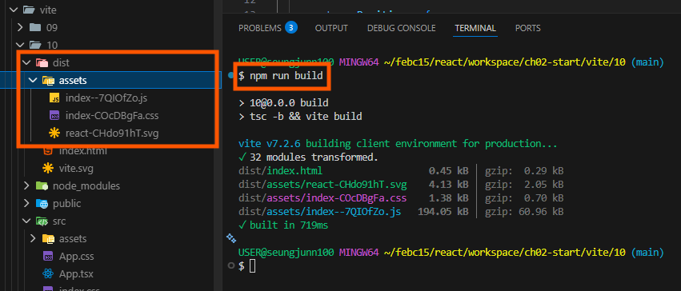
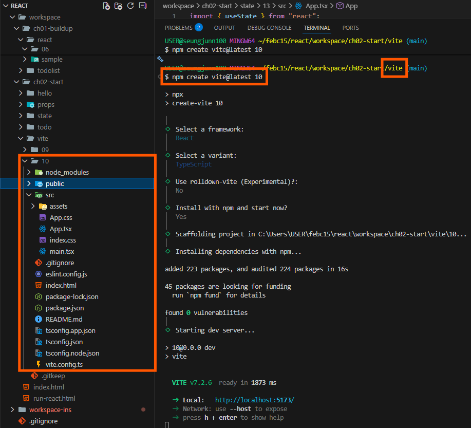
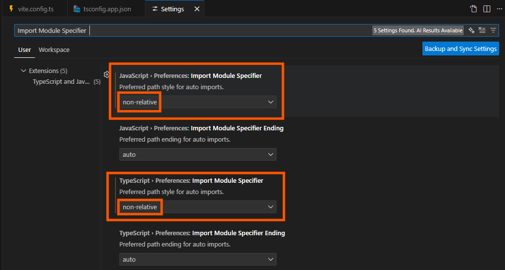

# 빌드 도구 `Vite`

- [빌드 도구](#빌드-도구)
  - [Vite](#vite)
  - [Vite 프로젝트 초기 구성](#vite-프로젝트-초기-구성)
- [import에서 사용할 path alias(별칭) 추가](#import에서-사용할-path-alias별칭-추가)
  - [vite.config.js - 번들러용 (dev 서버/빌드)](#viteconfigjs---번들러용-dev-서버빌드)
  - [tsconfig.app.json - 타입스크립트용 (컴파일러)](#tsconfigappjson---타입스크립트용-컴파일러)
  - [VSCode alias 기준 자동 import 설정](#vscode-alias-기준-자동-import-설정)


<br />
<br />


## 빌드 도구

프론트엔드 개발에 필요한 환경을 자동으로 구축해주는 도구로 다양한 기능들을 제공한다.

- 반복적으로 사용하는 프로젝트 기본 구조 자동 생성 (보일러플레이트 제공)
  
- 개발 서버, 번들링 설정 등 설정 파일을 자동 구성

- 필요한 라이브러리 기본 구성 (의존성 설치)

- `HMR(Hot Module Replacement)`: 코드 수정 시 새로고침 없이 화면 즉시 갱신

- 프로덕션 배포를 위한 번들링 기능 제공

  - 배포를 위한 `JS/CSS` 최적화 및 묶는 작업

  - 번들링 도구: `Webpack`, `Rollup`, `Parcel`, `ESBuild` 등

<br />

### Vite

그 중 하나가 `Vite`이며, 프랑스어로 `빠르다`는 의미의 차세대 프론트엔드 개발 도구이다.

- `Webpack`을 번들러로 사용하는 `CRA(create-react-app)` 대비, 10~100배 빠른 개발 서버 속도를 제공

- `React`, `Svelte`, `Solid` 등 다양한 `SPA` 개발 환경을 지원한다.

- `Dev server`에서는 `ESBuild`가 담당

  - 파일을 수정하면 `HMR`로 즉시 반영되어 개발 효율 높음
  
- `build`시 `Rollup` 기반 번들링

  - 트랜스파일링(컴파일) - JSX 문법을 Javascript 코드로 변환

  - Tree-Shaking(필요없는 것은 제거), 압축 등 최적화 수행

    - 주석 제거/불필요한 공백 제거/변수명, 함수명 축소로 바이트 절약

  - 결과물은 모두 하나의 번들로 묶여 `dist` 폴더에 생성

    

  - `public` 폴더의 파일은 그대로 `dist`로 복사

    - 경로는 항상 루트(/) 기준으로 접근

      - 퍼블릭에 있는 이미지는 루트에 있다고 판단하고 사용 - `src="/vite.svg"`

- 설정을 통해 번들링 도구를 다른 도구로 설정해서 사용할 수 있음

<br />

### Vite 프로젝트 초기 구성

```bash
npm create vite@latest 10
```



- 리액트 개발 환경 프로젝트 생성

- 타입스크립트로 리액트 개발

- 새로운 번들러 실험기능 사용 여부

  - 아직 안정성과 호환성이 충분하지 않음

- 프로젝트 생성 후 자동으로 `npm install`, 서버 실행


<br />
<br />


## import에서 사용할 path alias(별칭) 추가

- 경로 계산 실수 방지

- 디렉토리 구조를 변경해도 `import`에 영향이 적음

- 프로젝트 전체 `import`의 일관성 증가

<br />

### vite.config.js - 번들러용 (dev 서버/빌드)

```javascript
// vite.config.ts
import { defineConfig } from 'vite';
import path from 'path';

export default defineConfig({
  resolve: {
    alias: {
      '@': path.resolve(__dirname, 'src'),
    },
  },
});
```

- 번들링할 때 `@/utils/axios.ts` → `src/utils/axios.ts` 경로로 찾도록 도와줌

<br />

### tsconfig.app.json - 타입스크립트용 (컴파일러)

```javascript
{
  "compilerOptions": {
    "baseUrl": ".",
    "paths": {
      "@/*": ["src/*"]
    }
  }
}
```

- `@/utils/axios.ts` → `src/utils/axios.ts`라고 인지하도록 알려주는 설정

<br />

### VSCode alias 기준 자동 import 설정



- `non-relative`로 해두면 `../../utils/axios` 이런 상대경로보다 `@/utils/axios` 같은 절대 경로를 선호

- 컨벤션에 따라 다를 수 있음