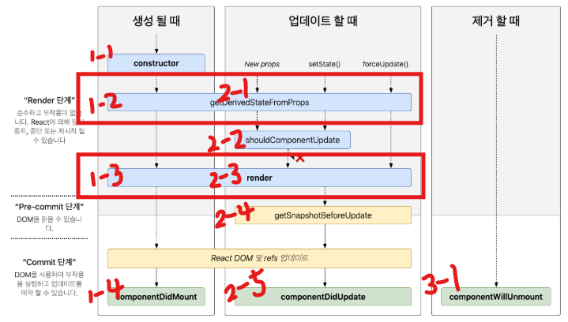
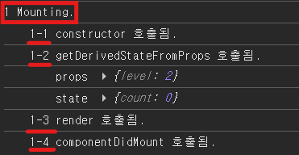
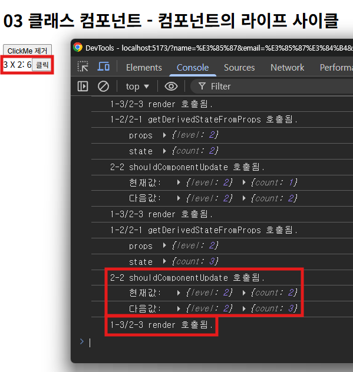
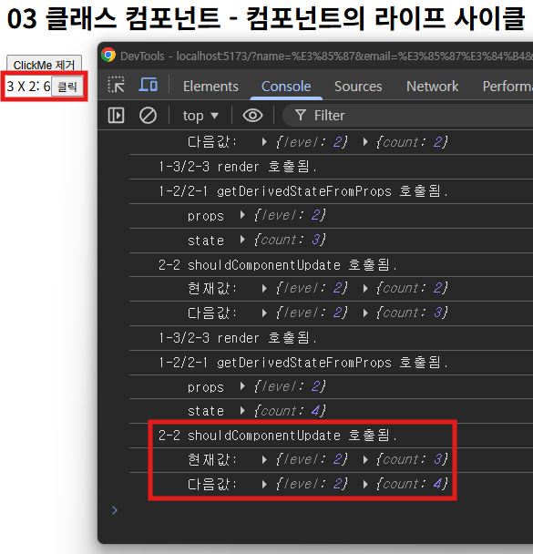
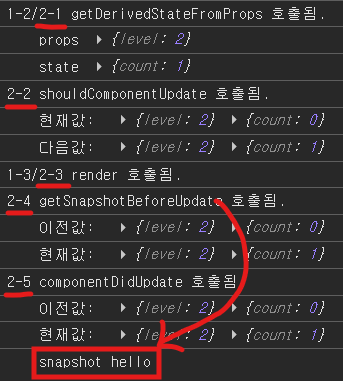
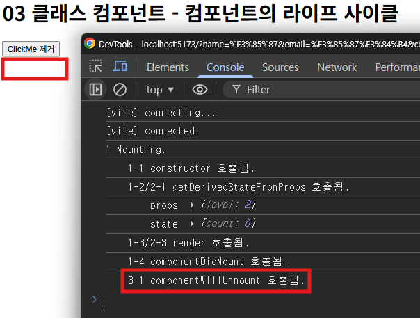

# 컴포넌트 라이프 사이클

- [Mounting](#mounting)
  - [constructor()](#constructor)
  - [getDerivedStateFromProps(props, state)](#getderivedstatefrompropsprops-state)
  - [render()](#render)
  - [componentDidMount()](#componentdidmount)
- [Updating](#updating)
  - [getDerivedStateFromProps(props, state)](#getderivedstatefrompropsprops-state-1)
  - [shouldComponentUpdate(nextProps, nextState)](#shouldcomponentupdatenextprops-nextstate)
  - [render()](#render-1)
  - [getSnapshotBeforeUpdate(prevProps, prevState)](#getsnapshotbeforeupdateprevprops-prevstate)
  - [componentDidUpdate(prevProps, prevState, snapshot)](#componentdidupdateprevprops-prevstate-snapshot)
- [Unmounting](#unmounting)
  - [componentWillUnmount()](#componentwillunmount)
- [메소드가 두번씩 호출되는 이유](#메소드가-두번씩-호출되는-이유)


<br />
<br />




## Mounting

컴포넌트가 처음으로 DOM에 추가되고 렌더링 되는 단계

<br />

### constructor()

```javascript
// 1-1
constructor(props: ClickMeProps) {
  console.log('1 Mounting.');
  console.log('\t1-1 constructor 호출됨.');
  super(props);
}
```

- `super(props)`를 통해 this 사용 가능 상태를 만듬

- `props` 기반 초기 `state`를 설정

  - `props`로 초기화를 하지 않는다면 `constructor`는 생략 가능

<br />

### getDerivedStateFromProps(props, state)

```javascript
// 1-2
static getDerivedStateFromProps(props: ClickMeProps, state: ClickMeState) {
  console.log('\t1-2 getDerivedStateFromProps 호출됨.');
  console.log('\t\tprops', props);
  console.log('\t\tstate', state);

  if (state.count / props.level > 10) {
    return { count: props.level }; // 새로운 값으로 state 대체함
  }
  return null; // state를 대체하지 않음
}
```

- 부모로부터 전달받은 `props`를 가지고 `state` 값을 변경하고 싶을 때 사용

- 이런 상황이 거의 없어서 거의 사용하지 않는다.

<br />

### render()

```javascript
// 1-3
render() {
  console.log('\t1-3 render 호출됨.');

  const result = this.state.count * this.props.level;
  
  return (
    <div>
      { this.state.count } X { this.props.level }: { result }
      <button onClick={ this.increment }>클릭</button>
    </div>
  );
}
```

- `JSX` 문법을 이용하여 렌더링

<br />

### componentDidMount()

```javascript
// 1-4
componentDidMount() {
  // API 서버로 부터 데이터 가져오는 작업(side effect)은 이곳에서 작성
  console.log('\t1-4 componentDidMount 호출됨.');
}
```

- 컴포넌트가 완전히 마운트되어 `DOM`에 반영된 후 실행

- 보통 데이터 요청 등 초기 작업을 처리하는 데 사용

- 함수형 컴포넌트에서는 `useEffect`로 사용 가능

<br />



- 순차적으로 실행된다.


<br />
<br />


## Updating

마운트 된 컴포넌트의 `상태(state)`나 `속성(props)`이 변경되어 리렌더링 되는 단계

<br />

### getDerivedStateFromProps(props, state)

```javascript
// 1-2, 2-1
static getDerivedStateFromProps(props: ClickMeProps, state: ClickMeState) {
  console.log('\t1-2/2-1 getDerivedStateFromProps 호출됨.');
  console.log('\t\tprops', props);
  console.log('\t\tstate', state);

  if (state.count / props.level > 10) {
    return { count: props.level }; // 새로운 값으로 state 대체함
  }
  return null; // state를 대체하지 않음
}
```

<br />

### shouldComponentUpdate(nextProps, nextState)

```javascript
// 2-2
shouldComponentUpdate(nextProps: ClickMeProps, nextState:ClickMeState) {
  console.log('\t2-2 shouldComponentUpdate 호출됨.');
  console.log('\t\t현재값: ', this.props, this.state);
  console.log('\t\t다음값: ', nextProps, nextState);
  if (nextState.count % 4 === 0) { // 4의 배수일 때는 렌더링 하지 않음
    return false; // render() 호출 X
  } else {
    return true; // render() 호출 O
  }
}
```

- 컴포넌트를 다시 렌더링할지 결정하는 메서드

- `true` → `render` 실행, `false` → `render` 생략

  - 기본값은 항상 `true`

- `nextProps`, `nextState`와 기존 `props`, `state`를 비교해 렌더링 여부를 최적화할 때 사용




- 다음 값이 4의 배수일 때 렌더링하지 않는걸 확인할 수 있다.

<br />

### render()

```javascript
// 1-3/2-3
render() {
  console.log('\t1-3/2-3 render 호출됨.');

  const result = this.state.count * this.props.level;
  return (
    <div>
      { this.state.count } X { this.props.level }: { result }
      <button onClick={ this.increment }>클릭</button>
    </div>
  );
}
```

- `JSX` 문법을 이용하여 렌더링

<br />

### getSnapshotBeforeUpdate(prevProps, prevState)

```javascript
// 2-4
getSnapshotBeforeUpdate(prevProps: ClickMeProps, prevState: ClickMeState) {
  console.log('\t2-4 getSnapshotBeforeUpdate 호출됨.');
  console.log('\t\t이전값: ', prevProps, prevState);
  console.log('\t\t현재값: ', this.props, this.state);
  return 'hello';
}
```

- `DOM`이 실제로 업데이트되기 직전에 호출된다.

- 리턴한 값은 `componentDidUpdate`의 세 번째 인자로 전달된다.

<br />

### componentDidUpdate(prevProps, prevState, snapshot)

```javascript
// 2-5
componentDidUpdate(prevProps: ClickMeProps, prevState: ClickMeState, snapshot: string) {
  console.log('\t2-5 componentDidUpdate 호출됨.');
  console.log('\t\t이전값: ', prevProps, prevState);
  console.log('\t\t현재값: ', this.props, this.state);
  console.log('\t\tsnapshot', snapshot);
}
```
- `DOM` 업데이트가 모두 끝난 뒤 호출

- 이전 `props`, `state`와 비교해 변화가 있을 때 외부 API 호출등의 작업 수행

- `getSnapshotBeforeUpdate`가 반환한 값이 `snapshot` 인자로 전달된다.

  - 두개의 함수가 같이 사용된다.

- 함수형 컴포넌트에서는 `useEffect`로 사용 가능

<br />



- 순차적으로 실행된다.


<br />
<br />


## Unmounting

컴포넌트가 DOM에서 제거되는 단계

<br />

### componentWillUnmount()

```javascript
function App() {
  const [ show, setShow ] = useState<boolean>(true);

  return (
    <>
      <div>
        <h1>03 클래스 컴포넌트 - 컴포넌트의 라이프 사이클</h1>
        <button onClick={ () => setShow(!show) }>ClickMe 제거</button>
        { show ? <ClickMe level={2} /> : '' }
      </div>
    </>
  )
}
```

```javascript
componentWillUnmount(): void {
  console.log('\t3-1 componentWillUnmount 호출됨.');
}
```

- 컴포넌트가 트리에서 제거되기 직전 호출된다.

- `componentDidMount()`와 세트로 사용

  - `WebSocket` 연결 해제, `setTimeout`/`interval` 정리

- 함수형 컴포넌트에서는 `useEffect`로 사용 가능

<br />



- 컴포넌트 제거되면서 `componentWillUnmount()` 호출됨


<br />
<br />


## 메소드가 두번씩 호출되는 이유

`main.jsx`의 `<StrictMode>`에 의해 개발 모드에서 버그를 체크할 수 있도록 의도적으로 두번 렌더링

### StrictMode를 사용할 경우

- 순수 함수 여부 확인을 위해 추가 렌더링

- 클린업 여부 확인을 위해 Effect 추가 실행

  - 마운트/언마운트를 2번 해서 클린업 함수가 제대로 작동하는지 확인