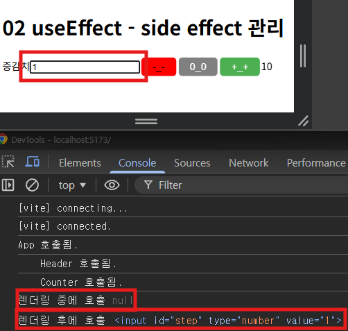
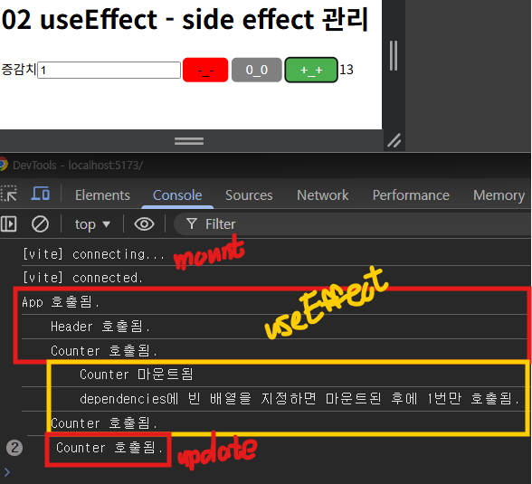
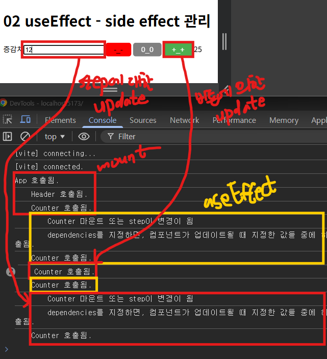

# useEffect

- [useEffect](#useeffect-1)
  - [사용 예시](#사용-예시)


<br />
<br />


## useEffect

함수형 컴포넌트에서 `Side Effect`를 안전하게 처리하기 위해 제공되는 훅

```jsx
useEffect(setup, dependencies?);
```

- `setup`

  - 컴포넌트가 렌더링된 후(DOM 업데이트 완료 후) 실행되는 함수
    
    - 생성(1-4), 업데이트(2-5), 제거(3-1)
  
  - 선택적으로 `clean up` 함수를 반환할 수 있다.
  
    - 컴포넌트가 업데이트되거나 제거될 때 호출된다.
      
      - `clean up` 함수 실행 후 `setup` 함수 재실행
      
      - 제거될 시 `clean up` 함수만 실행

- `dependencies`

  - 컴포넌트가 업데이트될 때 `setup` 함수를 호출할지 말지 여부를 결정하는데 사용

  - 컴포넌트가 마운트될 때는 `dependencies` 여부와 상관없이 `setup`이 호출됨

  - `dependencies`를 생략하면, 컴포넌트가 업데이트될 때 항상 `setup`이 호출됨

  - `dependencies`에 빈 배열을 지정하면, 컴포넌트가 업데이트될 때 호출되지 않음

  - `dependencies`를 지정하면, 컴포넌트가 업데이트 될 때 지정한 값 중 하나라도 수정되었을 경우에만 `setup` 함수가 호출됨

<br />

### 사용 예시

```jsx
function Counter({ children }: CounterProps) {
  console.log('\tCounter 호출됨.');

  const initCount = Number(children);

  const [ count, setCount ] = useState(initCount);

  const [ step, setStep ] = useState(1);

  // 카운트 감소
  const handleDown = () => {
    setCount(count - step);
  };

  // 카운트 증가
  const handleUp = () => {
    setCount(count + step);
  };

  // 카운트 초기화
  const handleReset = () => {
    setCount(initCount);
  };

  // 리액트 규칙: 렌더링 중에 상태가 변경되면 안됨
  console.log('렌더링 중에 호출', document.querySelector('input'));

  useEffect(() => {
    console.log('렌더링 후에 호출', document.querySelector('input'));
    document.querySelector('input')?.focus();
  }, []);

  return (
    <div id="counter">
      <label htmlFor="step">증감치</label>
      <input id="step" type="number" value={ step } onChange={ (e) => setStep(Number(e.target.value)) } />
      <Button bgColor="red" color="black" onClick={ handleDown }>-_-</Button>
      <Button bgColor="gray" onClick={ handleReset }>0_0</Button>
      <Button onClick={ handleUp }>+_+</Button>
      <span>{ count }</span>
    </div>
  );
}
```



- 렌더링 후에 `useEffect`에 의해 `setup` 함수가 실행되어 `input`에 `focus` 상태가 되었다.

<br />

```jsx
function Counter({ children }: CounterProps) {
  ...

  // 1. 1초 후에 handleUp()을 호출해서 자동으로 값을 1회 증가
  // setTimeout(() => {
  //   handleUp();
  // }, 1000);

  useEffect(() => {
    console.log('\t\tCounter 마운트됨');
    setTimeout(() => {
      handleUp();
    }, 1000);
    console.log('\t\tdependencies에 빈 배열을 지정하면 마운트된 후에 1번만 호출됨.');
  }, []);

  ...
}
```

- 1회만 증가시키기 위해 `setTimeout` 함수를 실행시켰지만 계속해서 증가하게된다.
  
  - `handleUp` 함수에 의해 렌더링이 되면서 `setTimeout` 함수를 실행하는 동작이 반복되기 때문이다.

- `useEffect`를 사용하면 마운트(생성)될 때는 `dependencies` 여부와 상관없이 `setup`이 호출된다.

  - `dependencies`에 빈 배열을 지정하면 컴포넌트가 리렌더링되어도 `setup` 함수는 호출되지 않는다.
  
  - `dependencies`를 생략하면 `setup` 함수가 계속 호출된다.



<br />

```jsx
function Counter({ children }: CounterProps) {
  ...

  // 2. 증감치(step)가 수정되면 1초 후에 handleUp()을 호출해서 자동으로 값을 1회 증가
  useEffect(() => {
    console.log('\t\tCounter 마운트 또는 step이 변경이 됨');
    setTimeout(() => {
      handleUp();
    }, 1000);
    console.log('\t\tdependencies를 지정하면, 컴포넌트가 업데이트될 때 지정한 값들 중에 하나라도 수정되었을 경우 호출됨.');
  }, [ step ]);

  ...
}
```



- `dependencies`를 `step`으로 지정해주어 `step`이 수정되면 `setup` 함수가 실행된다.

  - 버튼에 의한 리렌더링은 `useEffect`에 영향을 주지 않는다.

<br />

```jsx
function Counter({ children }: CounterProps) {
  ...

  // 3. 1초마다 handleUp()을 호출해서 자동으로 값을 계속 증가
  useEffect(() => { // setup 함수
    console.log('\t\tCounter 마운트 또는 업데이트 됨');
    const timerId = setTimeout(() => {
      handleUp();
    }, 1000);
    console.log('\t\tdependencies에 생략하면 마운트된 후와 업데이트된 후에도 계속 호출됨.', timerId);

    return () => { // cleanup 함수
      console.log('\t\tcleanup 호출', timerId);
      clearTimeout(timerId);
    };
  });

  ...
}
```

- `dependencies`를 생략하여 렌더링마다 `setup` 함수가 실행된다.

- `cleanup` 함수는 컴포넌트가 업데이트되거나 언마운트될 때 호출된다.

  - 업데이트 시에는 `cleanup` → `setup` 재실행 순서로 동작한다.

- 렌더링이 반복될 때마다 새로운 타이머가 만들어진다.

  - 여러 이벤트들을 통해 여러 타이머가 만들어지면 타이머가 점점 기하 급수적으로 늘어나게 되어 좋지 않다.

- 이를 방지하기 위해 `cleanup` 함수에서 이전 타이머를 삭제하고 `setup` 함수에 의해 만들어진 새로운 타이머 하나만 유지되도록 한다.

<br />

### useEffect에서 주로 구현하는 기능

- 서버에서 데이터 `fetching`

- 렌더링 작업 외에 작업

  - 브라우저 이벤트, 타이머 등

    - 설치(setup)한 기능의 정리(clean-up)

      - 이벤트 제거, 타이머 해제 등

- 렌더링 이후에 처리할 작업

  - `state`, `props` 변화에 따른 `DOM` 조작