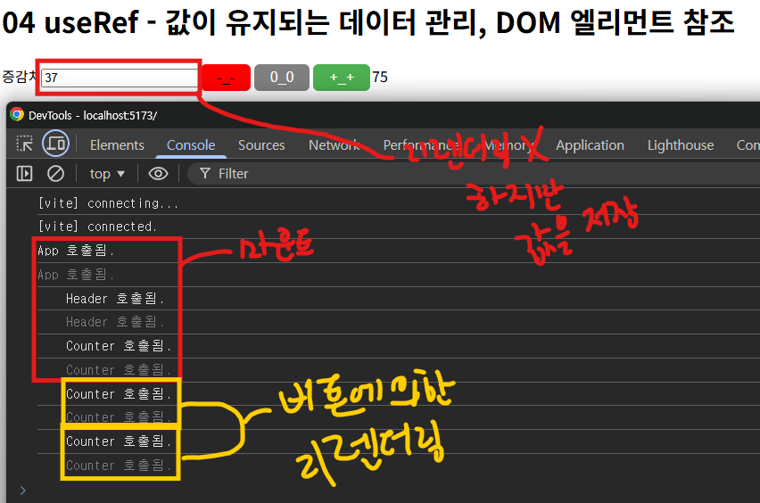

# useRef

- [useRef](#useref-1)


<br />
<br />


## useRef

컴포넌트가 다시 렌더링되더라도 기존 상태값을 유지하는 변수를 생성하는 훅

- `useRef`는 값이 변경되어도 컴포넌트가 리렌더링되지 않는다.

- 상태값은 변경된 값으로 저장된다.

```tsx
const ref = useRef(initialValue);
```

- `initialValue` : 초기값

- `{ current: value }`를 반환한다.

<br />

### 사용 예시

#### 상태값 이용

```tsx
function Counter({ children }: CounterProps) {
  console.log('\tCounter 호출됨.');

  const initCount = Number(children);
  const [ count, setCount ] = useState(initCount);

  // useRef
  const stepRef = useRef(1); // { current: 1 } 객체를 반환

  // 카운트 감소
  const handleDown = () => {
    setCount(count - stepRef.current);
  };

  // 카운트 증가
  const handleUp = () => {
    setCount(count + stepRef.current);
  };

  // 카운트 초기화
  const handleReset = () => {
    setCount(initCount);
  };

  return (
    <div id="counter">
      <label htmlFor="step">증감치</label>
      <input 
        id="step" 
        type="number" 
        defaultValue={ stepRef.current } 
        onChange={ (e) => stepRef.current = (Number(e.target.value)) } 
      />
      <Button bgColor="red" color="black" onClick={ handleDown }>-_-</Button>
      <Button bgColor="gray" onClick={ handleReset }>0_0</Button>
      <Button onClick={ handleUp }>+_+</Button>
      <span>{ count }</span>
    </div>
  );
}
```

- `useRef`를 사용하면 `input` 요소는 비제어 컴포넌트로 구현해야한다.

  - 제어 컴포넌트는 입력값에 따라 리렌더링되기 때문이다.

    - 리렌더링이 자주 발생하면 메모리, CPU 연산 등의 작업도 발생하여 성능이 떨어지는 오버헤드 현상이 발생한다.

  - 비제어 컴포넌트는 리렌더링이 되지않아 성능 최적화면에서도 좋다.

- `value`는 `defaultValue`로 설정해주고 초기값을 받도록 설정해준다.

- `onChange`는 입력할 때마다 `stepRef.current` 값에 입력 값을 할당해주도록 한다.



- 값이 변경 되면 변경된 값을 유지하면서 리렌더링이 발생하지 않는다.

- 저장된 새로운 상태값으로 이벤트 핸들러를 동작할 수 있다.

#### DOM 요소 이용

```tsx
function Counter({ children }: CounterProps) {
  console.log('\tCounter 호출됨.');

  const initCount = Number(children);
  const [ count, setCount ] = useState(initCount);

  // useRef
  const stepRef = useRef(1); // { current: 1 } 객체를 반환
  const stepElem = useRef<HTMLInputElement>(null); // { current: null } 객체를 반환

  // 카운트 감소
  const handleDown = () => {
    setCount(count - stepRef.current);
  };

  // 카운트 증가
  const handleUp = () => {
    setCount(count + stepRef.current);
  };

  // 카운트 초기화
  const handleReset = () => {
    setCount(initCount);
    stepElem.current?.focus();
  };

  return (
    <div id="counter">
      <label htmlFor="step">증감치</label>
      <input 
        ref={ stepElem }
        id="step" 
        type="number" 
        defaultValue={ stepRef.current } 
        onChange={ (e) => stepRef.current = (Number(e.target.value)) } 
      />
      <Button bgColor="red" color="black" onClick={ handleDown }>-_-</Button>
      <Button bgColor="gray" onClick={ handleReset }>0_0</Button>
      <Button onClick={ handleUp }>+_+</Button>
      <span>{ count }</span>
    </div>
  );
}
```

- 리액트 철학이나 패턴 관점에서 `DOM`을 직접 제어하는건 지양하는 것이 좋다.

- `DOM` 객체에 대한 직접 참조를 사용하여 제어할 수 있다.

  - `JSX` 태그에 `ref` 속성을 추가하면 브라우저 `DOM` 엘리먼트에 직접 접근 가능하다.

- `useRef`를 사용하고 싶은 `JSX` 태그에 `ref` 속성을 추가한다.

  - `current`에 해당 요소가 저장된다.

- 카운트가 초기화될 때 `해당 요소(stepElem.current)`에 포커스가 되게 해준다.

  - 이 때 리렌더링은 발생하지 않는다.